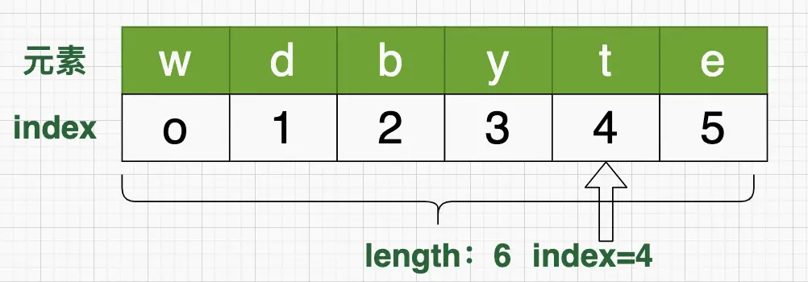
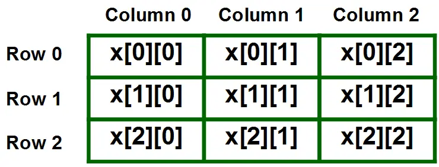

## array 介绍

数组（Array）：是一种线性表数据结构。它用一组连续的内存空间，数组是相同类型数据的集合。

数组中特定数据点的位置被称为其索引，而数据本身被称为元素。数组的索引通常是从 0 开始。



## array 特点

- 数组大小固定：数组的大小是固定的，无法动态扩容。
- 同类型元素：数组中的数据类型必须相同，否则无法通过下标计算偏移量。
- 内存连续：数组中的元素在内存中是连续存储的，可以通过下标计算偏移量，查找效率高。
- 下标访问：数组支持随机访问，通过下标访问元素的时间复杂度为 O(1)，从0开始。

## array 使用

数组定义语法：`type [] name`; 或者 `type name []`;

```java
int[] arr; // 声明数组变量 dataType [ ] nameOfArray; 
arr = new int[10]; // 创建数组，分配内存空间，初始化默认值，arr指向数组的首地址
```

## 初始化

### 静态初始化

初始化时只指定数组长度，由系统为数组分配初始值。

```java
int[] arr = {1, 2, 3, 4, 5};
```

### 动态初始化

初始化时指定每个数组元素的初始值，由系统决定数组长度

```java
int[] arr = new int[10];
```

### 多维数组

多维数组本质上也是一维数组，其每个元素是一个子数组的引用。 `dataType[][] arrayName = new dataType[row][column];`



```java
String[][] str = new String[3][4];
```

#### 应用场景

1. 矩阵运算
2. 图像处理
3. 游戏地图
4. 地理信息存储

### sort(T[] a)

这个方法用于对数组`a`进行排序，其中`T`是数组中元素的类型。它使用优化的快速排序算法对数组进行升序排序。对于基本数据类型的数组，它使用双轴快速排序。

### parallelSort(T[] a)

这个方法与`sort`类似，但是它使用`forkjoinpool`多线程来并行排序数组 a，以加快排序速度。对于大型数组来说，parallelSort 可以在多核处理器上更快地完成排序操作。

### binarySearch(T[] a, T key)

这个方法用于在已排序的数组`a`中执行二分查找。它返回要查找的元素`key`在数组中的索引，如果找不到该元素，则返回负数值。前提是数组必须是有序的，否则结果不可预测。

### fill(T[] a, T val)

该方法用于将数组`a`中的所有元素设置为指定的值`val`。它可以用于快速初始化数组，将所有元素设置为相同的值。

### copyOf(T[] original, int newLength)

这个方法用于创建一个新的数组，其中包含从原始数组`original`复制的元素，新数组的长度为`newLength`。如果`newLength`大于原始数组的长度，将用默认值填充额外的位置。

### copyOfRange(T[] original, int from, int to)

这个方法用于创建一个新的数组，其中包含从原始数组`original`复制的元素，新数组的长度为`to-from`。新数组的第一个元素将是原始数组的`from`索引处的元素。如果`to-from`大于原始数组的长度，将用默认值填充额外的位置。

### asList(T... a)

这个方法用于将数组`a`转换为`List`对象。它返回一个固定大小的列表，其中包含指定数组中的所有元素，对列表的修改将直接影响到原始数组。

```java
public static <T> List<T> asList(T... a) {
    // 这里的ArrayList不是java.util.ArrayList，而是Arrays类的一个内部类
    return new ArrayList<>(a);
}

private static class ArrayList<E> extends AbstractList<E>
    implements RandomAccess, java.io.Serializable
{
    private static final long serialVersionUID = -2764017481108945198L;
    // 这里的a就是我们传入的数组，这里的a是final的，也就是说我们传入的数组是不可变的，不能进行add，remove等操作，否则会抛出UnsupportedOperationException异常
    private final E[] a;

    ArrayList(E[] array) {
        a = Objects.requireNonNull(array);
    }
}
```