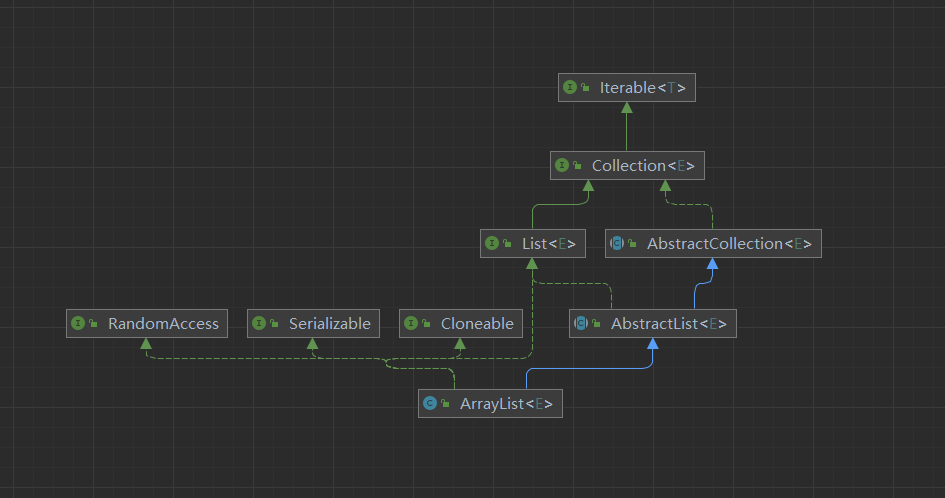
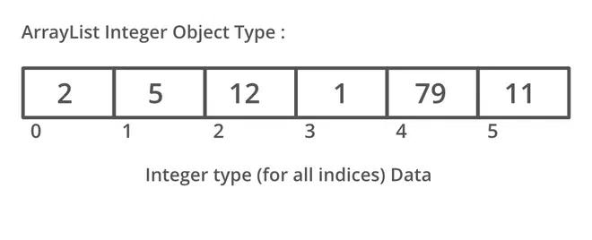

## arraylist 介绍

数组列表（ArrayList）：是一种动态数组，它可以随时增加或删除元素。与 Java 中的数组相比，它的容量能动态增长。它继承于 `AbstractList`，实现了 `List`、`RandomAccess`、`Cloneable`、`java.io.Serializable` 接口。





## arraylist 特点

1. 可变长度，可以根据需要动态增加或减少其大小。这使得它非常适用于需要经常添加或删除元素的情况。
2. 基于数组，支持随机访问，通过下标访问元素的时间复杂度为 O(1)，从0开始。
3. 允许重复元素： ArrayList 允许存储重复的元素，同一个元素可以出现多次。
4. 有序集合： ArrayList 中的元素按照它们被添加的顺序进行存储，因此它是有序集合。可以通过索引来访问和操作元素的顺序。
5. 支持泛型： Java 5 引入了泛型，允许在 ArrayList 中指定要存储的元素类型，从而提供类型安全性。
6. 自动扩容： 当 ArrayList 中的元素数量达到其当前容量时，它会自动扩展其内部数组的大小，以容纳更多的元素。这个过程是透明的，用户无需手动管理容量。

## arraylist 基本操作

### 构造函数

```java

/**
 * 默认初始容量
 */
private static final int DEFAULT_CAPACITY = 10;

/**
 * 共享的空数组实例。
 */
private static final Object[] EMPTY_ELEMENTDATA = {};

/**
 * 共享的空数组实例，用于默认大小的空实例。我们将此与 EMPTY_ELEMENTDATA 区分开来，
 */
private static final Object[] DEFAULTCAPACITY_EMPTY_ELEMENTDATA = {};

/**
 * 存储 ArrayList 元素的数组缓冲区。
 */
transient Object[] elementData; // non-private to simplify nested class access

/**
 * ArrayList 的大小（它包含的元素数）。
 *
 * @serial
 */
private int size;

/**
 * 创建一个空的列表，其初始容量为 10。
 */
 */
public ArrayList() {
    this.elementData = DEFAULTCAPACITY_EMPTY_ELEMENTDATA;
}

/**
 * 构造指定集合元素的列表
 */
public ArrayList(Collection<? extends E> c) {
    Object[] a = c.toArray();
    if ((size = a.length) != 0) {
        if (c.getClass() == ArrayList.class) {
            elementData = a;
        } else {
            elementData = Arrays.copyOf(a, size, Object[].class);
        }
    } else {
        // replace with empty array.
        elementData = EMPTY_ELEMENTDATA;
    }
}

/**
 * 创建一个具有指定初始容量的空列表。
 */
public ArrayList(int initialCapacity) {
    if (initialCapacity > 0) {
        this.elementData = new Object[initialCapacity];
    } else if (initialCapacity == 0) {
        this.elementData = EMPTY_ELEMENTDATA;
    } else {
        throw new IllegalArgumentException("Illegal Capacity: "+
                                           initialCapacity);
    }
}
```

### add

```java
/**
 * 将指定的元素添加到此列表的尾部。
 */
public boolean add(E e) {
    ensureCapacityInternal(size + 1);  // Increments modCount!!
    elementData[size++] = e;
    return true;
}

/**
 * 将指定的元素插入此列表中的指定位置。
 */
public void add(int index, E element) {
    // 检查 index 是否越界 IndexOutOfBoundsException 
    rangeCheckForAdd(index);

    // 确保容量
    ensureCapacityInternal(size + 1);  // Increments modCount!!
    // 将 index 位置后面的元素向后移动一位
    System.arraycopy(elementData, index, elementData, index + 1,
                     size - index)
    // 将 element 放到 index 位置
    elementData[index] = element;
    // size 加一 表示元素数量增加了一个。
    size++;
}
```

### addAll

```java
/**
 * 将指定集合中的所有元素添加到列表的尾部，按照指定集合的迭代器返回它们的顺序。[1,2,3,4]
 */
public boolean addAll(Collection<? extends E> c) {
    // [5,6,7,8]
    Object[] a = c.toArray();
    int numNew = a.length;
    // 确保容量 [1,2,3,4,null,null,null,null]
    ensureCapacityInternal(size + numNew);  // Increments modCount
    // 将 a 数组中的元素复制到 elementData 数组中 [1,2,3,4,5,6,7,8]
    System.arraycopy(a, 0, elementData, size, numNew);
    size += numNew;
    return numNew != 0;
}

/**
 * 将指定集合中的所有元素插入到列表中，从指定的位置开始。 [1,2,3,4]
 */
public boolean addAll(int index, Collection<? extends E> c) {
    rangeCheckForAdd(index);

    // 1, [4,5,6]
    Object[] a = c.toArray();
    int numNew = a.length;
    ensureCapacityInternal(size + numNew);  // Increments modCount

    // 计算 index 位置后面的元素个数  
    int numMoved = size - index;
    if (numMoved > 0)
        // 将 index 位置后面的元素向后移动 numNew 位   [1,null,null,null,2,3,4]  
        System.arraycopy(elementData, index, elementData, index + numNew,
                            numMoved);

    // 将 a 数组中的元素复制到 index 位置 [1,4,5,6,2,3,4]
    System.arraycopy(a, 0, elementData, index, numNew);
    size += numNew;
    return numNew != 0;
}
```

### get

```java
/**
 * 返回此列表中指定位置的元素。
 */
public E get(int index) {
    // 检查 index 是否越界 IndexOutOfBoundsException 
    rangeCheck(index);

    return elementData(index);
}
```

### set

```java
/**
 * 用指定的元素替换此列表中指定位置的元素。
 */
public E set(int index, E element) {
    // 检查 index 是否越界 IndexOutOfBoundsException 
    rangeCheck(index);

    E oldValue = elementData(index);
    elementData[index] = element;
    return oldValue;
}
```

### remove

```java
/**
 * 移除此列表中指定位置上的元素。将任何后续元素向左移动（从索引中减去一个元素）。返回从列表中删除的元素。
 */
public E remove(int index) {
    rangeCheck(index);

    modCount++;
    E oldValue = elementData(index);

    int numMoved = size - index - 1;
    if (numMoved > 0)
        // 将 index 位置后面的元素向前移动一位
        System.arraycopy(elementData, index+1, elementData, index,
                            numMoved)
    // 将最后一个元素置为 null
    elementData[--size] = null; // clear to let GC do its work

    return oldValue;
}

/**
 * 从此列表中移除指定元素的第一个匹配项，如果存在的话。如果列表不包含该元素，则它不会更改。
 */
public boolean remove(Object o) {
    if (o == null) {
        for (int index = 0; index < size; index++)
            if (elementData[index] == null) {
                fastRemove(index);
                return true;
            }
    } else {
        for (int index = 0; index < size; index++)
            if (o.equals(elementData[index])) {
                fastRemove(index);
                return true;
            }
    }
    return false;
}

private void fastRemove(int index) {
    modCount++;
    int numMoved = size - index - 1;
    if (numMoved > 0)
        System.arraycopy(elementData, index+1, elementData, index,
                            numMoved);
    elementData[--size] = null; // clear to let GC do its work
}

```

### other

```java
/**
 * 从此列表中移除所有元素。此调用返回后，列表将为空。
 */
public void clear() {
    modCount++;

    // clear to let GC do its work
    for (int i = 0; i < size; i++)
        elementData[i] = null;

    size = 0;
}

public int size() {
    return size;
}

/**
 * Returns <tt>true</tt> if this list contains no elements.
 *
 * @return <tt>true</tt> if this list contains no elements
 */
public boolean isEmpty() {
    return size == 0;
}

public boolean contains(Object o) {
    return indexOf(o) >= 0;
}

/**
 * 返回此列表中指定元素的第一次出现的索引，如果此列表不包含该元素，则返回-1。
 */
public int indexOf(Object o) {
    if (o == null) {
        for (int i = 0; i < size; i++)
            if (elementData[i]==null)
                return i;
    } else {
        for (int i = 0; i < size; i++)
            if (o.equals(elementData[i]))
                return i;
    }
    return -1;
}

/**
 * 返回此列表中指定元素的最后一次出现的索引，如果此列表不包含该元素，则返回-1。
 */
public int lastIndexOf(Object o) {
    if (o == null) {
        for (int i = size-1; i >= 0; i--)
            if (elementData[i]==null)
                return i;
    } else {
        for (int i = size-1; i >= 0; i--)
            if (o.equals(elementData[i]))
                return i;
    }
    return -1;
}
```

### grow

```java

/**
 * 计算容量，初始化未指定容量时，使用默认容量。否则使用指定容量。
 */
private static int calculateCapacity(Object[] elementData, int minCapacity) {
    if (elementData == DEFAULTCAPACITY_EMPTY_ELEMENTDATA) {
        return Math.max(DEFAULT_CAPACITY, minCapacity);
    }
    return minCapacity;
}


private void ensureCapacityInternal(int minCapacity) {
    ensureExplicitCapacity(calculateCapacity(elementData, minCapacity));
}


private void ensureExplicitCapacity(int minCapacity) {
    modCount++;

    // overflow-conscious code
    if (minCapacity - elementData.length > 0)
        grow(minCapacity);
}

/**
 * 最大数组大小。
 */
private static final int MAX_ARRAY_SIZE = Integer.MAX_VALUE - 8;

/**
 * 增加容量，确保容量足够。
 */
private void grow(int minCapacity) {
    // 旧容量
    int oldCapacity = elementData.length;
    // 新容量 = 旧容量 + 旧容量的一半
    int newCapacity = oldCapacity + (oldCapacity >> 1);
    // 如果新容量小于最小容量，则使用最小容量
    if (newCapacity - minCapacity < 0)
        newCapacity = minCapacity;
    // 如果新容量大于最大数组大小，则使用 hugeCapacity 方法计算容量
    if (newCapacity - MAX_ARRAY_SIZE > 0)
        newCapacity = hugeCapacity(minCapacity);
    // 将旧数组中的元素复制到新数组中
    elementData = Arrays.copyOf(elementData, newCapacity);
}

private static int hugeCapacity(int minCapacity) {
    if (minCapacity < 0) // overflow
        throw new OutOfMemoryError();
    return (minCapacity > MAX_ARRAY_SIZE) ?
        Integer.MAX_VALUE :
        MAX_ARRAY_SIZE;
}
```

### modCount && fail-fast

ArrayList 中的`modCount`变量主要用于记录`ArrayList`内部结构发生变化的次数,它的主要作用有:

在进行迭代操作时,检测`ArrayList`是否发生结构性变化。
`Iterator`和`ListIterator`迭代器在遍历时都会检查`modCount`变量,如果遍历过程中数组被修改过,那么`modCount`的值就会改变,迭代器就会抛出 `ConcurrentModificationException`异常。

```java
/**
 * 迭代器内部维护了一个`expectedModCount`变量，用于记录迭代器创建时的`modCount`值。当迭代器遍历时，会检查`modCount`和`expectedModCount`是否相等，如果不相等，说明`ArrayList`发生了结构性变化，就会抛出`ConcurrentModificationException`异常。
 */
private class Itr implements Iterator<E> {
    int cursor;       // index of next element to return
    int lastRet = -1; // index of last element returned; -1 if no such
    int expectedModCount = modCount; // modCount value when Iterator created
}

final void checkForComodification() {
    if (modCount != expectedModCount)
        throw new ConcurrentModificationException();
}

/**
 * 正确的迭代方式
 */
List<String> list = new ArrayList<>();
list.add("a");
list.add("b");
list.add("c");
list.add("d");
list.add("e");
Iterator<String> iterator = list.iterator();
while (iterator.hasNext()) {
    String next = iterator.next();
    if ("b".equals(next)) {
        // 调用iterator.remove()方法，会将modCount的值赋值给expectedModCount
        iterator.remove(); 
    }
}

public void remove() {
    if (lastRet < 0)
        throw new IllegalStateException();
    // 检查modCount和expectedModCount是否相等
    checkForComodification();
    try {
        // 调用ArrayList的remove方法，会将modCount的值加一
        ArrayList.this.remove(lastRet);
        cursor = lastRet;
        lastRet = -1;
        // 将modCount的值赋值给expectedModCount
        expectedModCount = modCount; 
    } catch (IndexOutOfBoundsException ex) {
        throw new ConcurrentModificationException();
    }
}
```