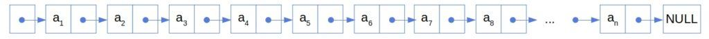
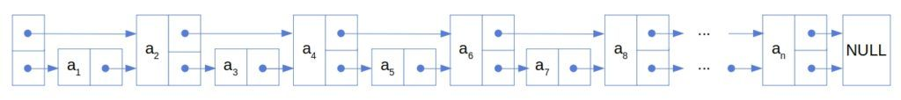
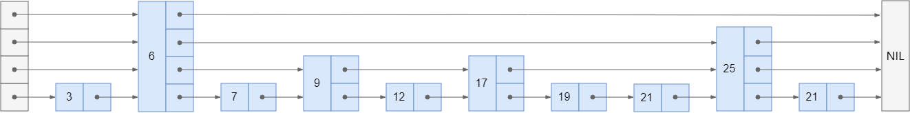
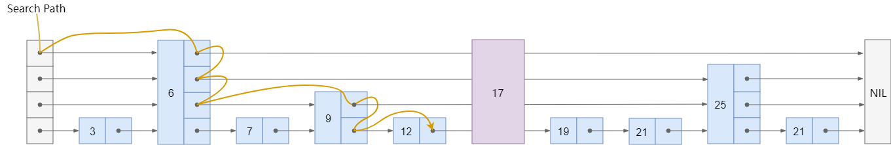
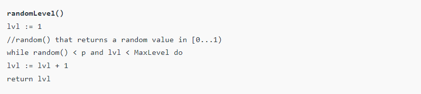
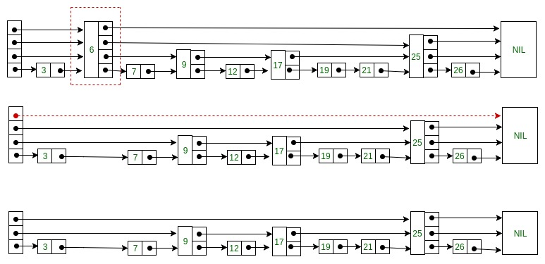

## skip list 介绍

跳表（Skip List）：是一种随机化的数据结构，实质上是一种可以进行二分查找的**有序链表**。跳表的出现是为了弥补链表只能顺序查找的缺陷，它通过构建**多级索引**来提高查询效率，实现了基于链表的“二分查找”。




## skip list 特点

- 跳表是一种动态数据结构，支持快速地插入、删除、查找操作，时间复杂度都是 O(logn)。
- 跳表对标的是平衡树（AVL Tree），AVL Tree 的插入、删除、查找操作的时间复杂度也是 O(logn)，且实现比较复杂，而跳表的实现比较简单。
- 跳表的实现很灵活，可以通过改变索引构建策略来调整性能。
- 跳表的缺点是维护成本较高，每次插入、删除操作都要维护索引，空间复杂度是 O(n)。
- 跳表的效率与索引的构建有很大关系，如果索引的构建不合理，很可能导致跳表退化成单链表，时间复杂度就退化成 O(n)。

## 跳表的实现

### 数据结构

```java
class Skiplist {
    static final int MAX_LEVEL = 16; // 最大层数
    static final double P_FACTOR = 0.25; // 层数增长概率
    private Node head; // 头节点
    private int level; // 当前层数
    private Random random; // 随机数生成器

    public Skiplist() {
        this.head = new Node(-1, MAX_LEVEL);
        this.level = 0;
        this.random = new Random();
    }   
}
```

### 随机层数


```java
public int randomLevel(float p, int maxLevel) {
    int level = 0;
    while (random() < p && level < maxLevel) {
        level += 1;
    }
    return level;
}
```

### 插入

下面是一个随机生成的跳表：



我们现在插入$17$的元素，在插入之前，我们需要搜索得到插入的位置：



接着，抛硬币决定新节点的层数，假设抛出了$2$，那么我们就需要在第$0$层、第$1$层插入新节点：



最终结果：


```java

/**
 *
 * 逐层查找，找到每层小于且最接近 num 的元素，将其保存到 update 数组中
 * 随机生成一个层数 lv，将新节点插入到 0~lv 层中 ，将上面查找到的元素的 forward 指向新节点
 * @param num
 *
 */
public void add(int num) {
    Node[] update = new Node[MAX_LEVEL];
    Arrays.fill(update, head);
    Node curr = this.head;
    for (int i = level - 1; i >= 0; i--) {
        /* 找到第 i 层小于且最接近 num 的元素*/
        while (curr.forward[i] != null && curr.forward[i].val < num) {
            curr = curr.forward[i];
        }
        update[i] = curr;
    }
    int lv = randomLevel();
    level = Math.max(level, lv);
    Node newNode = new Node(num, lv);
    for (int i = 0; i < lv; i++) {
        /* 对第 i 层的状态进行更新，将当前元素的 forward 指向新的节点 */
        newNode.forward[i] = update[i].forward[i];
        update[i].forward[i] = newNode;
    }
}


```


1. 找到插入位置
2. 选择插入层数
3. 更新应该指向新节点的指针

### 查找


我们还是在以下跳表中搜索$17$：

1. 从最高层开始，从左到右搜索，直到找到第一个大于等于$17$的元素，然后转到下一层。


```java
/**
 * 查找时，以最高层的头结点为起点，比较搜索的元素X和右侧元素Y的大小，根据判断结果决定是返回Y (X == Y)，还是在Y的左侧继续搜索(X < Y)，或者是在Y的右侧搜索(X > Y)。重复这个过程，直到找到X或者确定X不存在。
 * @param target
 * @return
 */
public boolean search(int target) {
    Node curr = this.head;
    for (int i = level - 1; i >= 0; i--) {
        /* 找到第 i 层小于且最接近 target 的元素*/
        while (curr.forward[i] != null && curr.forward[i].val < target) {
            curr = curr.forward[i];
        }
    }
    curr = curr.forward[0];
    /* 检测当前元素的值是否等于 target */
    if (curr != null && curr.val == target) {
        return true;
    }
    return false;
}
```

### 删除


删除和插入类似，也是需要先找到删除位置，然后逐层删除。



```java
/**
 * 删除与插入和查找类似。我们首先找到包含要删除的值的节点。在此过程中，我们记住哪些节点指向它。如果我们找到该节点，我们就会将其与其前任节点取消链接，并将它们指向适当级别的节点的后继节点：
 * @param num
 * @return
 */
public boolean remove(int num) {
    Node[] update = new Node[MAX_LEVEL];
    Node curr = this.head;
    for (int i = level - 1; i >= 0; i--) {
        /* 找到第 i 层小于且最接近 num 的元素*/
        while (curr.forward[i] != null && curr.forward[i].val < num) {
            curr = curr.forward[i];
        }
        update[i] = curr;
    }
    curr = curr.forward[0];
    /* 如果值不存在则返回 false */
    if (curr == null || curr.val != num) {
        return false;
    }
    for (int i = 0; i < level; i++) {
        if (update[i].forward[i] != curr) {
            break;
        }
        /* 对第 i 层的状态进行更新，将 forward 指向被删除节点的下一跳 */
        update[i].forward[i] = curr.forward[i];
    }
    /* 更新当前的 level */
    while (level > 1 && head.forward[level - 1] == null) {
        level--;
    }
    return true;
}
```

## 打印

```java
/**
 * 逐层打印跳表
 */
public String toString() {
    StringBuilder sb = new StringBuilder();
    for (int i = level - 1; i >= 0; i--) {
        Node curr = this.head;
        sb.append("level ").append(i).append(":");
        while (curr.forward[i] != null) {
            sb.append("->").append(curr.forward[i].val);
            curr = curr.forward[i];
        }
        sb.append("\n");
    }
    return sb.toString();
}

```

## skip list 应用

### Redis 中的有序集合

- `Redis` 中的有序集合（`Sorted Set`）就是用跳表来实现的。
- `ConcurrentSkipListMap`
- `ConcurrentSkipListSet`

## 参考资料

- [论文](https://15721.courses.cs.cmu.edu/spring2018/papers/08-oltpindexes1/pugh-skiplists-cacm1990.pdf)
- [跳表（Skip List）](https://lotabout.me/2018/skip-list/)
- [Skip List (Introduction)](https://www.geeksforgeeks.org/skip-list/)
- [baeldung skiplists](https://www.baeldung.com/cs/skip-lists)
- [算法可视化](https://www.cs.usfca.edu/~galles/visualization/Algorithms.html)
- [数据结构可视化](https://visualgo.net/zh)