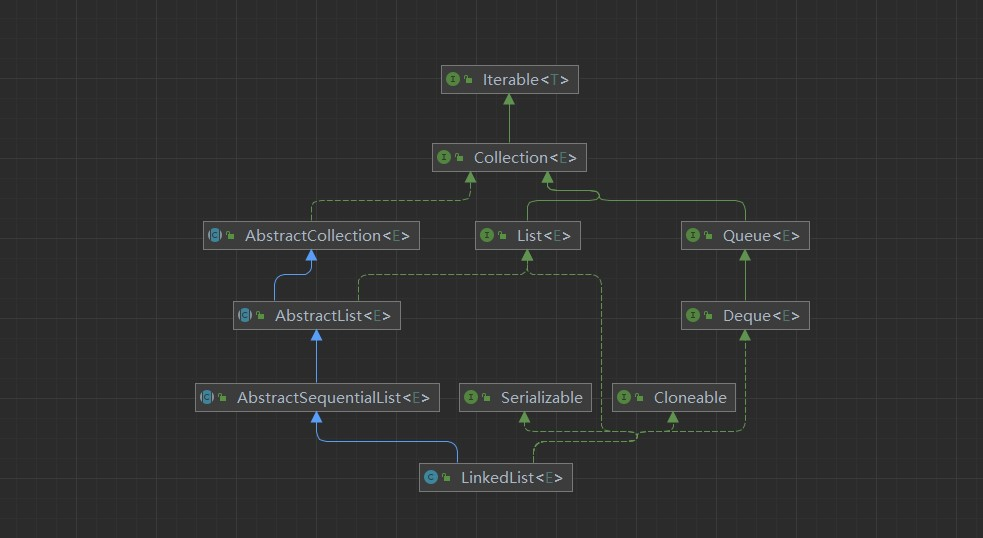
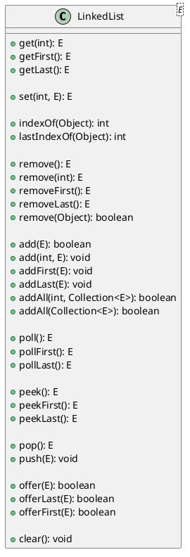

## linked list 介绍

链表（Linked List）：是一种线性表数据结构。它用一组任意的内存空间，链表中的元素在内存中不是顺序存储的，而是通过指针链接到一起，每个元素包含两个部分：数据域和指针域。



链表有多种类型，包括单链表、双链表和循环链表等。


## linked list 特点

- 链表大小不固定：链表的大小是动态的，可以根据实际情况进行扩容。
- 链表中的数据元素称为节点(Node),每个节点由两部分组成:存储数据元素的数据域和存储下一个节点地址的指针域
- 节点之间通过指针链接,可以方便地增加删除节点
- 链表不必须按顺序存储,链表项之间的逻辑顺序由链表本身确定。
- 链表访问任何位置的节点时,必须从头结点(首节点)开始逐个访问直到该位置,所以访问速度较慢。
- 插入删除节点时间复杂度为 O(1),不受元素位置的影响。但查找某个节点时间复杂度为 O(n)。
- 链表的存储方式不连续,链表节点在内存中可以离散存储。
  
## linked list 基本操作



> `LinkedList`实现了`List`接口和`Deque`接口,所以`LinkedList`既可以当作`List`使用,也可以当作`Deque`使用。其中很多方法都是`List`接口和 `Deque`接口的默认方法,所以`LinkedList`重写了很多方法。但是方法很多都是等效的，只是方法名不同而已。所以在使用时,可以根据需要选择合适的方法。

| deque 方法 | deque 方法 |
| :--- | :--- |
| addFirst() | offerFirst() |
| addLast() | offerLast() |
| removeFirst() | pollFirst() |
| removeLast() | pollLast() |
| getFirst() | peekFirst() |
| getLast() | peekLast() |
| add() | offer() |
| remove() | poll() |

| Queue 方法 | deque 方法 |
| :--- | :--- |
| add() | addLast() |
| offer() | offerLast() |
| remove() | removeFirst() |
| poll() | pollFirst |
| element() | getFirst() |
| peek()| peekFirst() |

| stack 方法 | deque 方法 |
| :--- | :--- |
| push() | addFirst() |
| pop() | removeFirst() |
| peek() | peekFirst() |

### 构造函数

```java
private static class Node<E> {
    E item;
    Node<E> next;
    Node<E> prev;

    Node(Node<E> prev, E element, Node<E> next) {
        this.item = element;
        this.next = next;
        this.prev = prev;
    }
}

public class LinkedList<E> {
    transient int size = 0;
    transient Node<E> first;
    transient Node<E> last;
}

public LinkedList() {
}

public LinkedList(Collection<? extends E> c) {
    this();
    addAll(c);
}
```

### add

```java

/**
 * 默认添加元素到链表尾部
 */
public boolean add(E e) {
    linkLast(e);
    return true;
}

/**
 * 添加元素到链表尾部
 */
public void addLast(E e) {
    linkLast(e);
}

void linkLast(E e) {
    final Node<E> l = last;
    // 创建一个新节点,其前驱节点为l,后继节点为null,数据域为e
    final Node<E> newNode = new Node<>(l, e, null);
    // 将尾节点指向新节点
    last = newNode;
    // 如果链表为空,则新节点为首节点
    if (l == null)
        first = newNode;
    else
        // 将原尾节点的next指向新节点
        l.next = newNode;
    size++;
    modCount++;
}

/**
 * 添加元素到链表头部
 */
public void addFirst(E e) {
    linkFirst(e);
}

private void linkFirst(E e) {
    final Node<E> f = first;
    // 创建一个新节点,其前驱节点为null,后继节点为f,数据域为e
    final Node<E> newNode = new Node<>(null, e, f);
    // 将首节点指向新节点
    first = newNode;
    // 如果链表为空,则新节点为尾节点
    if (f == null)
        last = newNode;
    else
        // 将原首节点的prev指向新节点
        f.prev = newNode;
    size++;
    modCount++;
}

/**
 * 在指定位置添加元素,如果index等于size,则添加到链表尾部,否则在指定位置添加元素
 */
public void add(int index, E element) {
    checkPositionIndex(index);
    // 如果index等于size,则添加到链表尾部
    if (index == size)
        linkLast(element);
    else
        // 在指定位置添加元素
        linkBefore(element, node(index));
}

/**
 * 在指定节点前添加元素 , 双向链表需要维护4个指针, 两个指针指向前驱节点,两个指针指向后继节点
 */
void linkBefore(E e, Node<E> succ) {
    // 获取succ的前驱节点
    final Node<E> pred = succ.prev;
    // 创建一个新节点,其前驱节点为pred,后继节点为succ,数据域为e
    final Node<E> newNode = new Node<>(pred, e, succ);
    // 将succ的前驱节点指向新节点
    succ.prev = newNode;
    // 如果pred为空,即succ是否是头节点,则新节点为首节点
    if (pred == null)
        first = newNode;
    else
        // 将pred的后继节点指向新节点
        pred.next = newNode;
    size++;
    modCount++;
}


/**
 * 找到指定位置的节点
 */
Node<E> node(int index) {
 
    // 判断索引index是否小于链表长度的一半。
    if (index < (size >> 1)) {
        Node<E> x = first;
        // 从首节点开始遍历,直到index位置
        for (int i = 0; i < index; i++)
            x = x.next;
        return x;
    } else {
        // 从尾节点开始倒序遍历,直到index位置
        Node<E> x = last;
        for (int i = size - 1; i > index; i--)
            x = x.prev;
        return x;
    }
}

public boolean addAll(Collection<? extends E> c) {
    return addAll(size, c);
}

/**
 * 在指定位置添加集合元素
 */
public boolean addAll(int index, Collection<? extends E> c) {
    checkPositionIndex(index);

    // 将集合转换为数组
    Object[] a = c.toArray();
    int numNew = a.length;
    // 如果集合为空,则不添加
    if (numNew == 0)
        return false;

    Node<E> pred, succ;
    // 如果index等于size,则添加到链表尾部
    if (index == size) {
        succ = null;
        // 前驱节点为尾节点
        pred = last;
    } else {
        // 找到index位置的节点
        succ = node(index);
        // 获取index位置节点的前驱节点
        pred = succ.prev;
    }

    // 遍历集合,将集合元素添加到链表中
    for (Object o : a) {
        @SuppressWarnings("unchecked") E e = (E) o;
        // 创建一个新节点,其前驱节点为pred,后继节点为null,数据域为e
        Node<E> newNode = new Node<>(pred, e, null);
        if (pred == null)
            first = newNode;
        else
            pred.next = newNode;
        // 将新节点设置为前驱节点pred
        pred = newNode;
    }

    // 如果succ为空, 则最后一个节点为pred
    if (succ == null) {
        last = pred;
    } else {
        // 将pred的后继节点设置为succ
        pred.next = succ;
        // 将succ的前驱节点设置为pred
        succ.prev = pred;
    }

    size += numNew;
    modCount++;
    return true;
}
```

### get

```java
/**
 * 获取指定位置的元素 o(n)
 */
public E get(int index) {
    checkElementIndex(index);
    return node(index).item;
}

public E getFirst() {
    final Node<E> f = first;
    if (f == null)
        throw new NoSuchElementException();
    return f.item;
}

public E getLast() {
    final Node<E> l = last;
    if (l == null)
        throw new NoSuchElementException();
    return l.item;
}
```

### set

```java
/**
 * 找到指定位置的节点,并将节点的数据域设置为element
 */
public E set(int index, E element) {
    checkElementIndex(index);
    Node<E> x = node(index);
    E oldVal = x.item;
    x.item = element;
    return oldVal;
}
```

### remove

```java

/**
 * 删除链表首节点
 */
 */
public E remove() {
    return removeFirst();
}

public E removeFirst() {
    final Node<E> f = first;
    if (f == null)
        throw new NoSuchElementException();
    return unlinkFirst(f);
}

public E removeLast() {
    final Node<E> l = last;
    if (l == null)
        throw new NoSuchElementException();
    return unlinkLast(l);
}

/**
 * 删除链表尾节点
 */
private E unlinkLast(Node<E> l) {
    // assert l == last && l != null;
    final E element = l.item;
    final Node<E> prev = l.prev;
    l.item = null;
    l.prev = null; // help GC
    // 将尾节点指向prev
    last = prev;
    if (prev == null)
        // 如果prev为空,则链表为空,将首节点设置为null
        first = null;
    else
        // 将prev的后继节点设置为null
        prev.next = null;
    size--;
    modCount++;
    return element;
}


/**
 * 删除链表头节点
 */
private E unlinkFirst(Node<E> f) {
    // assert f == first && f != null;
    final E element = f.item;
    final Node<E> next = f.next;
    f.item = null;
    f.next = null; // help GC
    // 将首节点指向next
    first = next;
    if (next == null)
        // 如果next为空,则链表为空,将尾节点设置为null
        last = null;
    else
        // 将next的前驱节点设置为null
        next.prev = null;
    size--;
    modCount++;
    return element;
}


/**
 * 删除指定位置的元素
 */
public E remove(int index) {
    checkElementIndex(index);
    return unlink(node(index));
}

E unlink(Node<E> x) {
    
    final E element = x.item;
    final Node<E> next = x.next;
    final Node<E> prev = x.prev;

    // 如果prev为空,则x为首节点,将首节点指向next
    if (prev == null) {
        first = next;
    } else {
        // 将prev的后继节点指向next
        prev.next = next;
        // 将x的前驱节点设置为null
        x.prev = null;
    }

    // 如果next为空,则x为尾节点,将尾节点指向prev
    if (next == null) {
        last = prev;
    } else {
        // 将next的前驱节点指向prev
        next.prev = prev;
        // 将x的后继节点设置为null
        x.next = null;
    }

    // 将x的数据域设置为null
    x.item = null;
    size--;
    modCount++;
    return element;
}

/**
 * 删除指定元素
 */
public boolean remove(Object o) {
    if (o == null) {
        for (Node<E> x = first; x != null; x = x.next) {
            if (x.item == null) {
                unlink(x);
                return true;
            }
        }
    } else {
        for (Node<E> x = first; x != null; x = x.next) {
            if (o.equals(x.item)) {
                unlink(x);
                return true;
            }
        }
    }
    return false;
}
```

### peek

```java
/**
 * 获取链表首节点的数据域
 */
 */
public E peek() {
    final Node<E> f = first;
    return (f == null) ? null : f.item;
}

public E peekFirst() {
    final Node<E> f = first;
    return (f == null) ? null : f.item;
}


/**
 * 获取链表尾节点的数据域
 */
public E peekLast() {
    final Node<E> l = last;
    return (l == null) ? null : l.item;
}
```

### poll

```java

/**
 * 删除链表首节点
 */
public E poll() {
    final Node<E> f = first;
    return (f == null) ? null : unlinkFirst(f);
}


public E pollFirst() {
    final Node<E> f = first;
    return (f == null) ? null : unlinkFirst(f);
}

/**
 * 删除链表尾节点
 */
public E pollLast() {
    final Node<E> l = last;
    return (l == null) ? null : unlinkLast(l);
}

```

### offer

```java
/**
 * 添加元素到链表尾部
 */
public boolean offer(E e) {
    return add(e);
}

public boolean offerLast(E e) {
    addLast(e);
    return true;
}

/**
 * 添加元素到链表头部
 */
 */
public boolean offerFirst(E e) {
    addFirst(e);
    return true;
}

```

### push

```java
/**
 * 添加元素到链表头部 等价于addFirst
 */
public void push(E e) {
    addFirst(e);
}

```

### pop

```java

/**
 * 删除链表头节点 等价于removeFirst
 */
public E pop() {
    return removeFirst();
}
```

## linked list 应用场景

1. 音乐播放器的播放列表，音乐播放器可以使用链表来管理和播放音乐播放列表中的歌曲。
2. 浏览器的历史记录，浏览器可以使用双向链表来管理用户的浏览历史记录，这样可以轻松实现前进和后退的功能。
3. 实现栈和队列：链表可以用来实现栈（Stack）和队列（Queue），这两种数据结构在计算机科学中非常常见，用于管理数据的先进先出（FIFO）或后进先出（LIFO）特性。
