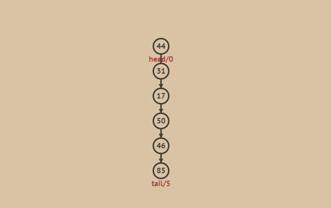
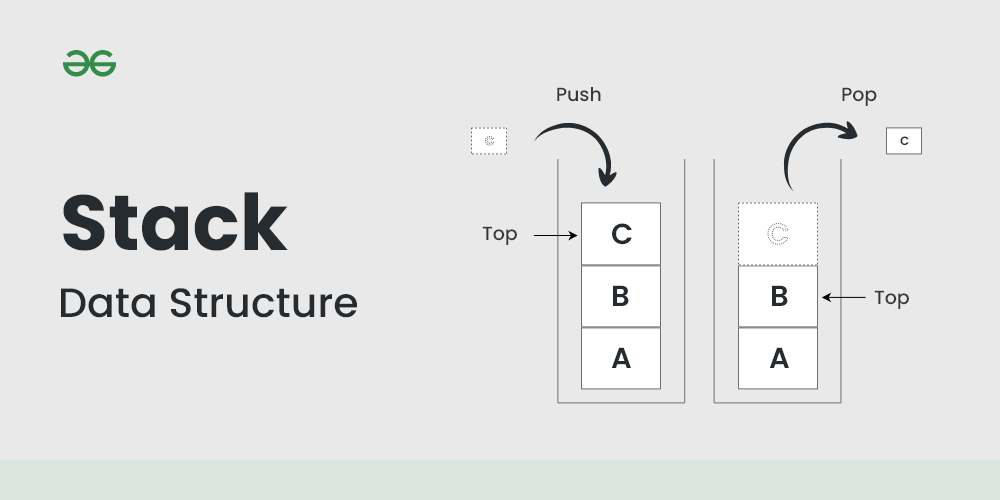

## stack 介绍

栈(Stack)是一种基础的数据结构,它按照后进先出(LIFO)的原则存储和访问数据



栈有两种基本操作:入栈和出栈。入栈是指将数据放入栈中,出栈是指将数据从栈中取出。栈的入栈和出栈操作只能在栈顶进行。



## stack 特点

- 栈是一种限定仅表尾进行插入和删除操作的线性表。
- 栈只有一个出口, Last In First Out,即最后插入的元素最先删除,先进入的元素后退出。
- 主要操作有两个:入栈(Push)和出栈(Pop)。
- 常用的实现方式有数组实现和链表实现。
  
## stack 基本操作

1. Push(element) - 向栈顶添加一个新元素
2. Pop() - 删除栈顶元素并返回删除元素
3. Peek() - 返回栈顶元素,不对栈做任何修改
4. isEmpty() - 判断栈是否为空
5. size() - 返回栈中元素的数量

### 构造函数

```java
public class Stack<E> extends Vector<E> {
    public Stack() {
    }
}
```

### push

```java
/**
 * 添加元素到栈顶，实际就是添加元素到数组末尾
 */
public E push(E item) {
    addElement(item);
    return item;
}
```

### pop

```java
/**
 * 删除栈顶元素并返回删除元素，实际就是删除数组末尾元素
 */
public synchronized E pop() {
    E       obj;
    int     len = size();

    obj = peek();
    removeElementAt(len - 1);

    return obj;
}

### peek

```java
/**
 * 返回栈顶元素，不对栈做任何修改
 */
public synchronized E peek() {
    int     len = size();

    if (len == 0)
        throw new EmptyStackException();
    return elementAt(len - 1);
}
```

### isEmpty

```java
/**
 * 判断栈是否为空
 */
public boolean empty() {
    return size() == 0;
}
```

### size

```java
/**
 * 返回栈中元素的数量
 */
public synchronized int size() {
    return elementCount;
}
```

## stack 应用

### 括号匹配

```java
public boolean isValid(String s) {
    Stack<Character> stack = new Stack<>();
    for (char c : s.toCharArray()) {
        if (c == '(' || c == '[' || c == '{') {
            stack.push(c);
        } else {
            if (stack.isEmpty()) {
                return false;
            }
            char topChar = stack.pop();
            if (c == ')' && topChar != '(') {
                return false;
            }
            if (c == ']' && topChar != '[') {
                return false;
            }
            if (c == '}' && topChar != '{') {
                return false;
            }
        }
    }
    return stack.isEmpty();
}
```

### 逆波兰表达式求值

```java
public int evalRPN(String[] tokens) {
    Stack<Integer> stack = new Stack<>();
    for (String token : tokens) {
        if (token.equals("+")) {
            stack.push(stack.pop() + stack.pop());
        } else if (token.equals("-")) {
            stack.push(stack.pop() + stack.pop());
        } else if (token.equals("*")) {
            stack.push(stack.pop() * stack.pop());
        } else if (token.equals("/")) {
            int num1 = stack.pop();
            int num2 = stack.pop();
            stack.push(num2 / num1);
        } else {
            stack.push(Integer.parseInt(token));
        }
    }
    return stack.pop();
}
```

