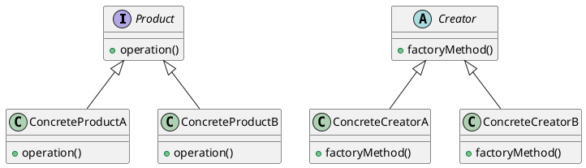
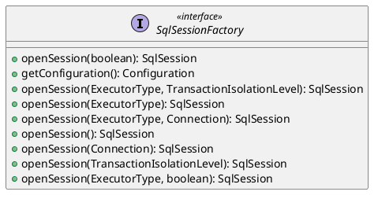
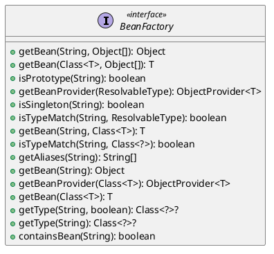

> 工厂模式：定义了一个创建对象的接口，但由子类决定要实例化的类是哪一个。工厂方法让类把实例化推迟到子类。

<!-- more -->

## 工厂模式结构

- 抽象产品（Product）：定义了产品的接口，描述了产品的公共接口。
- 具体产品（ConcreteProduct）：实现了抽象产品接口，定义了一个将被相应的具体工厂创建的产品对象。
- 创建者（Creator）：声明了工厂方法，该方法返回一个产品类型的对象。Creator 也可以定义一个工厂方法的缺省实现，它返回一个缺省的 ConcreteProduct 对象。
- 具体创建者（ConcreteCreator）：实现了工厂方法，并返回一个产品的实例。



## 工厂模式的使用场景

1. 对象的创建过程复杂：当对象的创建涉及多个步骤、条件判断或依赖其他对象时，工厂模式可以将这些复杂的实例化逻辑封装在工厂类中，使客户端代码更简洁。

2. 对象的类不稳定：如果对象的具体类经常发生变化，而客户端代码依赖于具体类，则需要频繁修改客户端代码。工厂模式可以通过引入工厂接口和具体工厂类来解耦客户端代码和具体类，从而降低变更的影响。

3. 对象的创建需要配置：如果对象的创建需要一些配置参数或环境信息，工厂模式可以将这些信息传递给工厂方法，以便根据配置创建正确的对象。

## 工厂模式的应用

### SqlSessionFactory



在`DefaultSqlSessionFactory`默认实现中，SqlSession就是典型的根据配置创建对象，该方法先从`configuration`读取对应的环境配置，然后初始化`TransactionFactory`获得一个`Transaction`对象，然后通过`Transaction`获取一个`Executor`对象，最后通过`configuration`、`Executor`、是否`autoCommit`三个参数构建了`SqlSession`。

```java
  private SqlSession openSessionFromDataSource(ExecutorType execType, TransactionIsolationLevel level, boolean autoCommit) {
    Transaction tx = null;
    try {
      final Environment environment = configuration.getEnvironment();
      final TransactionFactory transactionFactory = getTransactionFactoryFromEnvironment(environment);
      tx = transactionFactory.newTransaction(environment.getDataSource(), level, autoCommit);
      final Executor executor = configuration.newExecutor(tx, execType);
      return new DefaultSqlSession(configuration, executor, autoCommit);
    } catch (Exception e) {
      closeTransaction(tx); // may have fetched a connection so lets call close()
      throw ExceptionFactory.wrapException("Error opening session.  Cause: " + e, e);
    } finally {
      ErrorContext.instance().reset();
    }
  }

```

### BeanFactory

