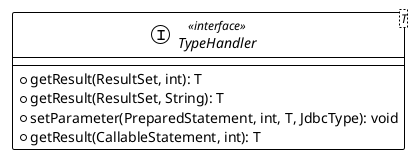

# mybatis 类型转换

一直很好奇，mybatis在设置预处理语句（PreparedStatement）中的参数或从结果集中取出一个值时，是如何将java类型和数据库类型进行转换的。这里就来探究一下mybatis的类型转换机制。

## 类型转换器

mybatis中的类型转换器是`org.apache.ibatis.type.TypeHandler`接口，它定义了java类型和数据库类型之间的转换规则。



```java
public interface TypeHandler<T> {

  /**
   * 设置预处理语句中的参数
   */
  void setParameter(PreparedStatement ps, int i, T parameter, JdbcType jdbcType) throws SQLException;

  /**
   * 从结果集中取值
   */
  T getResult(ResultSet rs, String columnName) throws SQLException;

  T getResult(ResultSet rs, int columnIndex) throws SQLException;

  T getResult(CallableStatement cs, int columnIndex) throws SQLException;

}
```

### 预设类型转换器

mybatis提供了一些常用的类型转换器，如`StringTypeHandler`、`IntegerTypeHandler`、`DateTypeHandler`等，这些类型转换器都实现了`TypeHandler`接口。

从 3.4.5 开始，MyBatis 默认支持 JSR-310（日期和时间 API） 。具体参考 TypeHandlerRegistry的构造函数。

| 类型转换器 | Java 类型 | JDBC 类型 |
| --- | --- | --- |
| StringTypeHandler | String | VARCHAR |
| IntegerTypeHandler | Integer | INTEGER |
| LongTypeHandler | Long | BIGINT |

### 类型转换器注册

mybatis中的类型转换器是通过`org.apache.ibatis.type.TypeHandlerRegistry`类进行注册和管理的。

```java
public class TypeHandlerRegistry {
  
  /**
   * jdbcType -> TypeHandler
   */
  private final Map<JdbcType, TypeHandler<?>> jdbcTypeHandlerMap = new EnumMap<>(JdbcType.class);

  /**
   * javaType -> (jdbcType -> TypeHandler)
   * 单个java类型可能对应多个jdbc类型, 如String对应VARCHAR和LONGVARCHAR, 所以这里使用Map<JdbcType, TypeHandler>来存储
   */
  private final Map<Type, Map<JdbcType, TypeHandler<?>>> typeHandlerMap = new ConcurrentHashMap<>();

  /**
   * 未知类型转换器
   */
  private final TypeHandler<Object> unknownTypeHandler;

  /**
   * 所有已注册类型转换器
   */
  private final Map<Class<?>, TypeHandler<?>> allTypeHandlersMap = new HashMap<>();

  private static final Map<JdbcType, TypeHandler<?>> NULL_TYPE_HANDLER_MAP = Collections.emptyMap();

  /**
   * 默认枚举类型转换器
   */
  private Class<? extends TypeHandler> defaultEnumTypeHandler = EnumTypeHandler.class;

  public void register(JdbcType jdbcType, TypeHandler<?> handler) {
    jdbcTypeHandlerMap.put(jdbcType, handler);
  }

  private void register(Type javaType, JdbcType jdbcType, TypeHandler<?> handler) {
    if (javaType != null) {
        Map<JdbcType, TypeHandler<?>> map = typeHandlerMap.get(javaType);
        if (map == null || map == NULL_TYPE_HANDLER_MAP) {
        map = new HashMap<>();
        }
        map.put(jdbcType, handler);
        typeHandlerMap.put(javaType, map);
    }
    allTypeHandlersMap.put(handler.getClass(), handler);
  }   
}
```

### 类型转换器使用

那么类型转换器注册后，是如何使用的呢，我们从两个方面来看。

1. 预处理语句中的参数设置, 通过`TypeHandler.setParameter`方法来设置预处理语句中的参数。

从`org.apache.ibatis.executor.parameter.ParameterHandler`类中可以看到，mybatis在设置预处理语句中的参数时，会调用`TypeHandler.setParameter`方法。

其实设值就是原始的jdbc预处理语句的设值，只是mybatis在这个过程中加入了类型转换器的处理。

我们来回忆下jdbc预处理语句的设值过程：

```java
PreparedStatement ps = connection.prepareStatement("select * from user where id = ?");
ps.setInt(1, 1);
```

mybatis中的设值过程：

```java
List<ParameterMapping> parameterMappings = boundSql.getParameterMappings();

for (int i = 0; i < parameterMappings.size(); i++) {
    ParameterMapping parameterMapping = parameterMappings.get(i);
    TypeHandler typeHandler = parameterMapping.getTypeHandler();
    JdbcType jdbcType = parameterMapping.getJdbcType();   
    typeHandler.setParameter(ps, i + 1, value, jdbcType);
}
```
