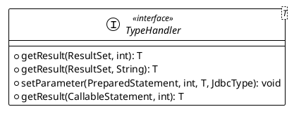

# mybatis 类型转换

一直很好奇，mybatis在设置预处理语句（PreparedStatement）中的参数或从结果集中取出一个值时，是如何将java类型和数据库类型进行转换的。这里就来探究一下mybatis的类型转换机制。

## 类型转换器

mybatis中的类型转换器是`org.apache.ibatis.type.TypeHandler`接口，它定义了java类型和数据库类型之间的转换规则。



```java
public interface TypeHandler<T> {

  /**
   * 设置预处理语句中的参数
   */
  void setParameter(PreparedStatement ps, int i, T parameter, JdbcType jdbcType) throws SQLException;

  /**
   * 从结果集中取值
   */
  T getResult(ResultSet rs, String columnName) throws SQLException;

  T getResult(ResultSet rs, int columnIndex) throws SQLException;

  T getResult(CallableStatement cs, int columnIndex) throws SQLException;

}
```

### 预设类型转换器

mybatis提供了一些常用的类型转换器，如`StringTypeHandler`、`IntegerTypeHandler`、`DateTypeHandler`等，这些类型转换器都实现了`TypeHandler`接口。

从 3.4.5 开始，MyBatis 默认支持 JSR-310（日期和时间 API） 。具体参考 TypeHandlerRegistry的构造函数。

| 类型转换器 | Java 类型 | JDBC 类型 |
| --- | --- | --- |
| StringTypeHandler | String | VARCHAR |
| IntegerTypeHandler | Integer | INTEGER |
| LongTypeHandler | Long | BIGINT |

### 类型转换器注册

mybatis中的类型转换器是通过`org.apache.ibatis.type.TypeHandlerRegistry`类进行注册和管理的。

```java
public class TypeHandlerRegistry {
  
  /**
   * jdbcType -> TypeHandler
   */
  private final Map<JdbcType, TypeHandler<?>> jdbcTypeHandlerMap = new EnumMap<>(JdbcType.class);

  /**
   * javaType -> (jdbcType -> TypeHandler)
   * 单个java类型可能对应多个jdbc类型, 如String对应VARCHAR和LONGVARCHAR, 所以这里使用Map<JdbcType, TypeHandler>来存储
   */
  private final Map<Type, Map<JdbcType, TypeHandler<?>>> typeHandlerMap = new ConcurrentHashMap<>();

  /**
   * 未知类型转换器
   */
  private final TypeHandler<Object> unknownTypeHandler;

  /**
   * 所有已注册类型转换器
   */
  private final Map<Class<?>, TypeHandler<?>> allTypeHandlersMap = new HashMap<>();

  private static final Map<JdbcType, TypeHandler<?>> NULL_TYPE_HANDLER_MAP = Collections.emptyMap();

  /**
   * 默认枚举类型转换器
   */
  private Class<? extends TypeHandler> defaultEnumTypeHandler = EnumTypeHandler.class;

  public void register(JdbcType jdbcType, TypeHandler<?> handler) {
    jdbcTypeHandlerMap.put(jdbcType, handler);
  }

  private void register(Type javaType, JdbcType jdbcType, TypeHandler<?> handler) {
    if (javaType != null) {
        Map<JdbcType, TypeHandler<?>> map = typeHandlerMap.get(javaType);
        if (map == null || map == NULL_TYPE_HANDLER_MAP) {
        map = new HashMap<>();
        }
        map.put(jdbcType, handler);
        typeHandlerMap.put(javaType, map);
    }
    allTypeHandlersMap.put(handler.getClass(), handler);
  }   
}
```

### 类型转换器使用

那么类型转换器注册后，是如何使用的呢，我们从两个方面来看。

1. 预处理语句中的参数设置, 通过`TypeHandler.setParameter`方法来设置预处理语句中的参数。

从`org.apache.ibatis.executor.parameter.ParameterHandler`类中可以看到，mybatis在设置预处理语句中的参数时，会调用`TypeHandler.setParameter`方法。

其实设值就是原始的jdbc预处理语句的设值，只是mybatis在这个过程中加入了类型转换器的处理。

我们来回忆下jdbc预处理语句的设值过程：

```java
PreparedStatement ps = connection.prepareStatement("select * from user where id = ?");
ps.setInt(1, 1);
```

mybatis中的设值过程：

```java
List<ParameterMapping> parameterMappings = boundSql.getParameterMappings();

for (int i = 0; i < parameterMappings.size(); i++) {
    ParameterMapping parameterMapping = parameterMappings.get(i);
    Object value;
    String propertyName = parameterMapping.getProperty();
    // 从boundSql中获取附加参数 优先级最高
    if (boundSql.hasAdditionalParameter(propertyName)) {
        value = boundSql.getAdditionalParameter(propertyName);
      // 对于null对象，直接赋值为null
    } else if (parameterObject == null) {
        value = null;
      // 如果typeHandlerRegistry中存在对应parameterObject类的类型处理器，则进入这个分支。例如 String、Integer、Date等类型
    } else if (typeHandlerRegistry.hasTypeHandler(parameterObject.getClass())) {
        value = parameterObject;
    } else {
        // 利用反射创建和获取parameterObject对象的属性值
        MetaObject metaObject = configuration.newMetaObject(parameterObject);
        // 通过MetaObject获取propertyName属性的值，并赋给value变量。
        value = metaObject.getValue(propertyName);
    }
    // 获取参数指定的类型处理器，这里的类型处理器是在mybatis初始化时注册的，后面会讲到具体如何获取的
    TypeHandler typeHandler = parameterMapping.getTypeHandler();
    // 获取参数指定的jdbc类型 也就是写在sql语句中的#{id, jdbcType=INTEGER}中的jdbcType
    JdbcType jdbcType = parameterMapping.getJdbcType();
    if (value == null && jdbcType == null) {
        jdbcType = configuration.getJdbcTypeForNull();
    }
    // 使用类型处理器的setParameter方法将参数值value设置到PreparedStatement（ps）中  
    typeHandler.setParameter(ps, i + 1, value, jdbcType);
}
```

2. 我们来逐步分析一下mybatis是如何获取类型转换器的，并绑定到参数上的。再看看mybatis如何根据传参对象获取参数值的，都有哪几种情况。

`boundSql.getParameterMappings();`  这里的`boundSql`是在`org.apache.ibatis.executor.parameter.DefaultParameterHandler`类中的`setParameters`方法中获取的。

```java
public DefaultParameterHandler(MappedStatement mappedStatement, Object parameterObject, BoundSql boundSql) {
    this.mappedStatement = mappedStatement;
    this.configuration = mappedStatement.getConfiguration();
    this.typeHandlerRegistry = mappedStatement.getConfiguration().getTypeHandlerRegistry();
    this.parameterObject = parameterObject;
    this.boundSql = boundSql;
}
```

1. 接口代理

mybatis中的接口代理是通过`org.apache.ibatis.binding.MapperProxy`类实现的。

2. 参数转换

mybatis中的参数映射是通过`org.apache.ibatis.binding.MapperMethod.MethodSignature#convertArgsToSqlCommandParam`类实现的。

3. 类型转换

`org.apache.ibatis.executor.SimpleExecutor#prepareStatement` 方法中，通过`org.apache.ibatis.executor.parameter.DefaultParameterHandler#setParameters`方法来设置预处理语句中的参数。

这个方法里有两个关键参数，一个是`parameterObject`，一个是`boundSql`。

a. boundSql 是在 org.apache.ibatis.executor.statement.BaseStatementHandler#BaseStatementHandler 初始化的

```java
  protected BaseStatementHandler(Executor executor, MappedStatement mappedStatement, Object parameterObject,
      RowBounds rowBounds, ResultHandler resultHandler, BoundSql boundSql) {
    this.configuration = mappedStatement.getConfiguration();
    this.executor = executor;
    this.mappedStatement = mappedStatement;
    this.rowBounds = rowBounds;

    this.typeHandlerRegistry = configuration.getTypeHandlerRegistry();
    this.objectFactory = configuration.getObjectFactory();

    if (boundSql == null) { // issue #435, get the key before calculating the statement
      generateKeys(parameterObject);
      boundSql = mappedStatement.getBoundSql(parameterObject);
    }

    this.boundSql = boundSql;

    this.parameterHandler = configuration.newParameterHandler(mappedStatement, parameterObject, boundSql);
    this.resultSetHandler = configuration.newResultSetHandler(executor, mappedStatement, rowBounds, parameterHandler,
        resultHandler, boundSql);
  }


    public BoundSql getBoundSql(Object parameterObject) {
    BoundSql boundSql = sqlSource.getBoundSql(parameterObject);
    List<ParameterMapping> parameterMappings = boundSql.getParameterMappings();
    if (parameterMappings == null || parameterMappings.isEmpty()) {
      boundSql = new BoundSql(configuration, boundSql.getSql(), parameterMap.getParameterMappings(), parameterObject);
    }

    // check for nested result maps in parameter mappings (issue #30)
    for (ParameterMapping pm : boundSql.getParameterMappings()) {
      String rmId = pm.getResultMapId();
      if (rmId != null) {
        ResultMap rm = configuration.getResultMap(rmId);
        if (rm != null) {
          hasNestedResultMaps |= rm.hasNestedResultMaps();
        }
      }
    }

    return boundSql;
  }

```

但是实际上还是从`MappedStatement`中获取的。里面有一个sqlSource属性，那么mappedStatement是怎么来的呢？

在`defaultSqlSession`中，通过`configuration`获取`MappedStatement`。

```java
MappedStatement ms = configuration.getMappedStatement(statement);

public MappedStatement getMappedStatement(String id) {
  return this.getMappedStatement(id, true);
}

public MappedStatement getMappedStatement(String id, boolean validateIncompleteStatements) {
  if (validateIncompleteStatements) {
    buildAllStatements();
  }
  return mappedStatements.get(id);
}

```

也就是说，`MappedStatement`是在`configuration`中的 `mappedStatements` 中获取的。那么`MappedStatement`是怎么来的呢？

```java

```
