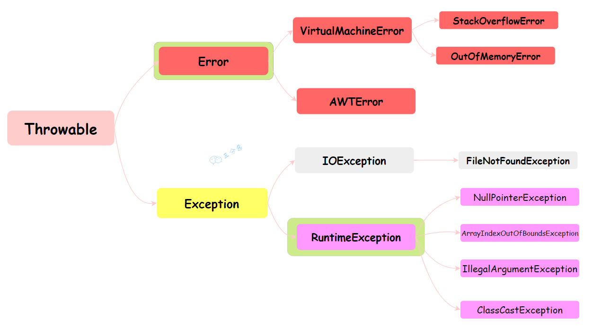
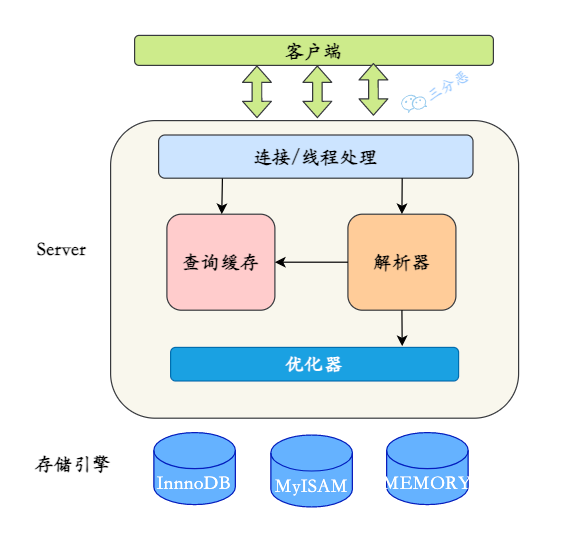

# 清单

好的,为您总结一下JAVA面试中常见的知识点和复习大纲:

## Java基础

### 基本数据类型

### 关键字

### 变量和常量

### 运算符

### 流程控制语句

### 注解

### 枚举

### 泛型

### 序列化

### 异常处理



### 面向对象概念

## Java核心类库

### String

### 集合框架(Collection、List、Set、Map等)

hashmap

1. 为什么HashMap的容量是2的幂次方？

(n - 1) & hash = hash % n 保证了hash值在n范围内，减少了hash冲突的概率。

2. 底层数据结构是什么？

HashMap的底层数据结构是数组+链表+红黑树。

3. 为什么HashMap的链表长度大于8且数组长度大于64时会转换为红黑树？

链表长度大于8时，链表的查询效率会变低，转换为红黑树可以提高查询效率。

4. 为什么链表转换红黑树的阈值是8？

泊松分布的一个特性，为8的概率已经非常小了。

5. 什么时候会扩容

当HashMap的size大于threshold时，会进行扩容，threshold = capacity * loadFactor。

例如：HashMap的默认容量是16，负载因子是0.75，那么threshold = 16 * 0.75 = 12，当HashMap的size大于12时，会进行扩容。


concurrent包下的集合类是线程安全的，适用于多线程环墋下的数据操作。

concurrentHashMap实现线程安全主要依靠以下三个方法：

一、使用volatile保证当Node中的值变化时对于其他线程是可见的
二、使用table数组的头结点作为synchronized的锁来保证写操作的安全
三、当头结点为null时，使用CAS操作来保证数据能正确的写入


### IO流

### 并发编程(线程、线程池、并发工具类)

### 网络编程

### 反射

### 代理

#### 静态代理

#### 动态代理

### 设计模式

## JVM

### 类加载机制

Bootstrap ClassLoader：启动类加载器，负责加载JDK中的核心类库，如rt.jar、resources.jar、charsets.jar等。

Extension ClassLoader：扩展类加载器，负责加载JDK的扩展目录中(%JAVA_HOME%/jre/lib/ext)的jar包。

AppClassLoader：应用程序类加载器，负责加载应用程序classpath目录下的类。

自定义类加载器：继承ClassLoader类，重写findClass方法，实现自定义的类加载器。

#### 双亲委派

双亲委派模型是指当一个类加载器收到类加载请求时，首先将请求委派给父类加载器，父类加载器再将请求委派给父类的父类加载器，依次递归，直到Bootstrap ClassLoader，如果父类加载器可以完成类加载任务，就成功返回，如果不能完成类加载任务，子类加载器才会尝试加载。

#### 缓存机制

类加载器在加载类的时候，会先检查缓存中是否已经加载过该类，如果已经加载过，直接返回缓存中的类，如果没有加载过，才会尝试加载类。

### 运行时内存结构


### 内存模型 JMM(JavaMemoryModel)


### 垃圾回收机制

JVM GC只回收堆和方法区内的基本类型数据和对象。

#### 堆内存结构


##### 新生代 (Young Generation)

年轻代又分 Eden 区和 Survivor 区，其中 Survivor 区又分 From 和 To 两个区。

1. 绝大多数新创建的对象会存放在Eden
2. 通过-Xmn设置新生代的大小
3. Eden区和Survivor区的比例通过-XX:SurvivorRatio设置
4. 默认情况下，新生代空间的分配：Eden : Fron : To = 8 : 1 : 1
5. 新创建的对象，是保存在Eden，经过一次Minor GC后，如果还存活，会被转移到Survivor区，经过多次GC后，如果还存活，会被转移到老年代

- 为什么需要Survior区？

1. 为了解决Eden区和老年代之间的对象拷贝问题，如果没有Survior区，那么每次GC都需要把Eden区和老年代之间的对象拷贝一遍，效率太低
2. 为了解决新生代中的对象晋升老年代的问题，如果没有Survior区，那么新生代中的对象只能在Eden区和老年代之间拷贝，这样会导致老年代中的对象过多，导致老年代GC效率低下

- 为什么有两个Survior区？

设置两个 Survivor 区最大的好处就是解决内存碎片化

1. 假设 Survivor 只有一个区域，那么每次 Minor GC 时，存活下来的对象都会被移动到这个 Survivor 区域，而 Eden 区域会被清空。而之前Survivor区域中的对象，如果还存活，那么就只有标记清除回收，而不是整理回收，这样会导致 Survivor 区域中的内存碎片化。

2. 如果有两个 Survivor 区域，所以每次 Minor GC，会将之前 Eden 区和 From 区中的存活对象复制到 To 区域。第二次 Minor GC 时，From 与 To 职责兑换，这时候会将 Eden 区和 To 区中的存活对象再复制到 From 区域，以此反复。

这种机制最大的好处就是，整个过程中，永远有一个 Survivor space 是空的，另一个非空的 Survivor space 是无碎片的。

##### 老年代（Old Generation）

1. 用于存放经过多次新生代GC任然存活的对象，-XX:MaxTenuringThreshold 来设置对象晋升老年代的阈值，默认为$15$，java -XX:+PrintFlagsFinal -version | grep MaxTenuringThreshold  查看默认的阈值

2. 用于存放大对象 -XX:PretenureSizeThreshold=1024 来设置大对象的阈值，超过这个值的对象直接分配到老年代 或者大的数组对象且数组中无引用关系

3. 动态对象年龄判断：如果Survivor区中相同年龄所有对象大小的总和大于Survivor区的一半，年龄大于或等于该年龄的对象可以直接进入老年代

老年代所占的内存大小为-Xmx对应的值减去-Xmn对应的值。

默认默认情况下，新生代（Young generation）、老年代（Old generation）所占空间比例为 1 : 2

##### 永久代/元空间

1. 用于存放类的元数据信息，1.8之前的版本中，永久代的大小通过-XX:MaxPermSize设置,1.8之后的版本中，元空间的大小通过-XX:MetaspaceSize设置
2. 用于存放字符串常量池，方法区等，持久代对垃圾回收没有显着影响，但是元空间会受到垃圾回收的影响

#### GC

顾名思义就是释放垃圾占用的空间，防止内存爆掉。那么需要搞清楚的是什么是垃圾，什么时候回收，怎么回收。

不同的区域，不同的收集器，触发GC的条件也不同，一般来说，GC分为四种类型：

Minor GC：只回收新生代区域。
Major GC：只回收老年代区域。只有CMS实现了Major GC，所以在老年代里，触发GC，除了CMS和G1之外的其他收集器，大多数触发的其实是 Full GC
Full GC： 回收整个堆区和方法区
Mixed GC：回收整个新生代和部分老年代。G1收集器实现了这个类型。

#### 怎么判断对象可以被回收呢？

1. 引用计数法：每个对象有一个引用计数器，当有一个引用指向对象时，计数器加1，引用失效时，计数器减1，当计数器为0时，说明对象不再被引用，可以被回收。
问题：无法解决循环引用的问题，比如A对象引用B对象，B对象引用A对象，这两个对象的引用计数器都不为0，但是实际上这两个对象都是不可达的。

2. 可达性分析法：通过一系列的GC Roots对象作为起始点，从这些节点开始向下搜索，搜索所走过的路径称为引用链，当一个对象到GC Roots没有任何引用链相连时，则证明此对象是不可用的。


GC Roots对象包括：

- 虚拟机栈中的引用（方法的参数、局部变量等）
- 本地方法栈中 JNI 的引用
- 类静态变量
- 运行时常量池中的常量（String 或 Class 类型）

#### Stop The World

"Stop The World"是 Java 垃圾收集中的一个重要概念。在垃圾收集过程中，JVM 会暂停所有的用户线程，这种暂停被称为"Stop The World"事件。

这么做的主要原因是为了防止在垃圾收集过程中，用户线程修改了堆中的对象，导致垃圾收集器无法准确地收集垃圾。

值得注意的是，"Stop The World"事件会对 Java 应用的性能产生影响。如果停顿时间过长，就会导致应用的响应时间变长，对于对实时性要求较高的应用，如交易系统、游戏服务器等，这种情况是不能接受的。

因此，在选择和调优垃圾收集器时，需要考虑其停顿时间。Java 中的一些垃圾收集器，如 G1 和 ZGC，都会尽可能地减少了"Stop The World"的时间，通过并发的垃圾收集，提高应用的响应性能。

总的来说，"Stop The World"是 Java 垃圾收集中必须面对的一个挑战，其目标是在保证内存的有效利用和应用的响应性能之间找到一个平衡。

#### 垃圾收集算法


在确定了对象是否可以被回收之后，就需要确定使用哪种垃圾收集器来回收这些对象。Java 中有很多种垃圾收集器，每种收集器都有自己的特点和适用场景。

但是如何高效的进行垃圾回收呢？这就需要了解垃圾收集算法。

##### 标记-清除算法

标记-清除算法(Mark-Sweep) 是最基础的垃圾回收算法，其主要分为两个阶段：

1. 先把内存区域中的这些对象进行标记，哪些属于可回收的标记出来（用前面提到的可达性分析法）
2. 然后进行清除，把标记的对象清除掉，释放内存空间


问题： 会产生内存碎片，导致大对象无法分配到连续的内存空间，从而导致频繁的GC

##### 复制算法

复制算法(Copying) 是为了解决标记-清除算法产生的内存碎片问题，其主要分为两个阶段：

1. 把内存区域分为两块，一块是存活对象的区域，一块是空闲区域
2. 把存活对象复制到空闲区域，然后清除原来的存活对象区域
3. 交换存活对象区域和空闲区域的角色


问题：浪费一半的内存空间

##### 标记-整理算法

标记-整理算法(Mark-Compact) 是为了解决复制算法浪费内存空间的问题，其主要分为三个阶段：

1. 先把内存区域中的这些对象进行标记，哪些属于可回收的标记出来
2. 让所有存活的对象都向一端移动，再清理掉端边界以外的内存区域。


问题：需要移动对象，内存变动更频繁，需要整理所有存活对象的引用地址，在效率上比复制算法差很多。

##### 分代收集算法

分代收集算法(Generational Collection) 是为了解决标记-清除算法、复制算法、标记-整理算法的问题，严格来说，分代收集算法并不是一种具体的垃圾回收算法，而是一种思想。


1. 把内存区域分为新生代和老年代，新生代每次垃圾收集时都发现有大批对象死去，只有少量存活，使用复制算法
2. 老年代每次垃圾收集时都发现有大量存活对象，使用标记-整理算法或者标记-清除算法
3. 根据对象的存活周期，把内存区域分为多个代，每个代使用不同的垃圾回收算法

#### 垃圾收集器

> 每一个回收器都存在Stop The World 的问题，只不过各个回收器在Stop The World 时间优化程度、算法的不同，可根据自身需求选择适合的回收器。
目前应用范围最广的，应该还是JDK8，它默认使用的是 Parallel Scavenge + Parallelo Old 收集器组合。


##### SerialOld

SerialOld 是 Serial 的老年代版本，是一个单线程的收集器，使用标记-整理算法，适用于单核 CPU 的环境。


##### Parallel

Parallel 收集器是一个多线程的收集器，使用复制算法，适用于多核 CPU 的环境。

- Parallel New：新生代收集器，使用复制算法，适用于多核 CPU 的环境， 可以配合CMS使用
- Parallel Scavenge：新生代收集器，使用复制算法，适用于多核 CPU 的环境
- Parallel Old：老年代收集器，使用标记-整理算法，适用于多核 CPU 的环境

##### CMS(Concurrent Mark Sweep)

CMS 是一种以获取最短回收停顿时间为目标的收集器，适用于对响应时间有要求的应用。

CMS之所以能实现低延迟，是因为它把垃圾搜集分成了几个明确的步骤，在一些耗时较长的阶段实现了用户线程和GC线程并发执行的能力。

用两次短暂的 Stop Tow World 来代替了其他收集器一整段长时间的 Stop Tow World。


可以通过-XX:CMSInitiatingOccupancyFraction 调整浮动垃圾回收阈值，当老年代使用率达到这个值时，会触发CMS回收。

##### G1(Garbage First)

G1 是一种面向服务端应用的垃圾收集器，适用于多核 CPU 和大内存的应用。

但它对堆（Java Heap）内存进行了重新布局，不再是简单的按照新生代、老年代分成两个固定大小的区域了，而是把堆区划分成很多个大小相同的区域（Region），新、老年代也不再固定在某个区域了。
每一个Region都可以根据运行情况的需要，扮演Eden、Survivor、老年代区域、或者Humongous区域。

大对象会被存储到Humongous区域，G1大多数情况下会把这个区域当作老年代来看待。如果对象占用空间超过Region的容量，就会存放到N个连续的 Humongous Region 中。


G1 收集器的设计理念是：实现一个停顿时间可控的低延迟垃圾收集器

- 运作流程：

1. 初始标记（initial mark，STW）：暂停所有的其他线程，并记录下gc roots直接能引用的对象，速度很快；
2. 并发标记（Concurrent Marking）：同CMS的并发标记，从根节点（GC Root）开始，顺着引用链遍历整个堆，找出存活的对象。这个步骤耗时较长，但用户线程可以和GC线程并发执行。
3. 最终标记（Remark，STW）：同CMS的重新标记
4. 筛选回收（Cleanup，STW）：筛选回收阶段首先对各个Region的回收价值和成本进行排序，根据用户所期望的GC停顿时间(可以用JVM参数 -XX:MaxGCPauseMillis指定)来制定回收计划

根据以上三个阶段标记完成的数据，计算出各个Region的回收价值和成本，再根据用户期望的停顿时间来决定要回收多少个Region。
回收使用的是复制算法，把需要回收的这些Region里存活的对象，复制到空闲的Region中，然后清理掉旧Region全部空间。
因为需要移动存活的对象，所以不可避免的要暂停用户线程，这个步骤支持多条线程并行回收。

- 优点：

并行与并发：G1能充分利用CPU、多核环境下的硬件优势，使用多个CPU（CPU或者CPU核心）来缩短Stop The-World停顿时间。
分代收集：虽然G1可以不需要其他收集器配合就能独立管理整个GC堆，但是还是保留了分代的概念。
空间整合：G1从整体来看是基于“标记整理”算法实现的收集器；从局部上来看是基于“复制”算法实现的
可预测的停顿：G1 除了求低停顿外，还能建立可预测的停顿时间模型，能让使用者明确指定在一个长度为M毫秒的时间片段(通过参数"-XX:MaxGCPauseMillis"指定)内完成垃圾收集。

- 缺点：

G1使用卡表处理跨代指针实现更为复杂，堆中每个Region，无论扮演的是新生代还是老年代角色，都必须有一份卡表，这导致G1的记忆集（和其他内存消耗）可能会占整个堆容量的20%乃至更多的内存空间，由于G1对写屏障的复杂操作需要消耗更多的运算资源，G1就不得不将其实现为类似于消息队列的结构，把写前屏障和写后屏障中要做的事情都放到队列里，然后再异步处理。

### 虚拟机参数调优

-Xms 初始堆大小 -X memory size
-Xmx 最大堆大小 -X memory max
-Xmn 新生代大小 -X memory new
-Xss 每个线程的堆栈大小 -X stack size
-XX:NewRatio 新生代和老年代的比例
-XX:SurvivorRatio Eden区和Survivor区的比例
-XX:MaxPermSize 永久代最大大小 1.8之前
-XX:MetaspaceSize 元空间大小 1.8之后
-XX:MaxMetaspaceSize 元空间最大大小 1.8之后
-XX:MaxTenuringThreshold 对象晋升老年代的阈值

## 框架/中间件

### Spring

#### IOC

#### AOP

AOP(Aspect Oriented Programming) 面向切面编程，是一种编程范式，它将横切关注点(如日志记录、性能监视、事务管理等)与核心业务逻辑分离，提高代码的模块化和可维护性。

##### 核心概念

- Aspect(切面)：一个横跨多个类的关注点的模块化。
- Joinpoint(连接点)：序执行过程中的一个点，例如方法执行或异常处理。
- Advice(通知)：切面在特定连接点采取的行动。
- Pointcut(切入点)：匹配连接点的断言
- Introduction(引入)：向现有类添加新方法或属性
- Target object(目标对象)：被一个或多个切面通知的对象，也被称为被通知对象。由于Spring AOP是通过使用运行时代理实现的，所以这个对象总是一个被代理的对象。
- AopProxy(代理)：AOP框架使用的对象，它包装了目标对象，并拦截方法调用以便执行通知。在Spring Framework中，AOP代理是一个JDK动态代理或CGLIB代理。
- Weaving(织入)：将切面与目标对象或类型关联起来创建通知对象的过程。

##### Spring AOP

Spring AOP基于代理模式，通过在目标对象周围创建代理对象来实现横切关注点的功能。当客户端调用目标对象的方法时，实际上是调用了代理对象的方法。代理对象在调用目标对象的方法之前或之后，执行与横切关注点相关的逻辑，比如日志记录、事务管理等。

Spring AOP主要有两种代理方式：基于JDK动态代理和基于CGLIB的动态代理。

基于JDK动态代理： 当目标对象实现了接口时，Spring AOP会使用JDK的动态代理来创建代理对象。JDK动态代理是通过java.lang.reflect.Proxy类来实现的，它要求目标对象必须实现接口。Spring AOP会动态地生成实现了相同接口的代理类，并在代理类的方法中添加横切逻辑。

基于CGLIB的动态代理： 当目标对象没有实现接口时，Spring AOP会使用CGLIB来创建代理对象。CGLIB是一个强大的字节码生成库，它可以在运行时动态地生成目标类的子类，并重写其中的方法来实现横切逻辑。

##### 过程讲解

看到上面的一堆概念，可能有点懵，下面通过一个例子来讲解Spring AOP的过程。分为两步，一 解析切面，二，创建动态代理，三，执行代理方法。

###### 解析切面

1. doCreateBean
2. postProcessBeforeInstantiation -> AbstractAutoProxyCreator#postProcessBeforeInstantiation
3. isInfrastructureClass -> AbstractAutoProxyCreator#isInfrastructureClass
4. shouldSkip -> AbstractAutoProxyCreator#shouldSkip
5. findCandidateAdvisors -> AbstractAdvisorAutoProxyCreator#findCandidateAdvisors
6. buildAspectJAdvisors -> BeanFactoryAspectJAdvisorsBuilderAdapter#buildAspectJAdvisors

###### 创建动态代理

1. doCreateBean
2. initializeBean
3. applyBeanPostProcessorsAfterInitialization
4. postProcessAfterInitialization -> AbstractAutoProxyCreator#postProcessAfterInitialization
5. wrapIfNecessary -> AbstractAutoProxyCreator#createProxy
6. getCustomTargetSource -> AbstractAutoProxyCreator#getCustomTargetSource
7. getAdvicesAndAdvisorsForBean -> AbstractAdvisorAutoProxyCreator#findEligibleAdvisors
8. createProxy
9. proxyFactory.addAdvisors(advisors)

###### 执行代理方法

###### 事务

Spring事务管理主要有两种方式：编程式事务管理和声明式事务管理。

编程式事务管理：通过编程的方式来管理事务，需要手动控制事务的开始、提交、回滚和关闭。

声明式事务管理：通过配置的方式来管理事务，不需要手动控制事务的开始、提交、回滚和关闭。

声明式事务原理:

第一步，在Bean初始化阶段创建代理对象；

Spring 容器在初始化单例`Bean`的时候，会遍历所有的 BeanPostProcessor 实现类，并执行其 postProcessAfterInitialization 方法。

在执行 postProcessAfterInitialization 方法时会遍历容器中所有的切面，查找与当前`Bean`匹配的切面，这里会获取事务的属性切面，也就是`@Transactional`注解及其属性值。

然后根据得到的切面创建一个代理对象，默认使用JDK动态代理创建代理，如果目标类是接口，则使用 JDK 动态代理，否则使用 Cglib。

如果已经是代理对象，则添加到代理对象的拦截器链中。

第二步，执行代理对象的方法时进行事务增强操作；


事务增强对该接口的实现为TransactionInterceptor

@Transactional注解是Spring提供的声明式事务管理的方式，通过在方法上添加@Transactional注解，可以实现对方法的事务管理。

@Transactional失效场景

1. 数据库引擎不支持事务, 如MyISAM
2. 没有被Spring管理的Bean, 事务是基于AOP实现的, 只对Spring管理的Bean有效
3. 数据源没有配置事务管理器,需要配置事务管理器
4. 方法不是public的, 事务是基于AOP实现的, 只对public方法有效
5. 同一个类中的方法调用, 事务是基于AOP实现的, 因为只有事务方法被当前类以外的代码调用时，才会由`Spring`生成的代理对象来管理。
6. 异常被捕获, 事务是基于AOP实现的, 需要异常抛出才有效,默认只对RuntimeException进行回滚
7. propagation设置错误，需要根据业务场景设置正确的传播行为

### spring boot

@SpringBootApplication：Spring Boot的启动类，用于标记一个主程序类，说明这是一个Spring Boot应用。包含以下三个注解：

@SpringBootConfiguration：Spring Boot的配置类，用于替代传统的xml配置文件。
@ComponentScan：Spring的组件扫描，用于扫描指定包下的所有组件。
@EnableAutoConfiguration：Spring Boot的自动配置，用于自动配置Spring应用。

#### 自动装配

`@EnableAutoConfiguration`，简化配置，提供了很多开箱即用的功能。约定大于配置。

```java
public String[] selectImports(AnnotationMetadata annotationMetadata) {
    if (!isEnabled(annotationMetadata)) {
        return NO_IMPORTS;
    }
    try {
        AutoConfigurationMetadata autoConfigurationMetadata = AutoConfigurationMetadataLoader
.loadMetadata(this.beanClassLoader);
        // 获取启动类上的注解属性，可能包含exclude属性，用于排除自动配置类
        AnnotationAttributes attributes = getAttributes(annotationMetadata);
        // 从META-INF/spring.factories中获取所有的自动配置类
        List<String> configurations = getCandidateConfigurations(annotationMetadata,
                attributes);
        // 移除配置列表中的重复项，确保每个自动配置类只被考虑一次。
        configurations = removeDuplicates(configurations);
        // 排序配置列表，确保具有相同优先级的配置类的顺序保持不变。
        configurations = sort(configurations, autoConfigurationMetadata);
        // 从配置列表中排除指定的自动配置类
        Set<String> exclusions = getExclusions(annotationMetadata, attributes);
        // 检查排除的自动配置类是否存在于配置列表中，是否有无效的排除类，如果有则抛出异常
        checkExcludedClasses(configurations, exclusions);
        // 从候选配置中移除排除的类
        configurations.removeAll(exclusions);
        configurations = filter(configurations, autoConfigurationMetadata);
        // 触发自动配置导入事件，用于监听自动配置导入的事件
        fireAutoConfigurationImportEvents(configurations, exclusions);
        // 
        return configurations.toArray(new String[configurations.size()]);
    }
    catch (IOException ex) {
        throw new IllegalStateException(ex);
    }
}
```

#### 按需装配

@ConditionalOnClass：当类路径下有指定的类时，才会创建当前的Bean。
@ConditionalOnMissingClass：当类路径下没有指定的类时，才会创建当前的Bean。
@ConditionalOnBean：当容器中有指定的Bean时，才会创建当前的Bean。
@ConditionalOnMissingBean：当容器中没有指定的Bean时，才会创建当前的Bean。
@ConditionalOnProperty：当指定的属性有指定的值时，才会创建当前的Bean。
@ConditionalOnExpression：基于SpEL表达式的条件判断，只有满足条件时才会创建当前的Bean。
@ConditionalOnWebApplication：当项目是Web项目时，才会创建当前的Bean。
@ConditionalOnNotWebApplication：当项目不是Web项目时，才会创建当前的Bean。
@ConditionalOnResource：当类路径下有指定的资源时，才会创建当前的Bean。
@ConditionalOnJndi：当JNDI存在指定的项时，才会创建当前的Bean。
@ConditionalOnJava：当JVM版本满足指定的要求时，才会创建当前的Bean。

@EnableConfigurationProperties 用于开启对@ConfigurationProperties注解配置Bean的支持。
@ConfigurationProperties 用于将配置文件中的配置映射到实体类中。

以Redis为例，Spring Boot提供了`spring-boot-starter-data-redis`依赖，只需要在`application.properties`中配置Redis的连接信息，然后在需要使用Redis的地方注入`RedisTemplate`即可。

1. 在spring-boot-autoconfigure，定义了Redis的自动配置类`RedisAutoConfiguration`，并在META-INF/spring.factories中配置了自动配置类org.springframework.boot.autoconfigure.data.redis.RedisAutoConfiguration
2. RedisAutoConfiguration进行自动配置，创建了`RedisTemplate`、`StringRedisTemplate`

```java
@Configuration(proxyBeanMethods = false)
@ConditionalOnClass(RedisOperations.class)
@EnableConfigurationProperties(RedisProperties.class)
@Import({ LettuceConnectionConfiguration.class, JedisConnectionConfiguration.class })
public class RedisAutoConfiguration {

    @Bean
    @ConditionalOnMissingBean(name = "redisTemplate")
    @ConditionalOnSingleCandidate(RedisConnectionFactory.class)
    public RedisTemplate<Object, Object> redisTemplate(RedisConnectionFactory redisConnectionFactory) {
        RedisTemplate<Object, Object> template = new RedisTemplate<>();
        template.setConnectionFactory(redisConnectionFactory);
        return template;
    }

    @Bean
    @ConditionalOnMissingBean
    @ConditionalOnSingleCandidate(RedisConnectionFactory.class)
    public StringRedisTemplate stringRedisTemplate(RedisConnectionFactory redisConnectionFactory) {
        return new StringRedisTemplate(redisConnectionFactory);
    }

}
```

#### 总结

SpringBoot 中的自动装配原理主要基于以下几个关键点:

```@EnableAutoConfiguration``` 注解
@EnableAutoConfiguration 是 SpringBoot 自动装配的核心注解。它通过 @Import(AutoConfigurationImportSelector.class) 导入了一个自动配置导入选择器。
```AutoConfigurationImportSelector```
AutoConfigurationImportSelector 实现了接口 DeferredImportSelector，它负责加载自动配置类。
它会扫描 META-INF/spring.factories 文件中配置的所有自动配置类(org.springframework.boot.autoconfigure.EnableAutoConfiguration 下的配置)，并将它们引入到应用程序中。
```SpringFactoriesLoader```
SpringFactoriesLoader 是一个 Spring 框架用于加载外部资源的工具类。它会扫描所有 jar 包中的 META-INF/spring.factories 文件,获取相应的配置类。
```xxxAutoConfiguration```
以 AutoConfiguration 结尾的配置类就是自动配置类。它们通过注解 @Configuration、@ConditionalOnXXX等条件装配注解,实现自动配置的判断和装配。
例如:

@ConditionalOnClass：当classpath中存在指定的类时,该配置才会被引入。
@ConditionalOnMissingBean：只有当容器中没有指定的Bean时,该配置才会被引入。
@ConditionalOnProperty：根据配置的属性值进行判断,符合条件时引入配置。

自动装配的整体执行流程:

当 SpringBoot 应用启动时,会加载`@EnableAutoConfiguration`注解导入的 AutoConfigurationImportSelector。
AutoConfigurationImportSelector 通过`SpringFactoriesLoader`加载 META-INF/spring.factories 中指定的自动配置类。
通过判断每个自动配置类上的`@Conditional`注解条件,决定是否将它们加入 IOC 容器中。
对于符合条件的配置类,SpringBoot 会解析它们的依赖关系,创建所需的 Bean。

这样SpringBoot就实现了开箱即用的目标,省去了繁琐的配置过程,极大地简化了应用程序的开发。

### Mybatis

#### 一级、二级缓存

一级缓存：存储作用域为 SqlSession，当SqlSession关闭或提交时，缓存失效。当 Session flush 或 close 之后，该 SqlSession 中的所有 Cache 就将清空，MyBatis 默认打开一级缓存。

二级缓存：存储作用域为 Mapper，多个 SqlSession 共享，当 SqlSession 关闭或提交时，缓存不会失效。MyBatis 默认不开启二级缓存，需要在配置文件中配置。

#### 原理

- XmlConfigBuilder#parseConfiguration 解析配置文件，创建`Configuration`对象，其中包含了所有的配置信息。
- SqlSessionFactoryBuilder#build 创建`SqlSessionFactory`对象，其中包含了所有的`Mapper` 接口和对应的`MapperProxyFactory`对象。
- SqlSessionManager#openSession 创建`SqlSession`对象，其中包含了`Executor`对象，用于执行SQL语句。

#### 组件

- Configuration：MyBatis的配置类，包含了所有的配置信息。
- SqlSessionFactory：MyBatis的工厂类，用于创建SqlSession对象。
- SqlSession：MyBatis的会话类，用于执行SQL语句。
- Executor：MyBatis的执行器，用于执行SQL语句。
- StatementHandler：MyBatis的语句处理器，用于处理SQL语句。
- ParameterHandler：MyBatis的参数处理器，用于处理SQL语句的参数。
- TypeHandler：MyBatis的类型处理器，用于处理Java类型和数据库类型之间的转换。
- ResultSetHandler：MyBatis的结果集处理器，用于处理SQL语句的结果集。


#### 整体流程


#### mapper接口

为什么mapper接口不需要实现类？

动态代理


- MapperProxyFactory：Mapper接口的代理工厂，用于创建Mapper接口的代理对象。
- MapperProxy：Mapper接口的代理对象，用于执行Mapper接口的方法。
- MapperMethod：Mapper接口的方法，用于执行Mapper接口的SQL语句。

#### 执行器

- SimpleExecutor：简单执行器，用于执行SQL语句。
- BatchExecutor：批量执行器，用于执行批量SQL语句。
- ReuseExecutor：重用执行器，用于重用SQL语句。

#### 插件原理

- Interceptor：MyBatis的插件接口，用于创建MyBatis的插件。

### Netty

- 建立连接
当一个客户端发起连接请求时,Netty的NioEventLoopGroup会分配一个NioEventLoop去监听新连接事件。当连接被接受后,对应的NioSocketChannel会被初始化并注册到NioEventLoop上。
- 事件循环(EventLoop)
Netty是基于事件驱动模型的,所有的IO操作都是由EventLoop负责监听和处理。一旦NioSocketChannel注册到EventLoop上,EventLoop就会不断循环执行NioSocketChannel上的事件。
- Pipeline和ChannelHandler
对于每一个新接受的NioSocketChannel,Netty会为其初始化一个ChannelPipeline,它持有一组ChannelHandler实例。当有新事件到达时,事件会从ChannelPipeline的头部开始传递,并依次被ChannelHandler所处理。
- 解码
针对不同的协议,Netty提供了多种编解码器ChannelHandler。对于HTTP请求,常见的编解码器有HttpRequestDecoder和HttpResponseEncoder。编解码器负责将原始的ByteBuf解码为对应的HTTP请求/响应对象。
- 处理请求
解码后的HTTP请求对象会传递到自定义的ChannelInboundHandler中进行具体的业务逻辑处理。可以在这一步完成路由分发、参数解析、访问数据库等操作。
- 编码
业务逻辑处理完毕后,需要将响应数据编码为ByteBuf。编码的过程与解码相反,需要经过HttpResponseEncoder等编码器。
- 发送响应
编码后的ByteBuf会通过NioSocketChannel发送回客户端。如果设置为长连接,NioSocketChannel会继续监听下一个请求事件。
- 关闭连接
当请求处理完毕,如果是短连接,连接会自动关闭。否则连接会保持开放状态直到超时或被主动关闭。

### Dubbo/Zookeeper  

### Kafka/RabbitMQ等

基础架构

- 生产者Producer：负责生产消息，发送消息到Broker。
- 消费者Consumer：负责消费消息，从Broker拉取消息。
- Broker：消息中间件，负责存储消息，转发消息。
  - broker就是kafka Server, 一个broker就是一个kafka实例
  - broker中包含多个partition
  - partition中包含多个segment file
- Topic：消息主题，用于区分不同的消息。逻辑概念，一个topic可以有多个partition。
- zookeeper：用于服务注册和发现, 用于协调分布式服务, 负责Broker的状态，Partition的分配。
  
持久化

partition中的数据是持久化的，每条消息根据分区规则路由到对应的partition中，然后写入到segment file中。追加写入。
partition的副本可以分布在不同的broker上，保证数据的高可用性。
partition的消息是顺序写入磁盘且有序的，但是不同partition之间的消息是无序的。
partition的个数最好是broker的个数的整数倍，这样可以保证partition的均匀分布。

segment file

每个partition中包含多个segment file，每个segment file包含一个index file和一个log file。
index file用于存储消息的offset和物理地址，log file用于存储消息的内容。

offset

current offset： 保存在Consumer端，表示下一次要读取的消息的offset。
Committed offset：保存在Broker端，表示已经被消费的消息的offset。

1. 怎么保证消息的可靠性？

- 生产者发送消息时，会等待Broker的ACK，Broker接收到消息后会返回ACK，表示消息已经成功写入到磁盘。
- 消费者消费消息后，会向Broker发送ACK，Broker接收到ACK后会更新Committed offset，表示消息已经被消费。

all：所有的副本都写入成功，才返回ACK。
0：不等待ACK，直接返回ACK。
1：只需要一个副本写入成功，就返回ACK。

1. 怎么保证消息的顺序性？

- 每个partition中的消息是有序的，但是不同partition之间的消息是无序的。
- 生产者发送消息时，可以指定key，相同key的消息会被发送到同一个partition中，保证消息的顺序性。
- 消费者消费消息时，可以指定Consumer Group，同一个Consumer Group中的Consumer会消费同一个partition中的消息，保证消息的顺序性。

### 缓存应用(Redis、Memcached)

## 数据库



### SQL语句

### 索引

#### 索引类型

- 普通索引：最基本的索引，没有任何限制。
- 唯一索引：索引列的值必顽唯一，但允许有空值。
- 主键索引：唯一索引的一种特殊类型，不允许有空值。
- 全文索引：对文本的内容进行索引，适用于大文本字段。
- 组合索引：多个列组合在一起创建的索引，适用于多个列的查询。

#### 索引原理

- B+树：是一种多路搜索树，每个节点最多有M个子节点，每个非叶子节点最多有M-1个关键字，每个非叶子节点的子节点数比关键字数多一个。
- Hash索引：是一种哈希表，适用于等值查询，不适用于范围查询。
- 全文索引：是一种倒排索引，适用于文本的内容查询。

### 数据库事务

- 原子性，undo log
- 一致性
- 隔离性, mvcc
- 持久性, redo log

#### 隔离的四大级别

- 读未提交（Read Uncommitted）：允许脏读，一个事务可以读取另一个未提交事务的数据。
- 读提交（Read Committed）：允许不可重复读，一个事务只能读取到另一个事务已经提交的数据。
- 可重复读（Repeatable Read）：允许幻读，一个事务在读取数据的时候，另一个事务不能对数据进行修改。 select for update , select * from table lock in share mode
- 串行化（Serializable）：最高的隔离级别，所有事务都是串行执行的，可以避免脏读、不可重复读、幻读。

#### MVCC

MVCC(Multi-Version Concurrency Control) 是一种并发控制机制，用于实现数据库的事务隔离级别。

- 锁

- 隐藏字段

DB_TRX_ID：最新插入或更新的事务ID
DB_ROLL_PTR：回滚指针，指向undo log中的回滚段
DB_ROW_ID：行ID，用于唯一标识一行数据

- Read View：

在InnoDB存储引擎中，每个事务都有一个Read View，用于判断事务是否可以读取数据。Read View包含以下信息：

- create_trx_id：事务开始时的事务ID
- low_limit_id：当前活跃的最小事务ID
- up_limit_id：下一个将要分配的事务ID
- m_ids：当前活跃的事务ID集合(未提交)

读取规则：

1. 如果被访问的版本事务ID等于当前创建视图的事务ID，则意味着读取自己当前事务的数据，可以被访问。
2. 如果被访问的版本事务ID小于当前活跃的最小事务ID，则意味着读取的是在视图生成前已提交的数据，可以被访问。
3. 如果被访问的版本事务ID大于下一个将要分配的事务ID，则意味着读取的是在视图生成后提交的数据，不能被访问。
4. 如果被访问的版本事务ID介于当前活跃的最小事务ID和下一个将要分配的事务ID之间：
    4.1 如果被访问的版本事务ID在当前活跃的事务ID集合中，则意味着读取的是未提交的数据，不能被访问。
    4.2 如果被访问的版本事务ID不在当前活跃的事务ID集合中，则意味着读取的是已提交的数据，可以被访问。
5. 如果不可被当前事务访问，则遍历版本链，直到找到可被访问的版本。

Read Committed，每次读取数据时，都会生成一个新的Read View。
Repeatable Read，只在事务开始时生成一个Read View。

#### 日志

- binlog   二进制日志  记录所有的DDL和DML操作，记录的是逻辑`SQL`语句，用于主从复制
- redo log 事务提交  崩溃恢复 innoDB存储引擎独有
- undo log 事务回滚  事务回滚 innoDB存储引擎独有
- slow query log 慢查询日志
- error log 错误日志

两阶段提交


#### 锁

- 共享锁（S Lock）：允许多个事务同时对同一数据行进行读取操作，但不允许有其他事务对该数据行进行写入操作。
- 排他锁（X Lock）：只允许一个事务对数据行进行写入操作，其他事务不能对该数据行进行读取或写入操作。

- 表锁：对整个表进行加锁，会影响整个表的读写操作。
- 行锁：对数据行进行加锁，只会影响到被锁定的数据行。
- 间隙锁：对数据行之间的间隙进行加锁，可以防止其他事务在间隙中插入数据。

- 乐观锁：通过版本号或时间戳来实现，不会对数据行进行加锁，而是在更新数据时检查数据的版本号或时间戳，如果与预期不符，则认为数据已经被其他事务修改，需要回滚。
- 悲观锁：通过对数据行进行加锁来实现，可以防止其他事务对数据行进行读取或写入操作。

#### 分页优化

数据量大时，使用limit offset分页会导致性能问题，可以使用Seek方法或者延迟关联进行分页优化。

- Seek方法：通过记录上一次查询的最后一行的某个值，然后下一次查询从这个值开始，避免了扫描大量不需要的行。

```sql
SELECT * FROM table WHERE id > ? ORDER BY id LIMIT 10
```

- 延迟关联：先查询主表的ID，然后再查询关联表的数据，避免了一次性查询所有数据。

```sql
SELECT id FROM table LIMIT 10
SELECT * FROM table2 WHERE id IN (...)
```

#### 索引优化

- 索引覆盖：通过索引来覆盖查询的字段，避免了回表查询。

- 避免使用`SELECT *`，只查询需要的字段。

- 避免使用!=或<>，会导致索引失效。

- 适当使用前缀索引，可以减少索引的存储空间。

- 适当使用联合索引，可以减少索引的数量。

- 避免使用函数或表达式，会导致索引失效。

- 小表驱动大表，先查询小表，再查询大表。

- 适当增加冗余字段，可以减少关联查询。

##### 执行计划

explain


- id：查询的标识符
- select_type：查询的类型，有SIMPLE、PRIMARY、SUBQUERY、DERIVED、UNION、UNION RESULT等。
- table：查询的表
- type：查询的类型，性能从好到差依次是：system > const > eq_ref > ref > range > index > all

system：表只有一行记录（等于系统表）
const：通过索引一次就找到了
eq_ref：唯一性索引扫描，对于每个索引键，表中只有一条记录与之匹配
ref：非唯一性索引扫描，返回匹配某个单独值的所有行
range：只检索给定范围的行，使用一个索引来选择行
index：遍历索引树
all：全表扫描，效率最低

- possible_keys：可能使用的索引
- key：实际使用的索引
- key_len：索引字段的长度
- ref：匹配的索引字段
- rows：扫描的行数, 估算值,越少越好
- Extra：额外的信息

Using index：表示使用了覆盖索引
Using where：表示使用了where条件
Using temporary：表示使用了临时表

为什么索引会加快查询速度？

数据库文件时存储在磁盘上的，当查询数据时，需要从磁盘中读取数据到内存中，然后再进行查询。如果没有索引，需要扫描整个表，将数据全部读取到内存中，然后再进行查询。如果有索引，可以直接通过索引来定位到数据的位置，然后再读取数据到内存中，这样就可以减少磁盘的IO操作，提高查询的速度。

为什么数据库索引采用 B+ 树，而不是平衡二叉搜索树？

1. B+ 树的查询效率更高：B+ 树的高度更低，每个节点可以存储更多的索引，可以减少磁盘的IO操作。
2. B+ 树的范围查询更方便：B+ 树的叶子节点是有序的，可以方便的进行范围查询。

## 计算机基础

### 数据结构与算法

### 计算机网络

### 操作系统

## 项目/工作相关

### 自己参与的项目

### 遇到的难题及解决方案

#### 延迟调度

##### 任务注册

- 任务ID 任务唯一标识 雪花算法

```java
/**
 * 雪花算法
    * 1位符号位，固定为0 正数
    * 41位时间戳，毫秒级 时间戳差值 = 当前时间戳 - 开始时间戳
    * 10位机器ID 随机数  
    * 12位序列号 每毫秒内的自增序列 0-4095
    * 
 */
 return ((timestamp - twepoch) << timestampLeftShift) //
                | (datacenterId << datacenterIdShift) //
                | (workerId << workerIdShift) //
                | sequence;
```

- 任务延迟时间最小1000ms


##### 任务调度

RateLimiter 限流 每秒2000

1. 注册请求入队，唤醒任务分发线程，同步任务到其他机房
2. 任务分发线程从队列中取出任务
   1. 任务触发时间为120分钟内的放入时间轮和入库，超过120分钟的直接进入库队列
   2. 内存保护，每5秒定时查看时间轮的内存占用，超过比例和允许的任务，50%时60分钟，60%时30分钟，70%时20分钟，80%时10分钟
   3. 时间轮最大内存，系统启动时计算，最大JVM内存的1/2

3. 任务入库

@PreDestroy 保证队列数据全部入库后销毁
redis防止重复入库
主数据任务ID+执行时间入库Mysql
任务详细数据写入mongoDb

4. 时间轮 netty

时间轮是以时间作为刻度组成的一个环形队列，所以叫做时间轮。这个环形队列采用数组来实现HashedWheelBucket[]，数组的每个元素称为槽，每个槽可以存放一个定时任务列表，叫HashedWheelBucket，它是一个双向链表，链表的每个节点表示一个定时任务项（HashedWheelTimeout），其中封装了真正的定时任务TimerTask。

时间轮由多个时间格组成，每个时间格代表当前时间轮的基本时间跨度（ticketDuration），其中时间轮的时间格的个数是固定的。

时间轮任务，当前节点为master节点，则进入触发队列。

5. 任务分发

拉取触发队列的任务，批量投递kafka, 投递失败加入补偿队列，重复投递

6. 任务扫描

开启定时延迟线程，每5分钟扫描近期30/20/10分钟任务，加入时间轮。

##### 任务执行

消费kafka消息，进行任务投递，dubbo调用,http调用,kafka调用,记录调用结果，失败重新加入任务调度，重试次数+1，超过重试次数或者超时时间，放弃。

##### 自写选主

zookeeper选主，选主成功后，开启定时任务，每隔5秒检查主节点是否存活，如果主节点挂掉，重新选主。

1. 监听对应path, 本地维护所有触发节点
2. 提供放弃选主接口
3. 初始化选主成功后，调用其他节点的放弃选主接口，并标记本机为master, 维护时间轮起始位置，记录zk
4. 心跳保持将本机时间轮起始位置写入zk

zookeeper断连处理

1. 提供http接口，返回本机是否为master
2. zk断连时，本机为master，开启定时任务，每500ms异步询问其他节点是否为master，如果有master节点，放弃Master身份，持续10s，如果没有master节点，保持Master身份.

触发器关机处理

保证各队列数据全部入库后。

执行器关机处理

先停止kafka消费，尽量保证在途任务执行完毕，再停止执行器。

#### 配置中心

提供Spring boot starter能力，开箱即用

继承 PropertyPlaceholderConfigurer

1. 拉取配置
2. 写入本地文件
3. 重写processProperties方法 保存需要动态刷新的bean信息
4. 定时线程拉取配置，比较配置是否有变化，有变化则刷新bean