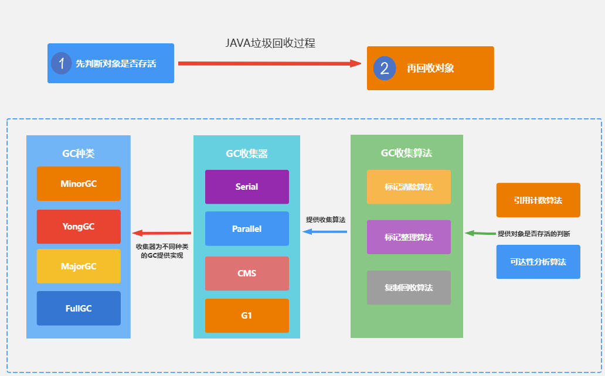

# 清单

好的,为您总结一下JAVA面试中常见的知识点和复习大纲:

## Java基础

### 基本数据类型

### 关键字

### 变量和常量

### 运算符

### 流程控制语句

### 面向对象概念

## Java核心类库

### String

### 集合框架(Collection、List、Set、Map等)

### IO流

### 并发编程(线程、线程池、并发工具类)

### 网络编程

### 反射

### 设计模式

## JVM

### 类加载机制

### 运行时内存结构

### 内存模型 JMM(JavaMemoryModel)

### 垃圾回收机制

JVM GC只回收堆和方法区内的基本类型数据和对象。

#### 堆内存结构

##### 新生代 (Young Generation)

年轻代又分 Eden 区和 Survivor 区，其中 Survivor 区又分 From 和 To 两个区。

1. 绝大多数新创建的对象会存放在Eden
2. 通过-Xmn设置新生代的大小
3. Eden区和Survivor区的比例通过-XX:SurvivorRatio设置
4. 默认情况下，新生代空间的分配：Eden : Fron : To = 8 : 1 : 1
5. 新创建的对象，是保存在Eden，经过一次Minor GC后，如果还存活，会被转移到Survivor区，经过多次GC后，如果还存活，会被转移到老年代

- 为什么需要Survior区？

1. 为了解决Eden区和老年代之间的对象拷贝问题，如果没有Survior区，那么每次GC都需要把Eden区和老年代之间的对象拷贝一遍，效率太低
2. 为了解决新生代中的对象晋升老年代的问题，如果没有Survior区，那么新生代中的对象只能在Eden区和老年代之间拷贝，这样会导致老年代中的对象过多，导致老年代GC效率低下

- 为什么有两个Survior区？

设置两个 Survivor 区最大的好处就是解决内存碎片化

1. 假设 Survivor 只有一个区域，那么每次 Minor GC 时，存活下来的对象都会被移动到这个 Survivor 区域，而 Eden 区域会被清空。而之前Survivor区域中的对象，如果还存活，那么就只有标记清除回收，而不是整理回收，这样会导致 Survivor 区域中的内存碎片化。

2. 如果有两个 Survivor 区域，所以每次 Minor GC，会将之前 Eden 区和 From 区中的存活对象复制到 To 区域。第二次 Minor GC 时，From 与 To 职责兑换，这时候会将 Eden 区和 To 区中的存活对象再复制到 From 区域，以此反复。

这种机制最大的好处就是，整个过程中，永远有一个 Survivor space 是空的，另一个非空的 Survivor space 是无碎片的。

##### 老年代（Old Generation）

1. 用于存放经过多次新生代GC任然存活的对象，-XX:MaxTenuringThreshold 来设置对象晋升老年代的阈值，默认为$15$，java -XX:+PrintFlagsFinal -version | grep MaxTenuringThreshold  查看默认的阈值

2. 用于存放大对象 -XX:PretenureSizeThreshold=1024 来设置大对象的阈值，超过这个值的对象直接分配到老年代 或者大的数组对象且数组中无引用关系

3. 动态对象年龄判断：如果Survivor区中相同年龄所有对象大小的总和大于Survivor区的一半，年龄大于或等于该年龄的对象可以直接进入老年代

老年代所占的内存大小为-Xmx对应的值减去-Xmn对应的值。

默认默认情况下，新生代（Young generation）、老年代（Old generation）所占空间比例为 1 : 2

##### 永久代/元空间

1. 用于存放类的元数据信息，1.8之前的版本中，永久代的大小通过-XX:MaxPermSize设置,1.8之后的版本中，元空间的大小通过-XX:MetaspaceSize设置
2. 用于存放字符串常量池，方法区等，持久代对垃圾回收没有显着影响，但是元空间会受到垃圾回收的影响

#### GC

顾名思义就是释放垃圾占用的空间，防止内存爆掉。那么需要搞清楚的是什么是垃圾，什么时候回收，怎么回收。

不同的区域，不同的收集器，触发GC的条件也不同，一般来说，GC分为四种类型：

Minor GC：只回收新生代区域。
Major GC：只回收老年代区域。只有CMS实现了Major GC，所以在老年代里，触发GC，除了CMS和G1之外的其他收集器，大多数触发的其实是 Full GC
Full GC： 回收整个堆区和方法区
Mixed GC：回收整个新生代和部分老年代。G1收集器实现了这个类型。

#### 怎么判断对象可以被回收呢？

1. 引用计数法：每个对象有一个引用计数器，当有一个引用指向对象时，计数器加1，引用失效时，计数器减1，当计数器为0时，说明对象不再被引用，可以被回收。
问题：无法解决循环引用的问题，比如A对象引用B对象，B对象引用A对象，这两个对象的引用计数器都不为0，但是实际上这两个对象都是不可达的。

2. 可达性分析法：通过一系列的GC Roots对象作为起始点，从这些节点开始向下搜索，搜索所走过的路径称为引用链，当一个对象到GC Roots没有任何引用链相连时，则证明此对象是不可用的。

GC Roots对象包括：

- 虚拟机栈中的引用（方法的参数、局部变量等）
- 本地方法栈中 JNI 的引用
- 类静态变量
- 运行时常量池中的常量（String 或 Class 类型）

#### Stop The World

"Stop The World"是 Java 垃圾收集中的一个重要概念。在垃圾收集过程中，JVM 会暂停所有的用户线程，这种暂停被称为"Stop The World"事件。

这么做的主要原因是为了防止在垃圾收集过程中，用户线程修改了堆中的对象，导致垃圾收集器无法准确地收集垃圾。

值得注意的是，"Stop The World"事件会对 Java 应用的性能产生影响。如果停顿时间过长，就会导致应用的响应时间变长，对于对实时性要求较高的应用，如交易系统、游戏服务器等，这种情况是不能接受的。

因此，在选择和调优垃圾收集器时，需要考虑其停顿时间。Java 中的一些垃圾收集器，如 G1 和 ZGC，都会尽可能地减少了"Stop The World"的时间，通过并发的垃圾收集，提高应用的响应性能。

总的来说，"Stop The World"是 Java 垃圾收集中必须面对的一个挑战，其目标是在保证内存的有效利用和应用的响应性能之间找到一个平衡。

#### 垃圾收集算法

在确定了对象是否可以被回收之后，就需要确定使用哪种垃圾收集器来回收这些对象。Java 中有很多种垃圾收集器，每种收集器都有自己的特点和适用场景。

但是如何高效的进行垃圾回收呢？这就需要了解垃圾收集算法。

##### 标记-清除算法

标记-清除算法(Mark-Sweep) 是最基础的垃圾回收算法，其主要分为两个阶段：

1. 先把内存区域中的这些对象进行标记，哪些属于可回收的标记出来（用前面提到的可达性分析法）
2. 然后进行清除，把标记的对象清除掉，释放内存空间

问题： 会产生内存碎片，导致大对象无法分配到连续的内存空间，从而导致频繁的GC

##### 复制算法

复制算法(Copying) 是为了解决标记-清除算法产生的内存碎片问题，其主要分为两个阶段：

1. 把内存区域分为两块，一块是存活对象的区域，一块是空闲区域
2. 把存活对象复制到空闲区域，然后清除原来的存活对象区域
3. 交换存活对象区域和空闲区域的角色

问题：浪费一半的内存空间

##### 标记-整理算法

标记-整理算法(Mark-Compact) 是为了解决复制算法浪费内存空间的问题，其主要分为三个阶段：

1. 先把内存区域中的这些对象进行标记，哪些属于可回收的标记出来
2. 让所有存活的对象都向一端移动，再清理掉端边界以外的内存区域。

问题：需要移动对象，内存变动更频繁，需要整理所有存活对象的引用地址，在效率上比复制算法差很多。

##### 分代收集算法

分代收集算法(Generational Collection) 是为了解决标记-清除算法、复制算法、标记-整理算法的问题，严格来说，分代收集算法并不是一种具体的垃圾回收算法，而是一种思想。

1. 把内存区域分为新生代和老年代，新生代每次垃圾收集时都发现有大批对象死去，只有少量存活，使用复制算法
2. 老年代每次垃圾收集时都发现有大量存活对象，使用标记-整理算法或者标记-清除算法
3. 根据对象的存活周期，把内存区域分为多个代，每个代使用不同的垃圾回收算法

#### 垃圾收集器

> 每一个回收器都存在Stop The World 的问题，只不过各个回收器在Stop The World 时间优化程度、算法的不同，可根据自身需求选择适合的回收器。
目前应用范围最广的，应该还是JDK8，它默认使用的是 Parallel Scavenge + Parallelo Old 收集器组合。

##### SerialOld

SerialOld 是 Serial 的老年代版本，是一个单线程的收集器，使用标记-整理算法，适用于单核 CPU 的环境。

##### Parallel

Parallel 收集器是一个多线程的收集器，使用复制算法，适用于多核 CPU 的环境。

- Parallel New：新生代收集器，使用复制算法，适用于多核 CPU 的环境， 可以配合CMS使用
- Parallel Scavenge：新生代收集器，使用复制算法，适用于多核 CPU 的环境
- Parallel Old：老年代收集器，使用标记-整理算法，适用于多核 CPU 的环境

##### CMS(Concurrent Mark Sweep)

CMS 是一种以获取最短回收停顿时间为目标的收集器，适用于对响应时间有要求的应用。

CMS之所以能实现低延迟，是因为它把垃圾搜集分成了几个明确的步骤，在一些耗时较长的阶段实现了用户线程和GC线程并发执行的能力。

用两次短暂的 Stop Tow World 来代替了其他收集器一整段长时间的 Stop Tow World。

可以通过-XX:CMSInitiatingOccupancyFraction 调整浮动垃圾回收阈值，当老年代使用率达到这个值时，会触发CMS回收。

##### G1(Garbage First)

G1 是一种面向服务端应用的垃圾收集器，适用于多核 CPU 和大内存的应用。

但它对堆（Java Heap）内存进行了重新布局，不再是简单的按照新生代、老年代分成两个固定大小的区域了，而是把堆区划分成很多个大小相同的区域（Region），新、老年代也不再固定在某个区域了。
每一个Region都可以根据运行情况的需要，扮演Eden、Survivor、老年代区域、或者Humongous区域。

大对象会被存储到Humongous区域，G1大多数情况下会把这个区域当作老年代来看待。如果对象占用空间超过Region的容量，就会存放到N个连续的 Humongous Region 中。

G1 收集器的设计理念是：实现一个停顿时间可控的低延迟垃圾收集器

- 运作流程：

1. 初始标记（initial mark，STW）：暂停所有的其他线程，并记录下gc roots直接能引用的对象，速度很快；
2. 并发标记（Concurrent Marking）：同CMS的并发标记，从根节点（GC Root）开始，顺着引用链遍历整个堆，找出存活的对象。这个步骤耗时较长，但用户线程可以和GC线程并发执行。
3. 最终标记（Remark，STW）：同CMS的重新标记
4. 筛选回收（Cleanup，STW）：筛选回收阶段首先对各个Region的回收价值和成本进行排序，根据用户所期望的GC停顿时间(可以用JVM参数 -XX:MaxGCPauseMillis指定)来制定回收计划

根据以上三个阶段标记完成的数据，计算出各个Region的回收价值和成本，再根据用户期望的停顿时间来决定要回收多少个Region。
回收使用的是复制算法，把需要回收的这些Region里存活的对象，复制到空闲的Region中，然后清理掉旧Region全部空间。
因为需要移动存活的对象，所以不可避免的要暂停用户线程，这个步骤支持多条线程并行回收。

- 优点：

并行与并发：G1能充分利用CPU、多核环境下的硬件优势，使用多个CPU（CPU或者CPU核心）来缩短Stop The-World停顿时间。
分代收集：虽然G1可以不需要其他收集器配合就能独立管理整个GC堆，但是还是保留了分代的概念。
空间整合：G1从整体来看是基于“标记整理”算法实现的收集器；从局部上来看是基于“复制”算法实现的
可预测的停顿：G1 除了求低停顿外，还能建立可预测的停顿时间模型，能让使用者明确指定在一个长度为M毫秒的时间片段(通过参数"-XX:MaxGCPauseMillis"指定)内完成垃圾收集。

- 缺点：

G1使用卡表处理跨代指针实现更为复杂，堆中每个Region，无论扮演的是新生代还是老年代角色，都必须有一份卡表，这导致G1的记忆集（和其他内存消耗）可能会占整个堆容量的20%乃至更多的内存空间，由于G1对写屏障的复杂操作需要消耗更多的运算资源，G1就不得不将其实现为类似于消息队列的结构，把写前屏障和写后屏障中要做的事情都放到队列里，然后再异步处理。

### 虚拟机参数调优

-Xms 初始堆大小 -X memory size
-Xmx 最大堆大小 -X memory max
-Xmn 新生代大小 -X memory new
-Xss 每个线程的堆栈大小 -X stack size
-XX:NewRatio 新生代和老年代的比例
-XX:SurvivorRatio Eden区和Survivor区的比例
-XX:MaxPermSize 永久代最大大小 1.8之前
-XX:MetaspaceSize 元空间大小 1.8之后
-XX:MaxMetaspaceSize 元空间最大大小 1.8之后
-XX:MaxTenuringThreshold 对象晋升老年代的阈值

## 框架/中间件

### Spring

#### IOC

#### AOP

AOP(Aspect Oriented Programming) 面向切面编程，是一种编程范式，它将横切关注点(如日志记录、性能监视、事务管理等)与核心业务逻辑分离，提高代码的模块化和可维护性。

##### 核心概念

- Aspect(切面)：一个横跨多个类的关注点的模块化。
- Joinpoint(连接点)：序执行过程中的一个点，例如方法执行或异常处理。
- Advice(通知)：切面在特定连接点采取的行动。
- Pointcut(切入点)：匹配连接点的断言
- Introduction(引入)：向现有类添加新方法或属性
- Target object(目标对象)：被一个或多个切面通知的对象，也被称为被通知对象。由于Spring AOP是通过使用运行时代理实现的，所以这个对象总是一个被代理的对象。
- AopProxy(代理)：AOP框架使用的对象，它包装了目标对象，并拦截方法调用以便执行通知。在Spring Framework中，AOP代理是一个JDK动态代理或CGLIB代理。
- Weaving(织入)：将切面与目标对象或类型关联起来创建通知对象的过程。

##### Spring AOP

Spring AOP基于代理模式，通过在目标对象周围创建代理对象来实现横切关注点的功能。当客户端调用目标对象的方法时，实际上是调用了代理对象的方法。代理对象在调用目标对象的方法之前或之后，执行与横切关注点相关的逻辑，比如日志记录、事务管理等。

Spring AOP主要有两种代理方式：基于JDK动态代理和基于CGLIB的动态代理。

基于JDK动态代理： 当目标对象实现了接口时，Spring AOP会使用JDK的动态代理来创建代理对象。JDK动态代理是通过java.lang.reflect.Proxy类来实现的，它要求目标对象必须实现接口。Spring AOP会动态地生成实现了相同接口的代理类，并在代理类的方法中添加横切逻辑。

基于CGLIB的动态代理： 当目标对象没有实现接口时，Spring AOP会使用CGLIB来创建代理对象。CGLIB是一个强大的字节码生成库，它可以在运行时动态地生成目标类的子类，并重写其中的方法来实现横切逻辑。

##### 过程讲解

看到上面的一堆概念，可能有点懵，下面通过一个例子来讲解Spring AOP的过程。

1. doCreateBean
2. initializeBean
3. applyBeanPostProcessorsAfterInitialization
4. postProcessAfterInitialization -> AbstractAutoProxyCreator.postProcessAfterInitialization
5. wrapIfNecessary -> AbstractAutoProxyCreator.createProxy
6. getAdvicesAndAdvisorsForBean -> AbstractAdvisorAutoProxyCreator.findEligibleAdvisors
7. createProxy
8. proxyFactory.addAdvisors(advisors)

### Mybatis

### Netty

### Dubbo/Zookeeper  

### Kafka/RabbitMQ等

### 缓存应用(Redis、Memcached)

## 数据库

### SQL语句

### 索引

### 事务

### 数据库设计范式

## 计算机基础

### 数据结构与算法

### 计算机网络

### 操作系统

## 项目/工作相关

### 自己参与的项目

### 遇到的难题及解决方案

### 职业规划
