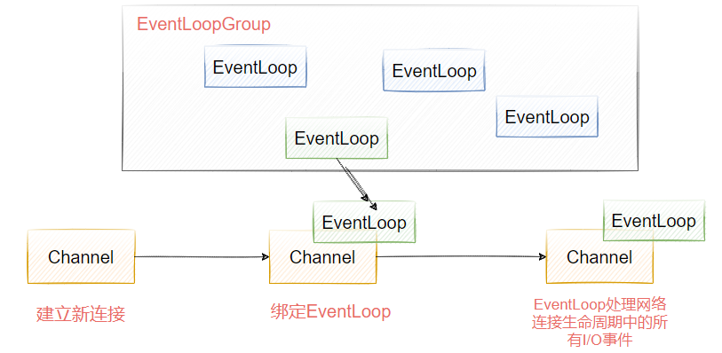

# Netty

## 工作机制

### 网络通信层

网络通信层主要的职责是执行网络的IO操作，它支持多种网络通信协议和I/O模型的链接操作。当网络数据读取到内核缓冲区后，会触发读写事件，这些事件在分发给时间调度器来进行处理。

在Netty中，网络通信的核心组件以下三个组件

Bootstrap， 客户端启动api，用来链接远程netty server，只绑定一个EventLoopGroup
ServerBootStrap，服务端监听api，用来监听指定端口，会绑定两个EventLoopGroup， bootstrap组件可以非常方便快捷的启动Netty应用程序
Channel，Channel是网络通信的载体，Netty自己实现的Channel是以JDK NIO channel为基础，提供了更高层次的抽象，同时也屏蔽了底层Socket的复杂性，为Channel提供了更加强大的功能。

随着连接和数据的变化，Channel也会存在多种状态，比如连接建立、连接注册、连接读写、连接销毁。随着状态的变化，Channel也会处于不同的生命周期，每种状态会绑定一个相应的事件回调。以下是常见的时间回调方法。

- channelRegistered， channel创建后被注册到EventLoop上
- channelUnregistered，channel创建后未注册或者从EventLoop取消注册
- channelActive，channel处于就绪状态，可以被读写
- channelInactive，Channel处于非就绪状态
- channelRead，Channel可以从源端读取数据
- channelReadComplete，Channel读取数据完成

简单总结一下，Bootstrap和ServerBootStrap分别负责客户端和服务端的启动，Channel是网络通信的载体，它提供了与底层Socket交互的能力。

而当Channel生命周期中的事件变化，就需要触发进一步处理，这个处理是由Netty的事件调度器来完成。

## 事件调度器

事件调度器是通过Reactor线程模型对各类事件进行聚合处理，通过Selector主循环线程集成多种事件（I/O时间、信号时间），当这些事件被触发后，具体针对该事件的处理需要给到服务编排层中相关的Handler来处理。

事件调度器核心组件：

- EventLoopGroup。相当于线程池

- EventLoop。相当于线程池中的线程

EventLoopGroup本质上是一个线程池，主要负责接收I/O请求，并分配线程执行处理请求。为了更好的理解EventLoopGroup、EventLoop、Channel之间的关系，我们来看图2-4所示的流程。

从图中可知

- 一个EventLoopGroup可以包含多个EventLoop，EventLoop用来处理Channel生命周期内所有的I/O事件，比如accept、connect、read、write等
- EventLoop同一时间会与一个线程绑定，每个EventLoop负责处理多个Channel
- 每新建一个Channel，EventLoopGroup会选择一个EventLoop进行绑定，该Channel在生命周期内可以对EventLoop进行多次绑定和解绑。

图2-5表示的是EventLoopGroup的类关系图，可以看出Netty提供了EventLoopGroup的多种实现，如NioEventLoop、EpollEventLoop、NioEventLoopGroup等。

从图中可以看到，EventLoop是EventLoopGroup的子接口，我们可以把EventLoop等价于EventLoopGroup，前提是EventLoopGroup中只包含一个EventLoop。

