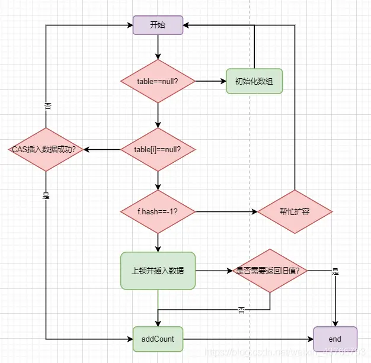

# 并发

- 可见性，一句话讲就是多个线程中有读有写操作同一个变量的时候，线程间可以互相知道，可见的意思。
- 有序性，一句话讲就是由于代码执行顺序可能被重排序，volatile可以保证代码行数按顺序执行。
- 原子性，一句话讲就是当多个线程进行同时写同一个变量的时候，只能有一个线程进这一操作。

## 基础

### Thread

#### State

NEW 就绪状态 尚未启动的线程
RUNNABLE 可运行状态  
BLOCKED 等待锁 正在等待锁进入同步块方法
WAITING 等待状态
    Object.wait()、Thread.join()、LockSupport.park()等方法
    notify()、notifyAll()、LockSupport.unpark()等方法 恢复RUNNABLE状态
TIMED_WAITING 超时等待状态
    Thread.sleep()、Object.wait(long)、Thread.join(long)、LockSupport.parkNanos()、LockSupport.parkUntil()等方法
TERMINATED 终止状态 线程执行完毕

### Sychronized

#### 实现原理

#### 锁升级机制

- 无锁态

表示第一次对刚创建的对象或者类加锁时的状态。我发现只有一个线程在操作代码块的资源，压根不需要加锁。此时会处于无锁态。

- 偏向锁

类似于贴标签，表示这个资源暂时属于某个线程

- 轻量级锁

轻量锁，底层是CAS自旋的操作，所以也叫自旋锁

- 重量级锁

重量级锁，底层是操作系统的mutex互斥锁，底层是操作系统的内核态的锁，用户态是不能直接操作内核态中资源的，只能通知内核态来操作

JVM的进程只是处于用户态的进程，所以需要向操作系统申请，这个过程肯定会很消耗资源的。

比如，synchronized的本质是JVM用户空间的一个进程（处于用户态）向操作系统(内核态)发起一个lock的锁指令操作 。

monitorenter、monitorexit。


### Sleep, Wait, Notify


### Volatile

使用场景：

1、 多个线程对同一个变量有读有写的时候

2、 多个线程需要保证有序性和可见性的时候

简单的讲，一句话：就是刷新主内存，强制过期其他线程的工作内存。

JVM内存模型

堆（Heap）：线程共享。所有的对象实例以及数组都要在堆上分配。回收器主要管理的对象。
方法区（Method Area）：线程共享。存储类信息、常量、静态变量、即时编译器编译后的代码。
方法栈（JVM Stack）：线程私有。存储局部变量表、操作栈、动态链接、方法出口，对象指针。
本地方法栈（Native Method Stack）：线程私有。为虚拟机使用到的Native 方法服务。如Java使用c或者c++编写的接口服务时，代码在此区运行。
程序计数器（Program Counter Register）：线程私有。有些文章也翻译成PC寄存器（PC Register），同一个东西。它可以看作是当前线程所执行的字节码的行号指示器。指向下一条要执行的指令。


JVM 逻辑内存模型


JMM的指令和使用规则

volatile保证可见性的原理，还是之前总结的一句话：写入主内存数据时，刷新主内存值之后，强制过期其他线程的工作内存，底层是因为lock、unlock操作的原则导致的，其他线程读取变量的时候必须重新加载主内存的最新数据，从而保证了可见性。

有序性 happen-before 规则

防止指令重排

volatile变量规则：对一个变量的写操作先行发生于后面对这个变量的读操作。volatile变量写，再是读，必须保证是先写，再读。

高速缓存、RAM内存、L3，CPU内部线程私有的内存L1、L2缓存，通过总线从逐层将缓存读入每一级缓存。如下流程所示：

RAM内存->高速缓存（L4一般位于总线）->L3级缓存（CPU共享）->L2级缓存（CPU内部私有）->L1级缓存（CPU内部私有）。

这样当java中多个线程执行的时候，实际是交给CPU的每个寄存器执行每一个线程。一套寄存器+程序计数器可以执行一个线程，平常我们说的4核8线程，实际指的是8个寄存器。所以Java多线程执行的逻辑对应CPU组件如下图所示：

### CAS（Compare And Swap）

- value
- valueOffset
- unsafe

```java

private static final Unsafe unsafe = Unsafe.getUnsafe();

private static final long valueOffset;

static {
    try {
        valueOffset = unsafe.objectFieldOffset
            (AtomicInteger.class.getDeclaredField("value"));
    } catch (Exception ex) { throw new Error(ex); }
}

private volatile int value;

public final int getAndAddInt(Object var1, long var2, int var4) {
    int var5;
    do {
        var5 = this.getIntVolatile(var1, var2);
    } while(!this.compareAndSwapInt(var1, var2, var5, var5 + var4));

    return var5;
}
```

#### 自旋无限循环性能问题

- 自旋等待的线程会一直占用 CPU，导致 CPU 利用率过高，采用分段CAS优化

`LongAdder`

分段CAS优化当某一个线程如果对一个值更新是，可以看对这个值进行分段更新，每一段叫做一个Cell，在更新每一个Cell的时候，发现说出现了很难更新它的值，出现了多次 CAS失败了，自旋的时候，进行自动迁移段，它会去尝试更新别的分段Cell的值，这样的话就可以让一个线程不会盲目的CAS自旋等待一个更新分段cell的值。

#### ABA问题

如果某个值一开始是A，后来变成了B，然后又变成了A，你本来期望的是值如果是第一个A才会设置新值，结果第二个A一比较也ok，也设置了新值，跟期望是不符合的。

解决方案：加版本号，每次更新的时候，版本号加1，这样的话，即使值一样，版本号不一样，也不会出现ABA问题。

```java
public boolean compareAndSet(V  expectedReference,
                V  newReference,
                int expectedStamp,
                int newStamp) {

Pair<V> current = pair;
return
    // 比对引用
    expectedReference == current.reference &&
    // 比对版本号
    expectedStamp == current.stamp &&
    ((newReference == current.reference &&
    newStamp == current.stamp) ||
    casPair(current, Pair.of(newReference, newStamp)));
}

private boolean casPair(Pair<V> cmp, Pair<V> val) {
    return UNSAFE.compareAndSwapObject(this, pairOffset, cmp, val);
}
```

### AQS (AbstractQueuedSynchronizer)

AQS使用一个Volatile的int类型的成员变量来表示同步状态，通过内置的FIFO队列来完成资源获取的排队工作，通过CAS完成对State值的修改。

- state
- owner
- AQS(等待队列 queue)


```java
static final class NonfairSync extends Sync {
    private static final long serialVersionUID = 7316153563782823691L;

    /**
     * Performs lock.  Try immediate barge, backing up to normal
     * acquire on failure.
     */
    final void lock() {
        // 首先进行的操作就是一个CAS，更新了volatile变量state，由0变为1
        if (compareAndSetState(0, 1))
            // 设置当前线程为独占线程 owner
            setExclusiveOwnerThread(Thread.currentThread());
        else
            acquire(1);
    }

    protected final boolean tryAcquire(int acquires) {
        return nonfairTryAcquire(acquires);
    }
}

protected final boolean compareAndSetState(int expect, int update) {
    // See below for intrinsics setup to support this
    return unsafe.compareAndSwapInt(this, stateOffset, expect, update);
}
```

- 无冲突加锁步骤


- 有冲突场景

```java
public final void acquire(int arg) {
    // 再次尝试获取锁
    if (!tryAcquire(arg) &&
        // 如果获取锁失败，将当前线程加入等待队列
        // 入队后会再次尝试获取锁，失败就会将线程挂起 park
        acquireQueued(addWaiter(Node.EXCLUSIVE), arg))
        selfInterrupt();
}

protected final boolean tryAcquire(int acquires) {
    return nonfairTryAcquire(acquires);
}

final boolean nonfairTryAcquire(int acquires) {
    final Thread current = Thread.currentThread();
    int c = getState();
    if (c == 0) {
        if (compareAndSetState(0, acquires)) {
            setExclusiveOwnerThread(current);
            return true;
        }
    }
    // 可重入
    else if (current == getExclusiveOwnerThread()) {
        int nextc = c + acquires;
        if (nextc < 0) // overflow
            throw new Error("Maximum lock count exceeded");
        setState(nextc);
        return true;
    }
    return false;
}

private Node addWaiter(Node mode) {
    Node node = new Node(Thread.currentThread(), mode);
    // Try the fast path of enq; backup to full enq on failure
    Node pred = tail;
    if (pred != null) {
        node.prev = pred;
        // 双向链表
        if (compareAndSetTail(pred, node)) {
            pred.next = node;
            return node;
        }
    }
    enq(node);
    return node;
}

// 将当前线程加入等待队列 双向链表
private Node enq(final Node node) {
    for (;;) {
        Node t = tail;
        // 第一次循环，初始化一个新的节点
        if (t == null) { // Must initialize
            // 通过CAS更新头节点 tail和head指向了空的new Node()。
            if (compareAndSetHead(new Node()))
                tail = head;
        } else {
            // 入参node节点的prev指向了t所指向的空Node。
            node.prev = t;
            // 通过CAS更新尾节点，将tail指向到入参node节点。
            if (compareAndSetTail(t, node)) {
                t.next = node;
                return t;
            }
        }
    }
}
```


#### 释放锁 unlock

```java
public void unlock() {
    sync.release(1);
}

public final boolean release(int arg) {
  if (tryRelease(arg)) {
    Node h = head;
    if (h != null && h.waitStatus != 0)
      unparkSuccessor(h);
    return true;
  }
  return false;
}
```

核心分为了2步：

1） tryRelease方法，释放state和owner变量

2） unparkSuccessor方法，唤醒队列元素

分别来看一下，首先释放变量tryRelease方法：

```java
 protected final boolean tryRelease(int releases) {
  // 加锁数量 
  int c = getState() - releases;
  if (Thread.currentThread() != getExclusiveOwnerThread())
    throw new IllegalMonitorStateException();
  boolean free = false;
  // 释放锁
  if (c == 0) {
    free = true;
    setExclusiveOwnerThread(null);
  }
  // 更新state
  setState(c);
  return free;
}
```

释放成功锁后，使用了h指针指向了当前队列的头部，判断一下队列中是否有等待的元素，注意对头元素waitStatus不能是0，如果是0，说明队列只有一个空节点，队列中没有等待元素。因为入队元素后会将头结点的waitStatus改成-1，SIGNAL。

```java
private void unparkSuccessor(Node node) {
  int ws = node.waitStatus;
  if (ws < 0)
    // 首先把head节点waitStatus从-1改为0。
    compareAndSetWaitStatus(node, ws, 0);
  // 找到下一个节点
  Node s = node.next;
  if (s == null || s.waitStatus > 0) {
    s = null;
    for (Node t = tail; t != null && t != node; t = t.prev)
      if (t.waitStatus <= 0)
        s = t;
  }

  if (s != null)
    // 唤醒线程
    LockSupport.unpark(s.thread);
}
```

#### 公平锁，非公平锁

加锁的时候，一个if判断

- 非公平锁, 会直接尝试获取锁，如果获取失败，再将线程加入等待队列
- 公平锁，会先判断队列中是否有等待的线程，如果有，先将线程加入等待队列，再尝试获取锁

#### 重入锁，非重入锁

同一个线程可以使用同一个ReentrantLock进行反复加锁。 加锁，state会在现有值上加+1，每再次加一次锁

另外，释放锁的话，肯定需要释放所多次，同一个线程加锁了几次，就需要释放几次，需要将state值恢复为0才算真正的释放锁，别的线程才能获取到。

#### 独占锁，共享锁

独占锁，只能有一个线程获取锁，其他线程只能等待，直到锁被释放

默认reentrantLock.lock创建的锁是什么的呢？非公平的可重入独占锁！

#### 核心组件

## 组件

### ReentrantLock = Volatile + AQS + CAS


1. 为什么使用LockSupport.park()和LockSupport.unpark()来实现线程的阻塞和唤醒？
2. 为什么使用双向链表来实现等待队列？
   一，线程阻塞之前需要判断前置节点的状态，如果没有指针指向前置节点，就需要从head节点开始遍历，性能非常低。
   二，允许阻塞线程中断，中断后会将节点状态设置为CANCELLED，需要从队列中移除，双向链表可以快速移除节点。
   三，避免线程阻塞和唤醒的开销，按照公平锁设计，只有前置节点为头节点的线程才需要再次竞争锁，其他线程直接阻塞。

### Atomic = Volatile + CAS

### CountDownLatch = Volatile + AQS

### Smeaphore = Volatile + AQS

### ThreadLocal = ThreadLocalMap

### ThreadPoolExecutor = CAS + AQS +  BlockingQueue

线程池（Thread Pool）是一种基于池化思想管理线程的工具，经常出现在多线程服务器中

线程池其实就做了三件事

1. 维护自身状态
2. 管理任务
3. 管理线程

让我们先来看看如何维护自身状态

线程池内部使用了一个原子变量ctl来维护线程池的状态，ctl是一个32位的整数，高3位表示线程池的状态，低29位表示线程池中线程的数量

```java
private final AtomicInteger ctl = new AtomicInteger(ctlOf(RUNNING, 0));

private static final int COUNT_BITS = Integer.SIZE - 3;
private static final int CAPACITY   = (1 << COUNT_BITS) - 1;

// runState is stored in the high-order bits
private static final int RUNNING    = -1 << COUNT_BITS;
private static final int SHUTDOWN   =  0 << COUNT_BITS;
private static final int STOP       =  1 << COUNT_BITS;
private static final int TIDYING    =  2 << COUNT_BITS;
private static final int TERMINATED =  3 << COUNT_BITS;

// Packing and unpacking ctl
private static int runStateOf(int c)     { return c & ~CAPACITY; }
private static int workerCountOf(int c)  { return c & CAPACITY; }
private static int ctlOf(int rs, int wc) { return rs | wc; }
```

天才般的设计，通过一个整数就可以表示线程池的状态和线程数量，这样就可以通过一个原子操作来更新线程池的状态和线程数量

可以看出，线程池的状态有5种，分别是RUNNING、SHUTDOWN、STOP、TIDYING、TERMINATED


状态之间的转换如下


2.1 任务的调度，execute方法是线程池的核心方法，用来提交任务

```java
public void execute(Runnable command) {
    if (command == null)
        throw new NullPointerException();
    int c = ctl.get();
    // 1. workerCountOf(c)表示线程池中线程的数量 < corePoolSize 表示线程池中的线程数量小于核心线程数，此时需要创建一个新的线程来执行任务
    if (workerCountOf(c) < corePoolSize) {
        if (addWorker(command, true))
            return;
        c = ctl.get();
    }
    // 线程池处于RUNNING状态，任务会被添加到工作队列中
    if (isRunning(c) && workQueue.offer(command)) {
        int recheck = ctl.get();
        if (! isRunning(recheck) && remove(command))
            reject(command);
        else if (workerCountOf(recheck) == 0)
            addWorker(null, false);
    }
    // 3. 如果队列满了，创建新的非核心线程来执行任务
    else if (!addWorker(command, false))
        // 4. 如果队列满了，创建新的非核心线程失败 workerCountOf(c) >= maximumPoolSize，拒绝任务
        reject(command);
}
```

2.2 任务缓冲

线程池的任务缓冲是通过一个阻塞队列来实现的，线程池中的线程会从阻塞队列中取出任务来执行

2.3 任务执行

任务的执行有两种可能：一种是任务直接由新创建的线程执行。另一种是线程从任务队列中获取任务然后执行，执行完任务的空闲线程会再次去从队列中申请任务再去执行。第一种情况仅出现在线程初始创建的时候，第二种是线程获取任务绝大多数的情况。getTask方法是线程池的核心方法，用来获取任务

```java

```

2.4 任务拒绝

线程池有一个最大的容量，当线程池的任务缓存队列已满，并且线程池中的线程数目达到maximumPoolSize时，就需要拒绝掉该任务，采取任务拒绝策略，保护线程池。

拒绝策略是一个接口，其设计如下：

```java
public interface RejectedExecutionHandler {
    void rejectedExecution(Runnable r, ThreadPoolExecutor executor);
}

```

提供了四种拒绝策略：


3.1 线程管理

线程池中的线程是通过Worker类来实现的，Worker类继承了AQS，是一个独占锁，用来保护线程池中的线程

Worker这个工作线程，实现了Runnable接口，并持有一个线程thread，一个初始化的任务firstTask。thread是在调用构造方法时通过ThreadFactory来创建的线程，可以用来执行任务；firstTask用它来保存传入的第一个任务，这个任务可以有也可以为null。如果这个值是非空的，那么线程就会在启动初期立即执行这个任务，也就对应核心线程创建时的情况；如果这个值是null，那么就需要创建一个线程去执行任务列表（workQueue）中的任务，也就是非核心线程的创建。

```java
private final class Worker extends AbstractQueuedSynchronizer implements Runnable
{

    /** Thread this worker is running in.  Null if factory fails. */
    final Thread thread;
    /** Initial task to run.  Possibly null. */
    Runnable firstTask;
    /** Per-thread task counter */
    volatile long completedTasks;

    /**
     * Creates with given first task and thread from ThreadFactory.
     * @param firstTask the first task (null if none)
     */
    Worker(Runnable firstTask) {
        setState(-1); // inhibit interrupts until runWorker
        this.firstTask = firstTask;
        this.thread = getThreadFactory().newThread(this);
    }

    /** Delegates main run loop to outer runWorker  */
    public void run() {
        runWorker(this);
    }
}
```

我们看看runWorker方法的实现

```java
final void runWorker(Worker w) {
    Thread wt = Thread.currentThread();
    Runnable task = w.firstTask;
    w.firstTask = null;
    w.unlock(); // allow interrupts
    boolean completedAbruptly = true;
    try {
        while (task != null || (task = getTask()) != null) {
            w.lock();
            if ((runStateAtLeast(ctl.get(), STOP) ||
                    (Thread.interrupted() &&
                    runStateAtLeast(ctl.get(), STOP))) &&
                !wt.isInterrupted())
                wt.interrupt();
            try {
                beforeExecute(wt, task);
                Throwable thrown = null;
                try {
                    task.run();
                } catch (RuntimeException x) {
                    thrown = x; throw x;
                } catch (Error x) {
                    thrown = x; throw x;
                } catch (Throwable x) {
                    thrown = x; throw new Error(x);
                } finally {
                    afterExecute(task, thrown);
                }
            } finally {
                task = null;
                w.completedTasks++;
                w.unlock();
            }
        }
        completedAbruptly = false; 
    } finally {
        processWorkerExit(w, completedAbruptly); //获取不到任务时，主动回收自己，并且判断线程池状态，维护核心线程数
    }
}
```

大概执行过程如下：

1.while循环不断地通过getTask()方法获取任务。
2.getTask()方法从阻塞队列中取任务。
3.如果线程池正在停止，那么要保证当前线程是中断状态，否则要保证当前线程不是中断状态。
4.执行任务。
5.如果getTask结果为null则跳出循环，执行processWorkerExit()方法，销毁线程。

### callable, future，futureTask, scheduledFuture

我们知道，线程池的submit方法可以接受Runnable和Callable两种类型的任务，那么这两种任务有什么区别呢？

Runnable接口是一个函数式接口，只有一个run方法，没有返回值，也不能抛出异常。
Callable接口也是一个函数式接口，只有一个call方法，有返回值，可以抛出异常。

```java
public interface Callable<V> {
    V call() throws Exception;
}

public <T> Future<T> submit(Runnable task, T result) {
    if (task == null) throw new NullPointerException();
    RunnableFuture<T> ftask = newTaskFor(task, result);
    execute(ftask);
    return ftask;
}

/**
 * @throws RejectedExecutionException {@inheritDoc}
 * @throws NullPointerException       {@inheritDoc}
 */
public <T> Future<T> submit(Callable<T> task) {
    if (task == null) throw new NullPointerException();
    RunnableFuture<T> ftask = newTaskFor(task);
    execute(ftask);
    return ftask;
}

protected <T> RunnableFuture<T> newTaskFor(Runnable runnable, T value) {
    return new FutureTask<T>(runnable, value);
}

```

不管是Runnable还是Callable，最终都会被包装成FutureTask，
FutureTask是Future接口的一个实现类，它实现了Runnable接口，所以可以被线程池执行。并且重新了run方法
另外实现了Future接口，可以获取任务的执行结果，还可以取消任务的执行, 判断任务是否执行完成


```java

public static <T> Callable<T> callable(Runnable task, T result) {
    if (task == null)
        throw new NullPointerException();
    return new RunnableAdapter<T>(task, result);
}

/**
 * Returns a {@link Callable} object that, when
 * called, runs the given task and returns {@code null}.
 * @param task the task to run
 * @return a callable object
 * @throws NullPointerException if task null
 */
public static Callable<Object> callable(Runnable task) {
    if (task == null)
        throw new NullPointerException();
    return new RunnableAdapter<Object>(task, null);
}


public void run() {
     // 如果状态不是 NEW，说明任务已经执行过或者已经被取消，直接返回
    if (state != NEW ||
        // // 如果状态是 NEW，则尝试把执行线程保存在 runnerOffset（runner字段），如果赋值失败，则直接返回
        !UNSAFE.compareAndSwapObject(this, runnerOffset,
                                        null, Thread.currentThread()))
        return;
    try {
        // 获取构造函数传入的 Callable 值
        Callable<V> c = callable;
        if (c != null && state == NEW) {
            V result;
            boolean ran;
            try {
                // 正常调用 Callable 的 call 方法就可以获取到返回值
                result = c.call();
                ran = true;
            } catch (Throwable ex) {
                result = null;
                ran = false;
                // 保存 call 方法抛出的异常, CAS操作
                setException(ex);
            }
            if (ran)
                 // 保存 call 方法的执行结果, CAS操作
                set(result);
        }
    } finally {
        // runner must be non-null until state is settled to
        // prevent concurrent calls to run()
        runner = null;
        // state must be re-read after nulling runner to prevent
        // leaked interrupts
        int s = state;
        if (s >= INTERRUPTING)
            handlePossibleCancellationInterrupt(s);
    }
}
```

再看看FutureTask的get方法

```java
public V get() throws InterruptedException, ExecutionException {
    int s = state;
    if (s <= COMPLETING)
        // 判断任务是否执行完成，如果没有执行完成，阻塞等待
        s = awaitDone(false, 0L);
    // 返回任务执行结果或者抛出异常
    return report(s);
}


我们再看看ScheduledThreadPoolExecutor, 它是ThreadPoolExecutor的子类，提供了定时任务的功能，可以延迟执行任务，也可以周期性执行任务

```java
public ScheduledFuture<?> schedule(Runnable command,
                                    long delay,
                                    TimeUnit unit) {
    if (command == null || unit == null)
        throw new NullPointerException();
    RunnableScheduledFuture<?> t = decorateTask(command,
        new ScheduledFutureTask<Void>(command, null,
                                        triggerTime(delay, unit)));
    delayedExecute(t);
    return t;
}

public ScheduledFuture<?> scheduleWithFixedDelay(Runnable command,
                                                    long initialDelay,
                                                    long delay,
                                                    TimeUnit unit) {
    if (command == null || unit == null)
        throw new NullPointerException();
    if (delay <= 0)
        throw new IllegalArgumentException();
    ScheduledFutureTask<Void> sft =
        new ScheduledFutureTask<Void>(command,
                                        null,
                                        triggerTime(initialDelay, unit),
                                        unit.toNanos(-delay));
    RunnableScheduledFuture<Void> t = decorateTask(command, sft);
    sft.outerTask = t;
    delayedExecute(t);
    return t;
}
```

初始化分为三步：

1. 创建一个ScheduledFutureTask对象，ScheduledFutureTask继承了FutureTask，扩展了一些定时任务需要的属性，比如下次执行时间、每次任务执行间隔。

2. decorateTask方法对任务进行装饰，返回一个RunnableScheduledFuture对象，RunnableScheduledFuture是ScheduledFuture和RunnableFuture的子接口，表示一个可以周期性执行的任务。

3. delayedExecute方法，从上图可以看到这个方法主要流程也简单，首先是把任务放到线程池的队列中，然后调用ensurePrestart方法，ensurePrestart方法是线程池的方法，作用是根据线程池线程数调用addWorker方法创建线程


那么如何执行任务的呢，我们看看ScheduledFutureTask对run方法也有特殊的实现。

```java
public void run() {
    // 判断是否是周期性任务
    boolean periodic = isPeriodic();
    if (!canRunInCurrentRunState(periodic))
        cancel(false);
    else if (!periodic)
        // 非周期性任务，直接调用父类的run方法
        ScheduledFutureTask.super.run();
    else if (ScheduledFutureTask.super.runAndReset()) {
        // 计算下次执行时间
        setNextRunTime();
        // 重新放入线程池队列
        reExecutePeriodic(outerTask);
    }
}
```

上面的run方式实现了什么时候执行和周期性执行的逻辑，那么怎么实现的定时执行呢？

```java
void ensurePrestart() {
    int wc = workerCountOf(ctl.get());
    if (wc < corePoolSize)
        addWorker(null, true);
    else if (wc == 0)
        addWorker(null, false);
}
```

我们可以看到，ScheduledThreadPoolExecutor的ensurePrestart方法，添加的worker都是没有传递task的，也就是说都是从队列中获取任务执行的。

我们就可以看看队列的take方法，是如何实现的 `DelayedWorkQueue`, take方法每次都从队列总取出第一个任务，判断是否到了执行时间，如果到了执行时间就返回这个任务，否则就阻塞等待。但是是如何保证任务是按照时间顺序执行的呢？

```java

public RunnableScheduledFuture<?> take() throws InterruptedException {
    final ReentrantLock lock = this.lock;
    lock.lockInterruptibly();
    try {
        for (;;) {
            RunnableScheduledFuture<?> first = queue[0];
            if (first == null)
                available.await();
            else {
                long delay = first.getDelay(NANOSECONDS);
                if (delay <= 0)
                    return finishPoll(first);
                first = null; // don't retain ref while waiting
                if (leader != null)
                    available.await();
                else {
                    Thread thisThread = Thread.currentThread();
                    leader = thisThread;
                    try {
                        available.awaitNanos(delay);
                    } finally {
                        if (leader == thisThread)
                            leader = null;
                    }
                }
            }
        }
    } finally {
        if (leader == null && queue[0] != null)
            available.signal();
        lock.unlock();
    }
}
```

需要看看队列的add方法，是如何保证任务是按照时间顺序插入的

```java
public boolean add(Runnable e) {
    return offer(e);
}

public boolean offer(Runnable x) {
    if (x == null)
        throw new NullPointerException();
    RunnableScheduledFuture<?> e = (RunnableScheduledFuture<?>)x;
    final ReentrantLock lock = this.lock;
    lock.lock();
    try {
        int i = size;
        if (i >= queue.length)
            // 自动扩容
            grow();
        size = i + 1;
        if (i == 0) {
            queue[0] = e;
            // 队列为空，再队列开头插入一个任务，唤醒等待线程
            setIndex(e, 0);
        } else {
            // 将任务根据执行时间插入到队列中 堆上浮操作
            siftUp(i, e);
        }
        if (queue[0] == e) {
            leader = null;
            available.signal();
        }
    } finally {
        lock.unlock();
    }
    return true;
}
```

由此可见不管是callable，还是ScheduledThreadPoolExecutor，都是对Executor的封装，提供了更多的功能，比如获取任务执行结果，取消任务执行，定时执行任务等。但是核心的执行逻辑还是在ThreadPoolExecutor中。

## 集合

### ConcurrentHashMap = Volatile + CAS + Sychronized

ConcurrentHashMap是一个线程安全的哈希表，里面的并发编程智慧值得我们学习。

重点分析ConcurrentHashMap的四个方法源码：putVal、initTable、addCount、transfer

ConcurrentHashMap添加数据时，采取了CAS+synchronize结合策略。

1. 首先会判断数组是否已经初始化，如若未初始化，会先去初始化数组；
2. 如果当前要插入的节点为null，尝试使用CAS插入数据；
3. 如果不为null，则判断节点hash值是否为-1；-1表示数组正在扩容，会先去协助扩容，再回来继续插入数据。（协助扩容后面会讲）
4. 最后会执行上锁，并插入数据，最后判断是否需要返回旧值；如果不是覆盖旧值，需要更新map中的节点数，也就是图中的addCount方法。

```java
public V put(K key, V value) {
    return putVal(key, value, false);
}


```



### ConcurrentLinkedQueue = Volatile + CAS

### CopyOnWriteArrayList = Volatile + ReentrantLock

### ArrayBlockingQueue = Condition + ReentrantLock

### LinkedBlockingQueue = Autmic + Condition + ReentrantLock