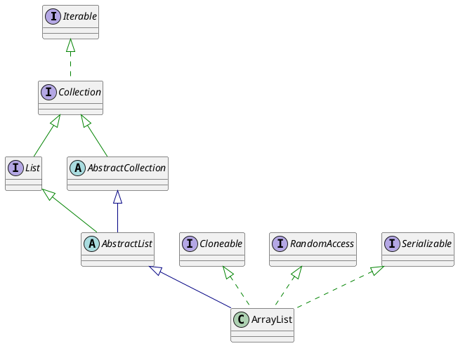

## 类关系图


```puml
@startuml


interface Iterable

interface Collection
interface List


together {
    abstract class AbstractCollection
    abstract class AbstractList
}


interface Cloneable
interface RandomAccess
interface Serializable


class ArrayList
Iterable ^-[#008200,dashed]- Collection

List <|-[#008200,plain]- AbstractList
Collection <|-[#008200,plain]- AbstractCollection

Collection <|-[#008200,plain]- List
AbstractCollection <|-[#000082,plain]- AbstractList
AbstractList <|-[#000082,plain]- ArrayList
RandomAccess ^-[#008200,dashed]- ArrayList
Cloneable ^-[#008200,dashed]- ArrayList
Serializable ^-[#008200,dashed]- ArrayList
@enduml
```

## 数据结构

```java
transient Object[] elementData;  // 数组
``` 

### add

### remove

### set

### get