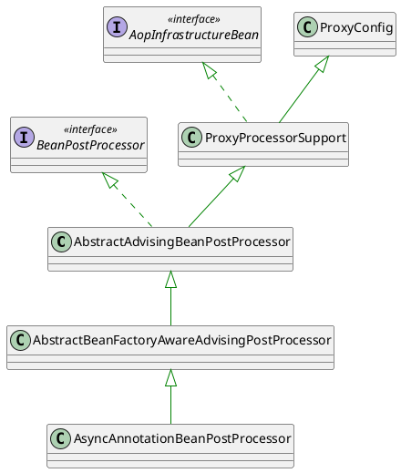
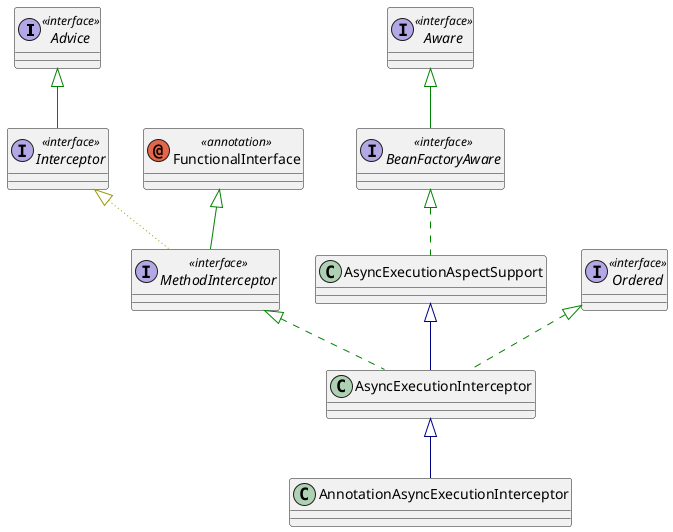

# Async的原理和使用

## spring async的原理

spring async的原理是通过AOP的方式实现的，通过@EnableAsync注解开启异步调用，通过@Async注解标注方法为异步方法，spring会自动创建一个线程池来执行异步方法。

## 源码分析

### @EnableAsync注解

@EnableAsync注解是一个组合注解，包含了@Import(AsyncConfigurationSelector.class)注解，AsyncConfigurationSelector类会根据配置文件中的配置创建一个线程池。

```java
@Target(ElementType.TYPE)
@Retention(RetentionPolicy.RUNTIME)
@Documented
@Import(AsyncConfigurationSelector.class)
public @interface EnableAsync {

}


```

### AsyncConfigurationSelector类

通过selectImports方法返回ProxyAsyncConfiguration或者AspectJAsyncConfiguration类，根据@EnableAsync注解中的mode属性来决定使用哪个类。

```java
public class AsyncConfigurationSelector extends AdviceModeImportSelector<EnableAsync> {

    private static final String ASYNC_EXECUTION_ASPECT_CONFIGURATION_CLASS_NAME =
            "org.springframework.scheduling.aspectj.AspectJAsyncConfiguration";


/**
 * Returns {@link ProxyAsyncConfiguration} or {@code AspectJAsyncConfiguration}
 * for {@code PROXY} and {@code ASPECTJ} values of {@link EnableAsync#mode()},
 * respectively.
 */
    @Override
    @Nullable
    public String[] selectImports(AdviceMode adviceMode) {
        switch (adviceMode) {
            case PROXY:
                return new String[] {ProxyAsyncConfiguration.class.getName()};
            case ASPECTJ:
                return new String[] {ASYNC_EXECUTION_ASPECT_CONFIGURATION_CLASS_NAME};
            default:
                return null;
        }
    }

}

```

### ProxyAsyncConfiguration

这个类是一个配置类，通过@Bean注解创建一个AsyncAnnotationBeanPostProcessor对象，AbstractAsyncConfiguration类的executor、exceptionHandler、enableAsync属性是通过配置文件中的配置注入的。使用@AutoWired注解注入AsyncConfigurer对象，通过AsyncConfigurer对象获取executor、exceptionHandler属性。全局只能有一个AsyncConfigurer对象。

```java
@Configuration(proxyBeanMethods = false)
@Role(BeanDefinition.ROLE_INFRASTRUCTURE)
public class ProxyAsyncConfiguration extends AbstractAsyncConfiguration {

    @Bean(name = TaskManagementConfigUtils.ASYNC_ANNOTATION_PROCESSOR_BEAN_NAME)
    @Role(BeanDefinition.ROLE_INFRASTRUCTURE)
    public AsyncAnnotationBeanPostProcessor asyncAdvisor() {
        // 必须要有@EnableAsync注解
        Assert.notNull(this.enableAsync, "@EnableAsync annotation metadata was not injected");
        AsyncAnnotationBeanPostProcessor bpp = new AsyncAnnotationBeanPostProcessor();
        bpp.configure(this.executor, this.exceptionHandler);
        Class<? extends Annotation> customAsyncAnnotation = this.enableAsync.getClass("annotation");
        if (customAsyncAnnotation != AnnotationUtils.getDefaultValue(EnableAsync.class, "annotation")) {
            bpp.setAsyncAnnotationType(customAsyncAnnotation);
        }
        bpp.setProxyTargetClass(this.enableAsync.getBoolean("proxyTargetClass"));
        bpp.setOrder(this.enableAsync.<Integer>getNumber("order"));
        return bpp;
    }

}


@Autowired
void setConfigurers(ObjectProvider<AsyncConfigurer> configurers) {
    Supplier<AsyncConfigurer> configurer = SingletonSupplier.of(() -> {
        List<AsyncConfigurer> candidates = configurers.stream().collect(Collectors.toList());
        if (CollectionUtils.isEmpty(candidates)) {
            return null;
        }
        if (candidates.size() > 1) {
            throw new IllegalStateException("Only one AsyncConfigurer may exist");
        }
        return candidates.get(0);
    });
    this.executor = adapt(configurer, AsyncConfigurer::getAsyncExecutor);
    this.exceptionHandler = adapt(configurer, AsyncConfigurer::getAsyncUncaughtExceptionHandler);
}

private <T> Supplier<T> adapt(Supplier<AsyncConfigurer> supplier, Function<AsyncConfigurer, T> provider) {
    return () -> {
        AsyncConfigurer configurer = supplier.get();
        return (configurer != null ? provider.apply(configurer) : null);
    };
}

```

### AsyncAnnotationBeanPostProcessor

这个类是一个BeanPostProcessor，继承了BeanFactoryAware接口， 里面有一个AsyncAnnotationAdvisor对象，通过setBeanFactory方法注入Advisor对象。

```java
@Override
public void setBeanFactory(BeanFactory beanFactory) {
    super.setBeanFactory(beanFactory);

    AsyncAnnotationAdvisor advisor = new AsyncAnnotationAdvisor(this.executor, this.exceptionHandler);
    if (this.asyncAnnotationType != null) {
        advisor.setAsyncAnnotationType(this.asyncAnnotationType);
    }
    advisor.setBeanFactory(beanFactory);
    this.advisor = advisor;
}
```

#### AsyncAnnotationAdvisor

这个类是一个Advisor，里面有一个Advice对象，通过buildAdvice方法创建一个AsyncExecutionInterceptor对象，通过buildPointcut方法创建一个AnnotationMatchingPointcut对象。

```java
public AsyncAnnotationAdvisor(
        @Nullable Supplier<Executor> executor, @Nullable Supplier<AsyncUncaughtExceptionHandler> exceptionHandler) {

    Set<Class<? extends Annotation>> asyncAnnotationTypes = new LinkedHashSet<>(2);
    asyncAnnotationTypes.add(Async.class);
    try {
        asyncAnnotationTypes.add((Class<? extends Annotation>)
                ClassUtils.forName("javax.ejb.Asynchronous", AsyncAnnotationAdvisor.class.getClassLoader()));
    }
    catch (ClassNotFoundException ex) {
        // If EJB 3.1 API not present, simply ignore.
    }
    this.advice = buildAdvice(executor, exceptionHandler);
    this.pointcut = buildPointcut(asyncAnnotationTypes);
}

/**
 * 通过BeanFactory接口 注入Adivce对象
 */
@Override
public void setBeanFactory(BeanFactory beanFactory) {
    if (this.advice instanceof BeanFactoryAware) {
        ((BeanFactoryAware) this.advice).setBeanFactory(beanFactory);
    }
}

/**
 * 定义一个Advice对象, 通过AnnotationAsyncExecutionInterceptor对象
 */
protected Advice buildAdvice(
        @Nullable Supplier<Executor> executor, @Nullable Supplier<AsyncUncaughtExceptionHandler> exceptionHandler) {

    AnnotationAsyncExecutionInterceptor interceptor = new AnnotationAsyncExecutionInterceptor(null);
    // 配置executor和exceptionHandler
    interceptor.configure(executor, exceptionHandler);
    return interceptor;
}

/**
 * 定义一个Pointcut对象, 通过AnnotationMatchingPointcut对象 @Async注解的方法和类都会被拦截
 */
protected Pointcut buildPointcut(Set<Class<? extends Annotation>> asyncAnnotationTypes) {
    ComposablePointcut result = null;
    for (Class<? extends Annotation> asyncAnnotationType : asyncAnnotationTypes) {
        Pointcut cpc = new AnnotationMatchingPointcut(asyncAnnotationType, true);
        Pointcut mpc = new AnnotationMatchingPointcut(null, asyncAnnotationType, true);
        if (result == null) {
            result = new ComposablePointcut(cpc);
        }
        else {
            result.union(cpc);
        }
        result = result.union(mpc);
    }
    return (result != null ? result : Pointcut.TRUE);
}

```

### AbstractBeanFactoryAwareAdvisingPostProcessor

前文提到的AsyncAnnotationBeanPostProcessor类继承了AbstractBeanFactoryAwareAdvisingPostProcessor类，这个类是一个BeanPostProcessor，继承了BeanFactoryAware接口，所以也肯定实现了 postProcessBeforeInitialization 和 postProcessAfterInitialization 方法。



如何将Advice对象注入到Bean呢，通过postProcessAfterInitialization方法，如果bean是一个Advised对象，就将Advice对象添加到Advisor链中，如果bean不是一个Advised对象，就创建一个ProxyFactory对象，将Advice对象添加到ProxyFactory对象中，然后通过ProxyFactory对象创建一个代理对象。 如何判断bean是否可以被代理呢，AopUtils.canApply方法会判断。

```java
public Object postProcessAfterInitialization(Object bean, String beanName) {
    if (this.advisor == null || bean instanceof AopInfrastructureBean) {
        // Ignore AOP infrastructure such as scoped proxies.
        return bean;
    }

    if (bean instanceof Advised) {
        Advised advised = (Advised) bean;
        if (!advised.isFrozen() && isEligible(AopUtils.getTargetClass(bean))) {
            // Add our local Advisor to the existing proxy's Advisor chain...
            if (this.beforeExistingAdvisors) {
                advised.addAdvisor(0, this.advisor);
            }
            else {
                advised.addAdvisor(this.advisor);
            }
            return bean;
        }
    }

    if (isEligible(bean, beanName)) {
        ProxyFactory proxyFactory = prepareProxyFactory(bean, beanName);
        if (!proxyFactory.isProxyTargetClass()) {
            evaluateProxyInterfaces(bean.getClass(), proxyFactory);
        }
        proxyFactory.addAdvisor(this.advisor);
        customizeProxyFactory(proxyFactory);

        // Use original ClassLoader if bean class not locally loaded in overriding class loader
        ClassLoader classLoader = getProxyClassLoader();
        if (classLoader instanceof SmartClassLoader && classLoader != bean.getClass().getClassLoader()) {
            classLoader = ((SmartClassLoader) classLoader).getOriginalClassLoader();
        }
        return proxyFactory.getProxy(classLoader);
    }

    // No proxy needed.
    return bean;
}

```

### AopUtils.canApply

原来是根据Advisor定义的pointcut来判断bean是否可以被代理，可以回到上文看到AsyncAnnotationAdvisor定义了一个Pointcut对象，这个Pointcut对象是一个AnnotationMatchingPointcut对象，这个对象会匹配所有被@Async注解的方法。也就是说Pointcut决定了哪些方法可以被拦截，而Advice决定了拦截后的处理逻辑。

```java
public static boolean canApply(Advisor advisor, Class<?> targetClass, boolean hasIntroductions) {
    if (advisor instanceof IntroductionAdvisor) {
        return ((IntroductionAdvisor) advisor).getClassFilter().matches(targetClass);
    }
    else if (advisor instanceof PointcutAdvisor) {
        PointcutAdvisor pca = (PointcutAdvisor) advisor;
        return canApply(pca.getPointcut(), targetClass, hasIntroductions);
    }
    else {
        // It doesn't have a pointcut so we assume it applies.
        return true;
    }
}
```

```java

@Override
public boolean matches(Method method, Class<?> targetClass) {
    if (matchesMethod(method)) {
        return true;
    }
    // Proxy classes never have annotations on their redeclared methods.
    if (Proxy.isProxyClass(targetClass)) {
        return false;
    }
    // The method may be on an interface, so let's check on the target class as well.
    Method specificMethod = AopUtils.getMostSpecificMethod(method, targetClass);
    return (specificMethod != method && matchesMethod(specificMethod));
}

private boolean matchesMethod(Method method) {
    return (this.checkInherited ? AnnotatedElementUtils.hasAnnotation(method, this.annotationType) :
            method.isAnnotationPresent(this.annotationType));
}

Set<Class<? extends Annotation>> asyncAnnotationTypes = new LinkedHashSet<>(2);
asyncAnnotationTypes.add(Async.class);

protected Pointcut buildPointcut(Set<Class<? extends Annotation>> asyncAnnotationTypes) {
    ComposablePointcut result = null;
    for (Class<? extends Annotation> asyncAnnotationType : asyncAnnotationTypes) {
        Pointcut cpc = new AnnotationMatchingPointcut(asyncAnnotationType, true);
        Pointcut mpc = new AnnotationMatchingPointcut(null, asyncAnnotationType, true);
        if (result == null) {
            result = new ComposablePointcut(cpc);
        }
        else {
            result.union(cpc);
        }
        result = result.union(mpc);
    }
    return (result != null ? result : Pointcut.TRUE);
}


```

### AnnotationAsyncExecutionInterceptor

上文注册的advice对象是一个AnnotationAsyncExecutionInterceptor对象，这个类是一个MethodInterceptor，通过invoke方法实现了对@Async注解方法的拦截。



这个类是一个MethodInterceptor，特殊的advice对象，通过invoke方法实现了对方法的拦截。

```java
@Override
@Nullable
public Object invoke(final MethodInvocation invocation) throws Throwable {
    Class<?> targetClass = (invocation.getThis() != null ? AopUtils.getTargetClass(invocation.getThis()) : null);
    Method specificMethod = ClassUtils.getMostSpecificMethod(invocation.getMethod(), targetClass);
    final Method userDeclaredMethod = BridgeMethodResolver.findBridgedMethod(specificMethod);
    
    // 获取executor并包装成AsyncTaskExecutor对象
    AsyncTaskExecutor executor = determineAsyncExecutor(userDeclaredMethod);
    if (executor == null) {
        throw new IllegalStateException(
                "No executor specified and no default executor set on AsyncExecutionInterceptor either");
    }

    // 创建一个Callable对象 封装了目标方法的调用
    Callable<Object> task = () -> {
        try {
            Object result = invocation.proceed();
            if (result instanceof Future) {
                return ((Future<?>) result).get();
            }
        }
        catch (ExecutionException ex) {
            // 处理异常
            handleError(ex.getCause(), userDeclaredMethod, invocation.getArguments());
        }
        catch (Throwable ex) {
            // 处理异常
            handleError(ex, userDeclaredMethod, invocation.getArguments());
        }
        return null;
    };
    // 提交任务
    return doSubmit(task, executor, invocation.getMethod().getReturnType());
}
```

```java
protected Object doSubmit(Callable<Object> task, AsyncTaskExecutor executor, Class<?> returnType) {
    // 根据不同的返回类型 提交任务
    if (CompletableFuture.class.isAssignableFrom(returnType)) {
        return CompletableFuture.supplyAsync(() -> {
            try {
                return task.call();
            }
            catch (Throwable ex) {
                throw new CompletionException(ex);
            }
        }, executor);
    }
    else if (ListenableFuture.class.isAssignableFrom(returnType)) {
        return ((AsyncListenableTaskExecutor) executor).submitListenable(task);
    }
    else if (Future.class.isAssignableFrom(returnType)) {
        return executor.submit(task);
    }
    else {
        executor.submit(task);
        return null;
    }
}
```
