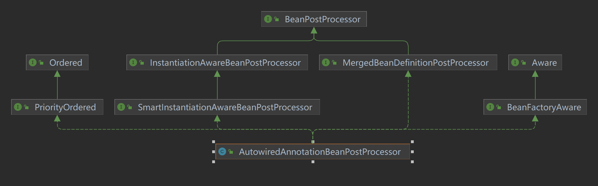
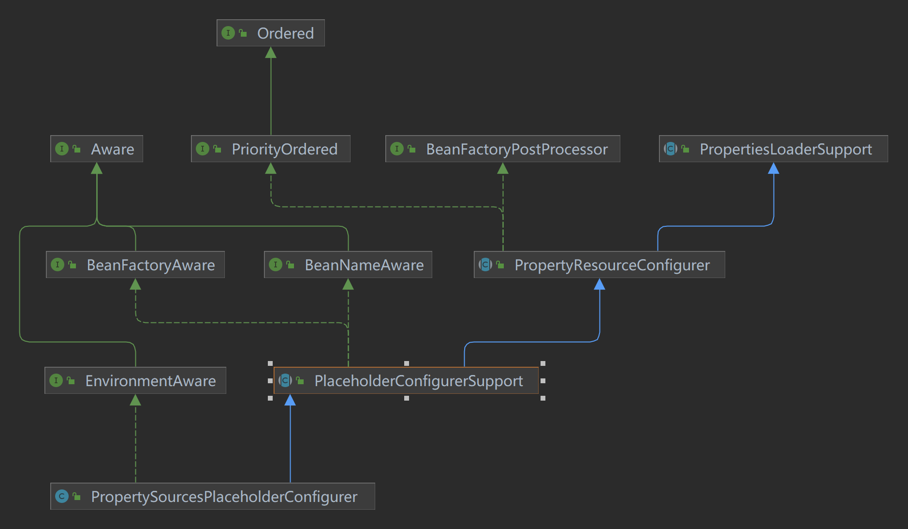

# Spring拓展点

## BeanPostProcessor

BeanPostProcessor是Spring框架提供的一个扩展点，它允许我们在Spring容器实例化Bean之后，初始化Bean之前对Bean进行一些自定义的处理。

BeanPostProcessor接口定义如下：

```java
public interface BeanPostProcessor {
    @Nullable
    default Object postProcessBeforeInitialization(Object bean, String beanName) throws BeansException {
        return bean;
    }

    @Nullable
    default Object postProcessAfterInitialization(Object bean, String beanName) throws BeansException {
        return bean;
    }
}
```

### BeanPostProcessor的使用

例如 Spring AOP 的实现就是通过 BeanPostProcessor 来实现的，Spring AOP 通过 BeanPostProcessor 在 Bean 实例化后，初始化前，对 Bean 进行代理，从而实现 AOP 的功能。 @Async 举例说明：

1. 初始化一个 AsyncAnnotationAdvisor，它是一个 Advisor，里面包含一个Advice，用于执行异步方法， 一个pointcut，用于匹配带有 @Async 注解的方法
2. 通过 AbstractAdvisingBeanPostProcessor 的 postProcessAfterInitialization 方法，将 AsyncAnnotationAdvisor 添加到 Bean 的代理链中

```java
@Override
public void setBeanFactory(BeanFactory beanFactory) {
    super.setBeanFactory(beanFactory);

    AsyncAnnotationAdvisor advisor = new AsyncAnnotationAdvisor(this.executor, this.exceptionHandler);
    if (this.asyncAnnotationType != null) {
        advisor.setAsyncAnnotationType(this.asyncAnnotationType);
    }
    advisor.setBeanFactory(beanFactory);
    this.advisor = advisor;
}

@Override
public Object postProcessAfterInitialization(Object bean, String beanName) {
    if (this.advisor == null || bean instanceof AopInfrastructureBean) {
        // Ignore AOP infrastructure such as scoped proxies.
        return bean;
    }

    if (bean instanceof Advised) {
        Advised advised = (Advised) bean;
        if (!advised.isFrozen() && isEligible(AopUtils.getTargetClass(bean))) {
            // Add our local Advisor to the existing proxy's Advisor chain...
            if (this.beforeExistingAdvisors) {
                advised.addAdvisor(0, this.advisor);
            }
            else {
                advised.addAdvisor(this.advisor);
            }
            return bean;
        }
    }

    if (isEligible(bean, beanName)) {
        ProxyFactory proxyFactory = prepareProxyFactory(bean, beanName);
        if (!proxyFactory.isProxyTargetClass()) {
            evaluateProxyInterfaces(bean.getClass(), proxyFactory);
        }
        proxyFactory.addAdvisor(this.advisor);
        customizeProxyFactory(proxyFactory);

        // Use original ClassLoader if bean class not locally loaded in overriding class loader
        ClassLoader classLoader = getProxyClassLoader();
        if (classLoader instanceof SmartClassLoader && classLoader != bean.getClass().getClassLoader()) {
            classLoader = ((SmartClassLoader) classLoader).getOriginalClassLoader();
        }
        return proxyFactory.getProxy(classLoader);
    }

    // No proxy needed.
    return bean;
}
```

### InstantiationAwareBeanPostProcessor

InstantiationAwareBeanPostProcessor是BeanPostProcessor的子接口，它定义了在实例化Bean之前和之后的回调方法。

InstantiationAwareBeanPostProcessor接口定义如下：

```java
public interface InstantiationAwareBeanPostProcessor extends BeanPostProcessor {
    @Nullable
    default Object postProcessBeforeInstantiation(Class<?> beanClass, String beanName) throws BeansException {
        return null;
    }

    default boolean postProcessAfterInstantiation(Object bean, String beanName) throws BeansException {
        return true;
    }

    @Nullable
    default PropertyValues postProcessProperties(PropertyValues pvs, Object bean, String beanName) throws BeansException {
        return null;
    }

    @Deprecated
    @Nullable
    default PropertyValues postProcessPropertyValues(
            PropertyValues pvs, PropertyDescriptor[] pds, Object bean, String beanName) throws BeansException {

        return pvs;
    }
}
```

我们看一个具体例子，AutowiredAnnotationBeanPostProcessor，它是一个 InstantiationAwareBeanPostProcessor，用于处理 @Autowired 注解：



## InitializingBean

InitializingBean是Spring框架提供的一个接口，它定义了Bean初始化的回调方法。

InitializingBean接口定义如下：

```java
public interface InitializingBean {
    void afterPropertiesSet() throws Exception;
}
```

### InitializingBean的使用

## BeanFactoryPostProcessor

BeanFactoryPostProcessor 是在 Spring 容器实例化 bean 之前执行的。

- 它允许修改 Spring 容器中的 bean 定义，包括对 bean 的属性值进行修改或替换，甚至可以完全替换 bean 的定义。
- 通常用于对 bean 的定义进行动态修改，例如在 bean 实例化之前设置特定的属性、修改属性值、注册其他的 bean 定义等。
- 它影响的范围是 Spring 容器级别的，对所有 bean 实例都生效。

### PropertySourcesPlaceholderConfigurer


