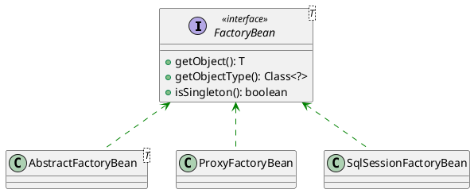

## spring factoryBean 介绍

- FactoryBean是一个接口，用于创建和管理特定类型的Bean对象。它允许你定义一个自定义的工厂类，该工厂类负责创建一个或多个Bean对象。
- 你需要实现FactoryBean接口，并提供getObject()方法来返回实际的Bean实例。
- FactoryBean通常用于创建复杂的Bean，或者在Bean的创建过程中执行一些特殊的逻辑。
- 使用FactoryBean创建的Bean可以在Spring容器中以FactoryBean的名称注册，也可以通过&前缀获取FactoryBean本身。



## spring factoryBean 应用

### SqlSessionFactoryBean

我们在使用mybatis时，通常会使用SqlSessionFactoryBean来创建SqlSessionFactory，这里就是使用了FactoryBean的特性。

```java
public class SqlSessionFactoryBean implements FactoryBean<SqlSessionFactory>, InitializingBean, ApplicationListener<ApplicationEvent> {
    // ...
    @Override
    public SqlSessionFactory getObject() throws Exception {
        if (this.sqlSessionFactory == null) {
            afterPropertiesSet();
        }
        return this.sqlSessionFactory;
    }
    // ...
}
```

```xml
<bean id="sqlSessionFactory" class="org.mybatis.spring.SqlSessionFactoryBean">
    <property name="dataSource" ref="dataSource"/>
    <property name="mapperLocations" value="classpath*:mapper/*.xml"/>
    <property name="configLocation" value="classpath:mybatis-config.xml"/>
</bean>
```

## FormattingConversionServiceFactoryBean

FormattingConversionServiceFactoryBean是Spring Framework提供的一个用于配置和管理类型转换（Type Conversion）和格式化（Formatting）的工厂Bean。它是Spring的一个功能组件，用于定制和配置在应用程序中进行类型转换和格式化的规则。主要用于处理各种数据类型之间的转换，例如字符串到日期、字符串到数字等。

```xml
<bean id="conversionService" class="org.springframework.format.support.FormattingConversionServiceFactoryBean">
    <!--注册自定义的类型转换器-->
    <property name="converters">
        <set>
            <bean class="org.example.MyConverter"/>
        </set>
    </property>
    <!--注册自定义的格式器-->
    <property name="formatters">
        <set>
            <bean class="org.example.MyFormatter"/>
            <bean class="org.example.MyAnnotationFormatterFactory"/>
        </set>
    </property>
    <!--注册一个注册器, 这是另一种注册方案, 使用代码的方式来注册转换器和格式器-->
    <property name="formatterRegistrars">
        <set>
            <bean class="org.example.MyFormatterRegistrar"/>
        </set>
    </property>
</bean>

```

