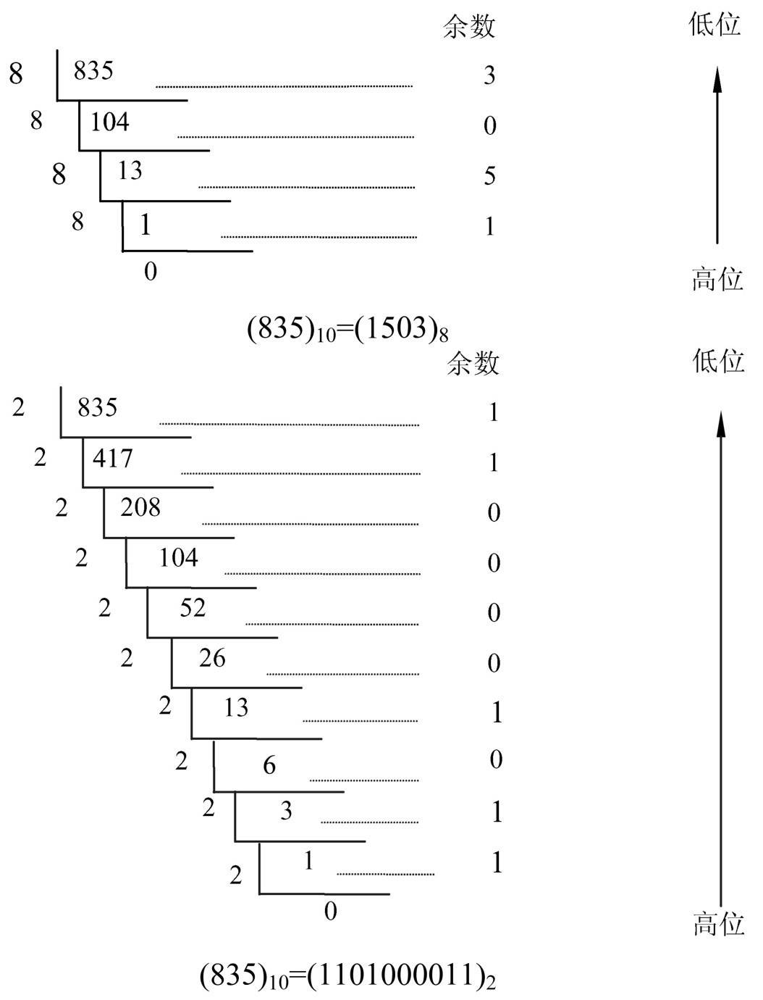

## 什么是二进制

所谓的 二进制，就是一种仅用 $1$ 和 $0$ 的排列组合来表示具体数值的，一种记数方法。

例如下面这个数是一个**八位无符号二进制数**，它的每位都是非$1$即$0$的，但是仅通过$1$和$0$的组合是如何表示某个具体数值的？

<table>
    <tr>
        <td>1</td>
        <td>0</td>
        <td>1</td>
        <td>0</td>
        <td>1</td>
        <td>0</td>
        <td>0</td>
        <td>0</td>
    </tr>
</table>

我们先来回忆一下小学数学里的 $0,1,2,3,4,5,6,7,8,9$，比如 $456$ 这个数字，我们读作 **四百五十六**，*四百五十六* 其实也是经过求值算出来的，具体如下：

$
\begin{aligned}
456&=400+50+6\\\\
&=4\times10^2+5\times10^1+6\times10^0
\end{aligned}
$

一般地，任意一个十进制数

$$
D=d_nd_{n-1}...d_1d_0. d_{-1}d_{-2}...d_{-m} \quad (m, n为正整数)
$$

其值为
$$
\begin{aligned}
V(D)&=d_n\times10^n+d_{n-1}\times10^{n-1}+...+d_1\times10^1+d_0\times10^0+d_{-1}\times10^{-1}+d_{-2}\times10^{-2}+...+d_{-m}\times10^{-m}
\end{aligned}
$$

其中，$d_i$可以是$0,1,2,3,4,5,6,7,8,9$里十个数字符号的任何一个，其中$10$称为基数，这个每位分别乘上的固定数值，就是所谓的 **位权（weight）**，即 **每位的权重**。

具体地，从第0位开始，它的每位位权分别是$1, 10, 100, 1000...$，或者说是$10^0, 10^1, 10^2, 10^3...$，在十进制数进行运算时，它每位满十就需要向高位进一，即 **逢十进一**

对于二进制来说其实他们的记数方法是一致的，我们看最开始的例子 $10101000_{B}$：

$
\begin{aligned}
10101000_{B}&=0\times2^0+0\times2^1+0\times2^2+1\times2^3+0\times2^4+1\times2^5+0\times2^6+1\times2^7 \\\\
 &=0+0+0+8+0+32+0+128 \\\\
 &=168
\end{aligned}
$

也就是说二进制$1010 \ 1000$ 对应的十进制是 $168$

一般地，任意一个二进制数

$$
B=b_nb_{n-1}...b_1b_0. b_{-1}b_{-2}...b_{-m} \quad (m, n为正整数)
$$

其值为
$$
\begin{aligned}
V(B)&=b_n\times2^n+b_{n-1}\times2^{n-1}+...+b_1\times2^1+b_0\times2^0+b_{-1}\times2^{-1}+b_{-2}\times2^{-2}+...+b_{-m}\times2^{-m}
\end{aligned}
$$

其中，$b_i$只可以是$0$和$1$两种数字，其中$2$是基数，从第0位开始，二进制每位位权分别是$1, 2, 4, 8$，或者说 $2^0, 2^1,2^2,2^3...$ , 所以，二进制是 **逢二进一**。

## 进制

一般地，在某个数字系统中，若采用$R$个基本符号(0, 1, 2,...,R-1)表示各位上的数字，则称其位 **R进制**，$R$被称为数字系统的基，它采用 **逢R进一**的运算规则，对于每一个数位$i$， 第 $i$ 位的位权就是 $R^i$。

计算机系统中，常用的进制有下列4种：

| **进制** | **R** |           **基本符号**            |  **后缀标识**  |
| :------: | :---: | :-------------------------------: | :------------: |
|  二进制  |   2   |               $0,1$               |   B(Binary)    |
|  八进制  |   8   |         $0,1,2,3,4,5,6,7$         |    O(Octal)    |
|  十进制  |  10   |       $0,1,2,3,4,5,6,7,8,9$       |   D(Decimal)   |
| 十六进制 |  16   | $0,1,2,3,4,5,6,7,8,9,A,B,C,D,E,F$ | H(Hexadecimal) |

查看下表[^1]

## 常用进制之间的转换

计算机内部所有信息采用二进制编码表示，但在计算机外部世界，为了书写和阅读的方便，大都采用八、十或十六进制数表示形式。因此，必须实现进制之间的转换。

### R进制数转换为十进制数

任何一个R进制数转换为十进制数时，只需要 **按位展开** 即可。

- *二进制转换十进制*
    $
        \begin{aligned}
        10101.01_{B}&=1\times2^4+0\times2^3+1\times2^2+0\times2^1+1\times2^0+0\times2^{-1}+1\times2^{-2}\\\\
        &=16+0+4+0+1+0+0.25 \\\\
        &=21.25_{D}
        \end{aligned}
    $

---

- *八进制转换十进制*
    $
        \begin{aligned}
        307.6_{O}&=3\times8^2+0\times8^1+7\times8^0+6\times8^{-1}\\\\
        &=192+0+7+0.75\\\\
        &=199.75_{D}
        \end{aligned}
    $

---

- *十六进制转换十进制*
    $
        \begin{aligned}
        3A.C_{H}&=3\times16^1+10\times16^0+12\times16^{-1}\\\\
        &=48+10+0.75\\\\
        &=58.75_{D}
        \end{aligned}
    $

### 十进制数转换为R进制数

任何一个十进制数转换为R进制数时，要将整数和小数部分分别进行转换。

- *整数部分的转换*

    整数部分的转换方法就是 **除基取余，上右下左**。也就是说，用要转换的十进制整数除以基数R，将得到的余数作为结果数据中各位的数字，直到商0为止。上面的余数（即先得到的余数）作为右边的低位数位，下面的余数作为左边的高位数位。

    

---

- *小数部分的转换*

    小数部分的转换方法就是 **乘基取整，上左下右**。也就是说，用要转换的十进制小数乘以基数R，将得到的乘积整数部分作为结果数据中各位的数字，小数部分继续与基数R相乘，依此类推，直到某一步乘积的小数部分为0或已得到希望的位数为止。  

    最后，将上面的整数部分作为左边的高位数位，下面的整数部分作为右边的低位数位。在转换过程中，可能乘积的小数部分总得不到0，即转换得到希望的位数后还有余数，这是得到的结果就是近似值。  

    例: 将十进制小数0.685分别转换为二进制和八进制数。  

    $
        \begin{aligned}
        0.6875 \times 2 = 1.375 \quad &整数位1 \\\\
        0.375 \times 2 = 0.75 \quad   &整数位0 \\\\
        0.75 \times 2 = 1.5 \quad     &整数位1 \\\\
        0.5 \times 2 = 1 \quad        &整数位1 \\\\
        &0.685_{D} = 0.1011_{B}  \quad 结果
        \end{aligned}
    $

    ---

    $
        \begin{aligned}
        0.6875 \times 8 = 5.5 \quad &整数位5 \\\\
        0.5 \times 8 = 4.0 \quad   &整数位4 \\\\
        &0.685_{D} = 0.54_{O}  \quad 结果
        \end{aligned}
    $

- *整数、小数部分的转换*

    只要将整数、小数部分分别转换，得到的转换后的整数和小数部分，然后将这两部分组合起来即可得到一个完整的数。

    例：将十进制835.6875转换为二进制和八进制数
    $
        \begin{aligned}
        835.6875_{D}=1101000011.1011_{B}=1503.54_{O}
        \end{aligned}
    $

### 二、八、十六进制的相互转换

- *八进制转换为二进制数*

    只要把八进制数的每一位改写为对应的3位二进制数即可，保持高低位次序不变。对应关系如下：
    <table>
        <tr>
            <td>八进制</td>
            <td>0</td>
            <td>1</td>
            <td>2</td>
            <td>3</td>
            <td>4</td>
            <td>5</td>
            <td>6</td>
            <td>7</td>
        </tr>
        <tr>
            <td>二进制</td>
            <td>000</td>
            <td>001</td>
            <td>010</td>
            <td>011</td>
            <td>100</td>
            <td>101</td>
            <td>110</td>
            <td>111</td>
        </tr>
    </table>

    例：$13.72_{O}=(001011.111010)_{B}$

---

- *十六进制转换为二进制*

    和八进制转换二进制类型，只要把八进制数的每一位改写为对应的4位二进制数即可，保持高低位次序不变。对应关系如下：
    <table>
        <tr>
            <td>十六进制</td>
            <td>0</td>
            <td>1</td>
            <td>2</td>
            <td>3</td>
            <td>4</td>
            <td>5</td>
            <td>6</td>
            <td>7</td>
            <td>8</td>
            <td>9</td>
            <td>A</td>
            <td>B</td>
            <td>C</td>
            <td>D</td>
            <td>E</td>
            <td>F</td>
        </tr>
        <tr>
            <td>二进制</td>
            <td>0000</td>
            <td>0001</td>
            <td>0010</td>
            <td>0011</td>
            <td>0100</td>
            <td>0101</td>
            <td>0110</td>
            <td>0111</td>
            <td>1000</td>
            <td>1001</td>
            <td>1010</td>
            <td>1011</td>
            <td>1100</td>
            <td>1101</td>
            <td>1110</td>
            <td>1111</td>
        </tr>
    </table>

    例：$2B.C_{H}=(00101011.1100)_{B}$

---

- *二进制数转换为八进制数*

    二进制转换成八进制时，整数部分由低向高位（从右到左）方向，每三位用一个等值的八位进制数进行替换，最后不足三位在高位补0凑满三位；小数部分从高位向低位（从左到右）方向，每三位用一个等值的八位进制数替换，最后不足三位时，在低位补0凑满三位。

    例：$10011.01_{B}=010011.010_{B}=(23.2)_{O}$

---

- *二进制数转换为十六进制数*

    同八进制相似，二进制转换成十六进制时，整数部分由低向高位（从右到左）方向，每四位用一个等值的十六位进制数进行替换，最后不足四位在高位补0凑满四位；小数部分从高位向低位（从左到右）方向，每四位用一个等值的十六进制数替换，最后不足四位时，在低位补0凑满四位。

    例：$11001.11_{B}=00011001.1100_{2}=(19.C)_{H}$

## 计算机中为什么使用二进制

在计算机系统中，凡是要进行处理、存储和传输的信息，都是用二进制数进行编码的。也就是说，计算机内部采用的是二进制数表示方式。这样做的原因有以下三点：

1. 二进制数只有两种基本状态。使用有两个稳定状态的物理器件就可以表示二进制数的每一位，而制造有两个稳定状态的物理器件比要制造多个稳定状态的物理器件容易得多。
例如，用高、低两个电位，或用脉冲的有、无，或用脉冲的正、负极性等，都可以很方便、很可靠的表示"0"和"1"。
2. 二进制的编码、计数和运算规则都简单。可以开关电路实现，简单易行。
3. "1"和"0"正好与逻辑命题的”真“，“假”两个值对应，为计算机中实现逻辑判断提供了便利条件。

## 常见单位

上面我们讲了二进制，大家都知道计算机是以二进制存储以及发送接收数据的，二进制的一位，就叫做$1 bit$。
也就是说$bit$的含义就是二进制数中的一个数位，即$0$或者$1$。**由于计算机的硬件决定，任何存储于计算机中的数据，其本质都是以二进制码存储**。

但是$bit（位）$实在太小了，还有其他常见的存储单位$Byte（字节）$、$KB（千字节）$、$MB（兆字节）$、$GB（千兆字节）$，换算如下，B是Byte的缩写:

$
1B = 8bit \\\\
1KB = 1024B \\\\
1MB = 1024kB \\\\
1GB = 1024MB \\\\
1TB = 1024GB \\\\
$

比如你的计算机内存是4GB，那么可以存储的位数为$4\times1024\times1024\times1024\times8$位,$1024$等于$2^{10}$, 即$32\times2^{30}$

[^1]:
<table><tr><td>**二进制**</td><td>**八进制**</td><td>**十进制**</td><td>**十六进制**</td></tr><tr><td>0000</td><td>0</td><td>0</td><td>0</td></tr><tr><td>0001</td><td>1</td><td>1</td><td>1</td></tr><tr><td>0010</td><td>2</td><td>2</td><td>2</td></tr><tr><td>0011</td><td>3</td><td>3</td><td>3</td></tr><tr><td>0100</td><td>4</td><td>4</td><td>4</td></tr><tr><td>0101</td><td>5</td><td>5</td><td>5</td></tr><tr><td>0110</td><td>6</td><td>6</td><td>6</td></tr><tr><td>0111</td><td>7</td><td>7</td><td>7</td></tr><tr><td>1000</td><td>10</td><td>8</td><td>8</td></tr><tr><td>1001</td><td>11</td><td>9</td><td>9</td></tr><tr><td>1010</td><td>12</td><td>10</td><td>A</td></tr><tr><td>1011</td><td>13</td><td>11</td><td>B</td></tr><tr><td>1100</td><td>14</td><td>12</td><td>C</td></tr><tr><td>1101</td><td>15</td><td>13</td><td>D</td></tr><tr><td>1110</td><td>16</td><td>14</td><td>E</td></tr><tr><td>1111</td><td>17</td><td>15</td><td>F</td></tr></table>
