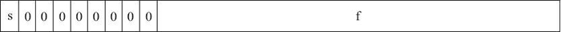

数据是对事实、概念或指令的一种特殊表达形式，这种特殊表达形式可由人工或自动化装置进行处理。在计算机内部，数字、文字、图形、图像、声音、视频等都不能直接由计算机进行处理和存储，它们必须采取”特殊的表达形式“才能由计算机进行通信、转换或加工处理。这种特殊的表达形式就是二进制编码形式，**在计算机系统中的数据均是以二进制编码形式出现的**。

这一节我们思考以下问题：

- 计算机如何表示小数点
- 什么是浮点数
- 浮点数的为什么存在精度问题
- 为什么32位的float表示范围比64位的long类型还大
- 计算机中浮点数是如何运算的

## 二进制中的小数

前面讲过，计算机中只能识别和表示$0$和$1$，无法识别小数点，因此在计算机中处理日常中的小数数据，必须解决小数点的表示，计算机中通过采用相应的定点与浮点表示规则来解决这个问题。

### 定点表示

定点表示法就是约定小数点的位置，且这个位置固定不变，小数点前、后的数字，分别用二进制表示，然后组合起来就可以把这个数字在计算机中存储起来，这种表示方式叫做「定点」表示法，用这种方法表示的数字叫做「定点数」。

1. 对于整数，其小数点总是固定在数的最右边，忽略不写。

    $100_{D} = 01100100_{B}$

2. 对于纯小数，其小数点总是固定在数的最左边，因此可以采用一种”定点小数“来表示它。

    $0.125_{D} = 0.00100000_{B}$

3. 对于整数+小数形式，约定小数点位置

    假设8(bit)为例子，约定前5位表示整数部分，后3位表示小数部分
    $1.5(D) = 00001 \ 100(B)$
    $25.125(D) = 1100 \ 1001(B)$

    用一个定点数来表示整数+小数，分为以下步骤：

    - 在有限的bit宽度下，先约定小数点的位置
    - 整数部分和小数部分，分别转换为二进制表示
    - 两部分二进制组合起来即是结果

    但是整数位的5位二进制的最大值是$11111_{B}$，十进制则是$2^4-1=31_{D}$,小数位的3位二进制，最大的是$0.111_{B}$，即十进制的$0.875_{D}$。

    要表示更大范围的数，就需要扩大bit的宽度或者改变小数点的位置，小数点向后移动，整个数字范围就会扩大，但是小数部分的精度就会越来越低，没有办法表示类似$0.00001$这种高精度的值。

### 浮点表示

在计算机内部，因为进行数据存储、运算和传输的部件的位数都是有限的，所以不管采用什么表数方法，都只能表示一定范围内的的有限个数。
定点数表示小数时，固定的小数点位置决定了固定位数的整数部分和小数部分，不利于同时表达特别大的数或者特别小的数。
因此，最终绝大多数现代的计算机系统都采纳了所谓的浮点数表达法。所以在计算机中，我们一般使用**浮点数**来表示小数。

之前我们学习了定点数，其中「定点」指的是约定小数点位置固定不变。那浮点数的「浮点」就是指，其小数点的位置是可以是漂浮不定的。

浮点数是采用**科学计数法**的方式来表示的，我们先以十进制小数举例，例如8.345，用科学计数法表示，可以有多种方式：

$
\begin{aligned}
8.345&=8.345\times10^0\\\\
&=83.45\times10^-1\\\\
&=834.5\times10^-2
\end{aligned}
$

因为这种表达的多样性，因此有必要对其加以规范化以达到统一表达的目标。规范的浮点数表达方式具有如下形式：

$$
\pm d.dd...d \times \beta^{e} (0 \leq d_{i} < \beta)
$$

其中，d.dd…d 为有效数字，$β$为基数，$e$为指数。
有效数字中数字的个数称为精度，我们可以用$p$来表示，即可称为$p$位有效数字精度。每个数字$d$介于$0$和基数$β$之间，可以写成以下形式：
$$
\pm (d_0 + d_{1}\beta^{-1}+...+d_{p-1}\beta^{-(p-1)}) \times \beta^{e} (0 \leq d_{i} < \beta)
$$

其中，对十进制的浮点数，即基数$β$等于$10$的浮点数而言，上面的表达式非常容易理解。
如 12.34，我们可以根据上面的表达式表达为：$1×10^1+2×10^0+3×10^{-1}+4×10^{-2}$，其规范浮点数表达为$1.234×10^1$。

使用同样的规则，对于二进制数，我们也可以用科学计数法表示，也就是说把基数$10$换成$2$即可。而每个数字$d$只能在$0$和$1$之间取值。如二进制数$1001.101$，我们可以根据上面的表达式表达为：$1×2^3+0×2^2+0×2^1+1×2^0+1×2^{-1}+0×2^{-2}+1×2^{-3}$，其规范浮点数表达为 $1.001101×2^3$。

### IEEE 浮点数标准

直到 20 世纪 80 年代（即在没有制定 IEEE 754 标准之前），业界还没有一个统一的浮点数标准。相反，很多计算机制造商根据自己的需要来设计自己的浮点数表示规则，以及浮点数的执行运算细节。另外，他们常常并不太关注运算的精确性，而把实现的速度和简易性看得比数字的精确性更重要，而这就给代码的可移植性造成了重大的障碍。

一个统一的标准应用而生：IEEE 于 1985 年制订了二进制浮点运算标准 IEEE 754，该标准限定指数的底为 2，并于同年被美国引用为 ANSI 标准。目前，几乎所有的计算机都支持 IEEE 754 标准，它大大地改善了科学应用程序的可移植性。

IEEE 浮点数标准是从逻辑上用三元组{S，E，M}来表示一个数 V 的。

$
V = (-1)^S\times M \times 2^E  (1 \leq M < 2)
$

其中各个变量的含义如下：

- S(Sign)：符号位，取值 0 或 1，决定一个数字的符号，0 表示正，1 表示负；
- M(Mantissa)：尾数位，也称为有效数字位，是二进制小数；
- E(Exponent)：指数，用整数表示，是 2 的幂（可能是负数），它的作用是对浮点数加权，E的值确定小数的位置；

在计算机中，把浮点数的位表示划分为3段：

- 一个单独的符号位 s；
- k 位的阶码字段 $exp=e_{k−1}...e_1e_0$ 编码阶码 $E$；
- n 位小数字段 $frac=f_{n−1}...f_1f_0$ 编码尾数$M$，编码出来的值依赖于阶码字段的值是否等于0；

<table width="%50">
    <tr>
        <td width="10%">S（符号位）</td>
        <td width="15%">E（指数位）</td>
        <td width="25%">M（尾数位）</td>
    </tr>
</table>

举例来说：

10进制中的$9.0$在二进制中写成$1001.0$，也就是 $1.001×2^3$，按照上面的格式，可以算出 $S=0, M=1.001, E=3$。

IEEE754规定，对于32位的浮点数，最高的1位是符号位$S$，接着的8位是指数$E$，剩下的23位为有效数字$M$。


对于64位的浮点数，最高的1位是符号位$S$，接着的11位是指数$E$，剩下的52位为有效数字$M$。


|   **名称**   | **类型** | **位数** | **符号位** | **指数位** | **尾数位** |
| :----------: | :------: | :------: | :--------: | :--------: | :--------: |
| 双精度浮点数 |  float   |    32    |     1      |     8      |     23     |
| 双精度浮点数 |  double  |    64    |     1      |     11     |     52     |

对于上述位的表示，根据阶段$exp$的表示，IEEE754浮点数包含三种状态：

以32位浮点数为例, 其内存状态分为3部分: 1位符号位 8位指数位 23位尾数位

1. 如果8位指数位全为0, 就代表当前数是个非规格数。 用于表示0, 以及非常靠近0的数, 比如1E-38.

2. 如果8位指数位全为1, 就代表当前数是个特殊数。 用于表示"无穷"和"NaN":

3. 如果8位指数不全为0, 也不全为1(也就是除去以上两种状态外, 剩下的所有状态), 这个数就是规格数。 用于表示最常见的数值, 比如1.2, 34567, 7.996, 0.2. 但规格数不能表示0和非常靠近0的数.


↑ 绿色区域就是32位浮点数中规格数的取值范围, 可见它取不到0和靠近0的极小数

↑ 红色区域包含0和靠近0的极小数, 红色区域其实是非规格数的取值范围。

下面分别对三种状态进行详细展开：

#### 规格化的值（normal number）

这是一般的情况，当$exp$的二进制表示中**既不全为0，也不全为1**都是规格化数组。这种情况下，阶码字段被解释为以偏置（biased）形式表示的有符号整数。

##### 指数偏移量（exponent bias）

*指数偏移量* 指浮点数表示法中的指数域的编码值为指数的实际值加上某个固定的值，IEEE标准规定该固定值为$2^{k-1}-1$ ，其中的$k$为存储指数的比特的长度。

那么偏移量解决的时什么问题呢，以float为例，指数E的指数位为8位bit，那么表示的范围是$[0, 2^8-1]$，即$[0, 255]$，指数可以为正数，也可以为负数，因此范围就是$[-127,127]$，但是二进制是无符号的，为了解决负数表示的问题，又不引入其他概念，就引入了偏移量（移码、偏置码）的概念，用无符号数来表示有符号数；

也就是说，阶码的值是$E=e-Bias$，其中$e$是无符号数。

例如指数$E=-126$ , 那么在指数域的表示就应该是$-126+127=1_{D}={00000001}_B$；同样，指数$E=127$，那么指数域的表示就应该是$127+127=254_{D}=11111110_{B}$

因为偏移量的存在由此产生指数的取值范围是：单精度为 $-126 \leq E \leq +127$，双精度为 $-1022 \leq E \leq +1023$。

##### 隐藏位

小数字段$frac$被解释为描述小数值$f$， 其中$0 \leq f <1$，其二进制表示为$0.f_{n−1}⋯f_{1}f_{0}$，也就是二进制小数点在最高有效位的左边。
尾数定义为$M=1+f$。我们可以把$M$看成是一个$1.f_{n−1}f_{n−2}...f_{0}$的数字。尾数$M$的第一位总是$1$（$1 \leq M <2$），因此这个$1$可以省略不写，它是个*隐藏位*，这样单精度23位尾数可以表示了24位有效数字，双精度52位尾数可以表示53位有效数字。

我们来举例说明一下，$8.25$用 float 表示的二进制应该是什么样子的：

$
\begin{aligned}
8_{D} = 1000_{2}  \quad &先转换整数位 \\\\
0.25_{D} = 0.1_{2} \quad &再转换小数位 \\\\
8.25_{D} = 1000.01_{2}  \quad &组合起来 \\\\
1000.01 = 1.00001 \times 2^3 &书写成科学计数法方式 \\\\
\end{aligned}
$

因为8.25是正数，所以$S=0$，指数$E=3$，所以指数段为$3+127=130_{D}=10000010_{B}$，有效数字省略掉小数点左侧的$1$之后为00001，然后在右侧用零补齐。因此所得的最终结果为：

|   0   | 10000010 | 00001000000000000000000 |
| :---: | :------: | :---------------------: |

也可以转换成16进制数，每4位一组划分：

| 0100  | 0001  | 0000  | 0100  | 0000  | 0000  | 0000  | 0000  |
| :---: | :---: | :---: | :---: | :---: | :---: | :---: | :---: |

即$41040000_{H}$


推荐一个工具地址[FloatConverter](https://www.h-schmidt.net/FloatConverter/IEEE754.html)，可以清楚查看浮点数的二进制形式。

也可以用java代码验证下

```java
public static void main(String[] args) {
    System.out.println(Math.getExponent(8.25)); //指数E 3
    System.out.println(Integer.toBinaryString(Float.floatToIntBits(8.25f))); //二进制码正数省略了最前面的0 -> 1000001000001000000000000000000
    System.out.println(Integer.toHexString(Float.floatToIntBits(8.25f))); //十六进制码 41040000
}
```

32位浮点数中, 规格数的取值范围: $(-2\times2^{127},-1\times2^{-126}] \cup [1\times2^{-126},2\times2^{127}) $

我们知道规格数的尾数大于等于1，一个始终大于1的数 乘以 一个始终大于0的数, 永远无法等于0，事实上，$1(尾数最小值) \times 2^-167(指数最小值) = 2^{-167}$

$2^{-167}$就是当前我们能表示的最小值，使用规格数时, 我们除了无法表示0, 也无法表示(0, 2^-167)之间的, 靠近0的极小数...，非规格化数解决了这个问题。

#### 非规格化的值（subnormal number）

当阶码位全为0时，表示的数就是非规格化的形式。这种情况下，阶码的值是$E=1−Bias$，和规格化数的阶码计算方式不一致，后面会讲到原因。
float是-126，double是-1022，而有效数字的值是$M=f$，也就是小数字段的值不包括隐含的1，范围是[0,1)。



非规格化的取值范围：所以尾数位的取值范围是[0.00000000000000000000000, 0.11111111111111111111111] (二进制)

非规格数尾数的取值范围是[0, 1), 指数固定为-126. 这就很简单了, 让尾数取0不就能表示数值0了:

| 符号位S |          指数 | 实际指数 |  指数域E  |           尾数域M            | 数值  | 含义  |
| :-----: | ------------: | :------: | :-------: | :--------------------------: | :---: | :---: |
|    0    | $e=e_{min}-1$ |    0     | 0000 0000 | 000 0000 0000 0000 0000 0000 |  +0   | 正数0 |
|    1    | $e=e_{min}-1$ |    0     | 0000 0000 | 100 0000 0000 0000 0000 0000 |  -0   | 负数0 |

非规格数的取值范围: ($-1\times2^{-126}$,$1\times2^{-126}$)

结合上面提到的规格数的取值范围：$(-2\times2^{127},-1\times2^{-126}] \cup [1\times2^{-126},2\times2^{127})$

刚好组成一个完整的范围：$(-2\times2^{127},2\times2^{127})$

非规格化数有两个用途。

1. 它们提供了一种表示数值0的方法，因为使用规格化数时，必须总是使$M \geq 1$，这样就不能表示0。实际上，+0.0的浮点表示的位模式为全0：符号位是0，阶码字段全为0（表示是一个非规格化的值），而小数域也全为0，这就得到$M=f=0$。但当符号位为1，其他域全为0时，会得到−0.0。根据IEEE的浮点格式，值 +0.0 和 −0.0在某些方面被认为是不同的，而在其他方面是相同的。
2. 另外一个功能是表示哪些非常接近于$0.0$的数。它们提供了一种属性，称为**逐渐溢出**（gradual underflow），其中，可能的数值分布均匀地接近于 0.0。

#### 逐渐溢出（gradual underflow）

前文说过, 非规格数尾数的取值范围是[0, 1), 指数固定-126，所以是尾数的变化在导致非规格数的值变大。

$0 \ 00000000 \ 00000000000000000000001$ > $0 \ 00000000 \ 00000000000000000000000$

$0 \ 00000000 \ 11111111111111111111111$ 这是非规格数的最大值，此时尾数(带上隐藏的整数部分0.)其实是0.11111111111111111111111, 是个比1小一点点的数, 记做$(1 - \epsilon)$，此时非规格数的值就是: $(1-\epsilon) \times 2^{-126}$

我们再往前前进一格, 就会进入*规格化数*的范围： $0 \ 00000001 \ 00000000000000000000000$ ，这是一个最小规格化数，其尾数位的值: 其实隐藏了1，或者说, 此时真正的尾数应该是1.00000000000000000000000 , 也就是1。其指数位的值是1, 则实际指数应该是$1-bias=1-127=-126$。

我们来看一下：非规格化数的最大值是： $(1-\epsilon) \times 2^{-126}$，规格化数的最小值是： $1\times 2^{-126}$，两者实现了非常平滑的过度，非规格化数一点点逐渐变大，最后其最大值平稳的衔接上了规格化数的最小值。这种特性就叫做*逐渐溢出*。

这就解释了两个问题：

1. 为什么规定非规格数的尾数前隐藏的整数部分是 0. 而规格数尾数前隐藏的整数部分是1.

   因为非规格化数的尾数取值范围是[0,1)，而规格化数的尾数取值范围是[1,2)，两者平滑过度，紧密衔接。

2. 为什么非规格数的真实指数的计算公式是$1-bias$, 而规格数的真实指数的计算公式是$2^{k-1}-1 (k是存储指数的有效位数)$

   以32位浮点数为例：非规格化数的指数固定位-126，而规格化数的指数是[-126,127]，两者也平滑衔接。

|    **描述**    | **指数段** | **E** |       **小数段**        |           **M**           |               **二进制值**               |     **十进制值**     |
| :------------: | :--------: | :---: | :---------------------: | :-----------------------: | :--------------------------------------: | :------------------: |
| 最小非规格化值 |  00000000  | -126  | 00000000000000000000001 |  0.000000000000000000001  | $-1 \times (2-2^{-23}) \times 2^{-126} $ | $1.40129846432e-45$  |
| 最大非规格化值 |  00000000  | -126  | 11111111111111111111111 | 0.11111111111111111111111 |   $(1-\epsilon) \times 2^{-126}$ ^[2]    | $1.17549421069e-38$  |
|  最小规格化值  |  00000001  | -126  | 00000000000000000000000 | 1.00000000000000000000000 |           $1\times 2^{-126}$            | $2.35098856151e-38$ |
|  最大规格化值  |  11111110  |  127  | 11111111111111111111111 | 1.1111111111111111111111  |      $(2-\epsilon) \times 2^{127}$       | $3.40282346639e+38$  |

#### 特殊数值（non-number）

IEEE 标准指定了以下特殊值:$\pm 0,+\infty,-\infty,NaN$，（如下表所示，以float为例）。
当阶码全为1时出现的。当小数域全为0时，得到的值表示无穷。当把两个非常大的数相乘，或者除以0时，无穷可以表示溢出的结果。当小数域为非零时，结果值被称为”NAN“。

| 符号位S |          指数 | 实际指数 |  指数域E  |           尾数域M            |   数值    |             含义             |
| :-----: | ------------: | :------: | :-------: | :--------------------------: | :-------: | :--------------------------: |
|    0    | $e=e^{max}+1$ |   255    | 1111 1111 | 000 0000 0000 0000 0000 0000 | $+\infty$ |           正无穷大           |
|    1    | $e=e^{max}+1$ |   255    | 1111 1111 | 000 0000 0000 0000 0000 0000 | $-\infty$ |           负无穷大           |
|    *    | $e=e^{max}+1$ |   255    | 1111 1111 |             非0              |    NaN    | 非数字，用来表示一些特殊情况 |

当要存储的数大于规格数取值范围的最大值时, 就会被记做+infinity, 比如2^128, 刚刚超过规格数的取值范围的最大值, 就会被记做+infinity

当要存储的数小于规格数取值范围的最小值时, 就会被记做-infinity, 比如-2^128, 刚刚小于规格数的取值范围的最小值, 就会被记做-infinity

规格化数的最大值是：$0 \ 11111110 \ 11111111111111111111111$，尾数位其实是1.11111111111111111111111, 非常接近2, 记做$2-\epsilon$，指数是127，

所以最大值记作$(2-\epsilon) \times 2^{127}$。+infinity的内存状态则是:$0 \ 11111111 \ 00000000000000000000000$, 尾数其实是: 1.00000000000000000000000, 等于1，指数是128，可见规格数的最大值也能和$+infinity$平滑衔接. $-infinity$同理。

三种状态结合起来就表示了整个数轴：


NaN 简单说一下，其实就是一种标记状态，表示计算出来的不是一个数字，例如$\sqrt{-1}$

下表是一些IEEE754示例：


### 浮点数精度问题

了解了浮点数在计算机中如何存储的后，就可以发现浮点数必定存在精度问题，因为有效位数的限制，超过的部分会被舍弃，就会出现精度丢失。

例如：0.4，我们来用float表示一下，先转换成二进制：

$
\begin{aligned}
0_{D}=0_{B}  \quad &先转换整数位 \\\\
0.4_{D}=0.11001100110011001100110...{B} \quad &再转换小数位 \\\\
0.4_{D}=0.011001100110011001100110...{B} （0011 无限循环） \quad &组合起来 \\\\
0.011001100110011001100110_{B}=1.1001100110011001100110... \times 2^{-2} &书写成科学计数法方式 \\\\
\end{aligned}
$

因为8.25是正数，所以$S=0$，指数$E=-2$，所以指数段为$-2+127=125_{D}=01111101_{B}$，有效数字省略掉小数点左侧的$1$之后为10011001100110011001100...，由于单精度浮点数尾数只有23位，所以需要舍入（舍入方法见后），由于第24位为1，且之后不全为0，所以需要向第23位进1完成上舍入：1.10011001100110011001101。因此所得的最终结果为：$00111110110011001100110011001101$ (此时就出现了精度损失)。

### 浮点数的范围

我们再来看一下，用浮点数表示一个数字，其范围和精度能有多大？

以float为例，它能表示的最大数肯定是指数域$E=127$，尾数域$M=1.111...1（小数点后23个1）$

### 浮点数的计算

#### 浮点数舍入方式

舍入误差是指运算得到的近似值和精确值之间的差异。大家知道，由于计算机的字长有限，因此在进行数值计算的过程中，对计算得到的中间结果数据要使用相关的舍入规则来取近似值，而这导致计算结果产生误差。

在浮点数的舍入问题上，IEEE浮点格式定义了 4 种不同的舍入方式，如下表所示。其中，默认的舍入方法是向偶数舍入，而其他三种可用于计算上界和下界。

|  **名称**  |                          **描述**                          |
| :--------: | :--------------------------------------------------------: |
| 向偶数舍入 | 也称为向最接近的值舍入，会将结果舍入为最接近且可以表示的值 |
|  向0舍入   |                    会将结果朝0方向舍入                     |
|  向上舍入  |     向$+\infty$方向舍入，会将结果朝正无穷大的方向舍入      |
|  向下舍入  |     向$-\infty$方向舍入，会将结果朝负无穷大的方向舍入      |

举例说明:

| **方式** | **1.40** | **1.60** | **1.50** | **2.50** | **-1.50** |
| :------: | :------: | :------: | :------: | :------: | :-------: |
| 向偶舍入 |    1     |    2     |    2     |    2     |    -2     |
| 向零舍入 |    1     |    1     |    1     |    2     |    -1     |
| 向下舍入 |    1     |    1     |    1     |    2     |    -2     |
| 向上舍入 |    2     |    2     |    2     |    3     |    -1     |

为什么要使中间值向偶舍入呢？因为使用向上舍入或者向下舍入，会在计算这些值的平均数中引入统计偏差。如果两个数的中间值始终用向上舍入，那么得到的一组数的平均值将比这些数本身的平均值略高一些；相反，向下舍入得到的一组数的平均值将比这些数本身的平均值略低一些。

向偶舍入在大多数情况中避免了这种统计偏差，在50%的时间里，它将向上舍入，而在50%的时间里，它将向下舍入。

以23位尾数位的单精度浮点数为例，舍入时需要重点参考第24位

- 若第24位为1，且第24位之后全部为0。此时就要使第23位为0：若第23位本来就是0则不管，若第23位为1，则第24位就要向第23位进一位，这样第23位就可以为0

- 若第24位为1，且第24位之后不全为0，则第24位就要向第23位进一完成上舍入。

- 若第24位为0，此时直接舍去不进位，称为下舍入。

### 小结

## 参考文章

[什么是浮点数](https://zhuanlan.zhihu.com/p/339949186)

[什么是定点数](https://zhuanlan.zhihu.com/p/338588296)

[一文读懂浮点数](https://zhuanlan.zhihu.com/p/349572768)

[计算机中浮点数的二进制表示](http://www.ideabuffer.cn/2017/05/17/%E8%AE%A1%E7%AE%97%E6%9C%BA%E4%B8%AD%E6%B5%AE%E7%82%B9%E6%95%B0%E7%9A%84%E4%BA%8C%E8%BF%9B%E5%88%B6%E8%A1%A8%E7%A4%BA/)

[IEEE 754浮点数标准详解](http://c.biancheng.net/view/314.html)

[IEEE规范](https://zhuanlan.zhihu.com/p/343049681)

[^1]:

Float和Double的最小值和最大值都是以科学记数法的形式输出的，结尾的"E+数字"表示E之前的数字要乘以10的多少次方。例如：$19971400000000=1.99714×10^{13}$。计算器表达10的幂是一般是用$E$或e，也就是$1.99714E13=19971400000000$。

[^2]:

机器码ε表示1与大于1的最小浮点数之差，。不同精度定义的机器ε不同，float $\epsilon=2^{-23}$， double $\epsilon=2^{-52}$
