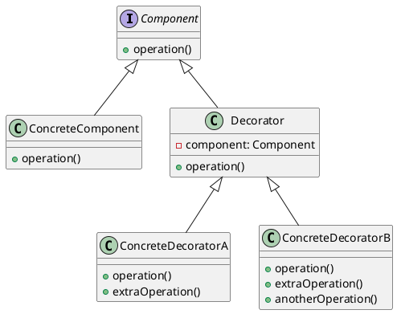
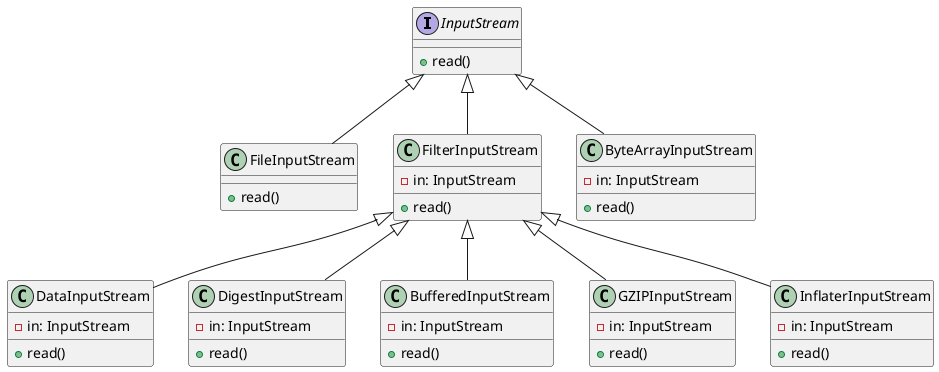

> 装饰者模式：动态地将责任附加到对象上。若要扩展功能，装饰者提供了比继承更有弹性的替代方案。

<!-- more -->

## 装饰者模式的角色

- 抽象组件（Component）：定义一个对象接口，可以给这些对象动态地添加职责。
- 具体组件（ConcreteComponent）：是被封装对象的原始状态，定义了基本行为，但是装饰类可以改变它。
- 抽象装饰者（Decorator）：维持一个指向 Component 对象的指针，并定义一个与 Component 接口一致的接口。
- 具体装饰者（ConcreteDecorator）：定义了可动态添加到组件的额外行为。具体装饰类会重写装饰基类的方法，并在调用基类方法之前或之后加上自己的行为。



## 装饰者模式的应用场景

- 需要扩展一个类的功能，或给一个类添加附加职责。

- IO 类就是装饰者模式的一个典型应用，如 `BufferedInputStream`、`BufferedOutputStream`、`DataInputStream`、`DataOutputStream` 等。



例如，GzipInputStream 类就是一个装饰者，它继承自 FilterInputStream 类，而 FilterInputStream 类又继承自 InputStream 类。GzipInputStream 类在读取数据之前，会先将数据解压缩，然后再读取。

```java
import java.io.ByteArrayInputStream;
import java.io.ByteArrayOutputStream;
import java.io.IOException;
import java.io.InputStream;
import java.util.zip.GZIPInputStream;

public class GzipUtils {
    public static byte[] decompress(byte[] compressedData) throws IOException {
        try (
            ByteArrayInputStream byteArrayInputStream = new ByteArrayInputStream(compressedData);
            GZIPInputStream gzipInputStream = new GZIPInputStream(byteArrayInputStream);
            ByteArrayOutputStream byteArrayOutputStream = new ByteArrayOutputStream()
        ) {
            byte[] buffer = new byte[1024];
            int bytesRead;
            while ((bytesRead = gzipInputStream.read(buffer)) != -1) {
                byteArrayOutputStream.write(buffer, 0, bytesRead);
            }
            return byteArrayOutputStream.toByteArray();
        }
    }
}

```

- `DataInputStream`：

作用：DataInputStream 用于从输入流中读取原始数据类型的数据，如整数、浮点数、字符等。它提供了方法来方便地读取这些数据类型，而无需手动进行字节转换。
典型用途：用于读取二进制文件或与其他系统通信时，处理基本数据类型的输入。

- `BufferedInputStream`：

作用：BufferedInputStream 用于缓冲输入流，从而提高读取数据的效率。它通过在内存中维护一个缓冲区来减少实际的物理读取操作，从而减少了 I/O 操作的次数。
典型用途：在读取大文件或者需要频繁读取的数据时，可以使用 BufferedInputStream 来减少磁盘或网络 I/O 的负担，提高性能。

- `DigestInputStream`：

作用：DigestInputStream 是一个装饰器（Decorator）类，它可以包装其他输入流，并计算输入流中数据的哈希值（如 MD5、SHA-1 等）。它提供了一种在读取数据的同时计算数据完整性校验值的方式。
典型用途：用于验证下载文件的完整性或者进行数据校验的场景，以确保数据没有被篡改。

```java
public class FileUtils {
    /**
     * 写一个获取文件MD5值的方法
     */
    public static String getFileMD5Str(String filePath) {
        try {
            // 创建一个 FileInputStream 来读取文件内容
            FileInputStream fileInputStream = new FileInputStream(filePath);

            // 创建一个 MessageDigest 实例，用于计算哈希值
            MessageDigest md = MessageDigest.getInstance("MD5");

            // 创建 DigestInputStream，它会包装 FileInputStream 并在读取数据时计算哈希值
            DigestInputStream digestInputStream = new DigestInputStream(fileInputStream, md);

            // 获取计算得到的哈希值
            byte[] hashBytes = md.digest();

            // 将哈希值转换为十六进制字符串
            StringBuilder hashStringBuilder = new StringBuilder();
            for (byte b : hashBytes) {
                hashStringBuilder.append(String.format("%02x", b));
            }
            // 关闭输入流
            digestInputStream.close();

            return hashStringBuilder.toString();

        } catch (IOException | NoSuchAlgorithmException e) {
            e.printStackTrace();
            throw new RuntimeException(e);
        }
    }
}
```

- `GZIPInputStream`：

作用：GZIPInputStream 用于解压缩经过 GZIP 压缩的数据流。它能够将压缩后的数据解压成原始的数据。
典型用途：在接收到经过 GZIP 压缩的数据流（如 HTTP 响应或文件）时，可以使用 GZIPInputStream 来解压数据。

- `InflaterInputStream`：

作用：InflaterInputStream 用于解压缩数据，通常用于解压缩经过 Deflate 压缩的数据流。
典型用途：在需要处理 Deflate 压缩的数据流时，可以使用 InflaterInputStream 解压数据，例如在处理 ZIP 文件或 HTTP 响应中的数据时。

## 装饰者模式的优缺点

### 优点

- 无需创建新的子类就可以扩展对象的行为。
- 可以在运行时添加或删除对象的功能。
- 可以通过对不同的装饰者进行排列组合，实现不同的效果。
