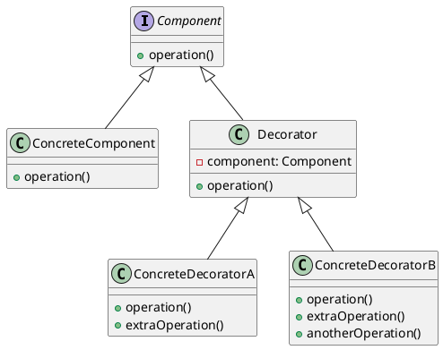

> 装饰者模式：动态地将责任附加到对象上。若要扩展功能，装饰者提供了比继承更有弹性的替代方案。

<!-- more -->

## 装饰者模式的角色

- 抽象组件（Component）：定义一个对象接口，可以给这些对象动态地添加职责。
- 具体组件（ConcreteComponent）：是被封装对象的原始状态，定义了基本行为，但是装饰类可以改变它。
- 抽象装饰者（Decorator）：维持一个指向 Component 对象的指针，并定义一个与 Component 接口一致的接口。
- 具体装饰者（ConcreteDecorator）：定义了可动态添加到组件的额外行为。具体装饰类会重写装饰基类的方法，并在调用基类方法之前或之后加上自己的行为。

## 装饰者模式的应用场景

- 需要扩展一个类的功能，或给一个类添加附加职责。

## 装饰者模式的优缺点

### 优点

- 无需创建新的子类就可以扩展对象的行为。
- 可以在运行时添加或删除对象的功能。
- 可以通过对不同的装饰者进行排列组合，实现不同的效果。
