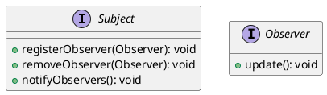
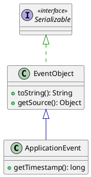
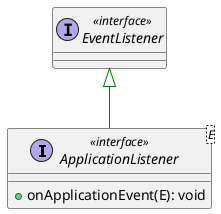
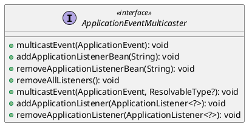
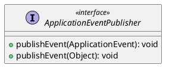

> 观察者模式是一种对象行为型设计模式,它表示对象之间存在一对多的依赖关系,这样当一个对象状态发生改变时,所有依赖它的对象都会得到通知并自动更新。

## 观察者模式的角色

主题(Subject)，主题是一个接口,该接口声明了添加、删除、通知观察者的方法。

观察者(Observer)，观察者是一个接口, 该接口声明了更新的方法。



我们以一个天气预报的例子来说明观察者模式的应用。根据WeatherData对象的状态, 我们需要更新三个布告板:目前状况布告板、气象统计布告板和天气预报布告板。

```java

/**
 * 第一个实现，不使用观察者模式，直接调用布告板的方法 
 */
 
public class WeatherData {
    private float temperature; // 温度
    private float humidity; // 湿度
    private float pressure; // 气压

    public void measurementsChanged() {
        float temp = getTemperature();
        float humidity = getHumidity();
        float pressure = getPressure();
        // 针对具体实现编程，增加和删除布告板都需要修改代码
        currentConditionsDisplay.update(temp, humidity, pressure);
        statisticsDisplay.update(temp, humidity, pressure);
        forecastDisplay.update(temp, humidity, pressure);
    }
}

// 想一想实际的生活场景，比如新闻订阅，当新闻发布的时候，媒体网站会通知所有订阅者，这里的订阅者就是观察者，媒体网站就是主题，当有新的订阅者时，或者取消订阅时，媒体网站不需要修改代码，只需要调用相应的方法即可。

/**
 * 第二个实现，使用观察者模式
 */

// 主题接口
public interface Subject {
    void registerObserver(Observer observer);
    void removeObserver(Observer observer);
    void notifyObservers();
}

// 观察者接口
public interface Observer {
    void update();
}

// 布告板接口
public interface DisplayElement {
    void display();
}

public class WeatherData implements Subject {
    private float temperature; // 温度
    private float humidity; // 湿度
    private float pressure; // 气压
    private List<Observer> observers; // 观察者列表

    public WeatherData() {
        observers = new ArrayList<>();
    }

    /**
     * 注册观察者
     */
    @Override
    public void registerObserver(Observer observer) {
        observers.add(observer);
    }

    /**
     * 删除观察者
     */
    @Override
    public void removeObserver(Observer observer) {
        int index = observers.indexOf(observer);
        if (index >= 0) {
            observers.remove(index);
        }
    }
    
    /**
     * 通知观察者
     */
    @Override
    public void notifyObservers() {
        for (Observer observer : observers) {
            observer.update();
        }
    }

    /**
     * 当气象站得到更新观测值时，通知观察者
     */
    public void measurementsChanged() {
        float temp = getTemperature();
        float humidity = getHumidity();
        float pressure = getPressure();
        notifyObservers();
    }
}


// 布告板实现
public class CurrentConditionsDisplay implements Observer, DisplayElement {
    private float temperature; // 温度
    private float humidity; // 湿度
    private float pressure; // 气压
    private Subject weatherData; // 主题

    public CurrentConditionsDisplay(Subject weatherData) {
        this.weatherData = weatherData;
        weatherData.registerObserver(this); // 注册观察者
    }


    @Override
    public void update() {
        this.temperature = weatherData.getTemperature();
        this.humidity = weatherData.getHumidity();
        this.pressure = weatherData.getPressure();
        display();
    }

    @Override
    public void display() {
        System.out.println("Current conditions: " + temperature + "F degrees and " + humidity + "% humidity");
    }
}

// 启动类

public class WeatherStation {
    public static void main(String[] args) {
        WeatherData weatherData = new WeatherData();
        CurrentConditionsDisplay currentConditionsDisplay = new CurrentConditionsDisplay(weatherData);
        weatherData.setMeasurements(80, 65, 30.4f);
    }
}

```

这种简单的观察者模式看起来比硬编码的方式要复杂一些，更容易拓展，但是它仍然存在一些问题，比如：观察者的注册和主题的变更是紧耦合的，我们来看看Spring中的事件监听机制，是如何解决这个问题的。

## 观察者模式的实现

我们来看看Spring中的事件监听机制，Spring中的事件监听机制是基于观察者模式实现的。

### Spring的事件监听机制

以用户注册举例，当用户注册后，我们需要发送邮件，短信，微信等通知用户注册成功。此时就可以使用Spring的事件监听机制。

```java

// 定义事件
public class UserRegisterEvent extends ApplicationEvent {
    private User user;

    public UserRegisterEvent(Object source, User user) {
        super(source);
        this.user = user;
    }

    public User getUser() {
        return user;
    }
}

// 定义监听器 1. 实现 ApplicationListener 接口 2. 使用 @EventListener 注解
@Component
public class SmsNotificationListener implements ApplicationListener<UserRegisterEvent> {
    @Override
    public void onApplicationEvent(UserRegisterEvent event) {
       // 短信通知
    }
}


@Component
public class UserRegisteredListener {

    @EventListener(classes = UserRegisteredEvent.class)
    public void wechatRegister(UserRegisteredEvent event) {
       // 微信注册
    }

    @EventListener(classes = UserRegisteredEvent.class)
    public void larkRegister(UserRegisteredEvent event) {
       // 飞书注册
    }

}


// 定义用户注册服务
@Service
public class UserService {
    private ApplicationEventPublisher publisher;

    public void register(User user) {
        // 用户注册逻辑
        publisher.publishEvent(new UserRegisterEvent(this, user));
    }

    @Autowired
    public void setPublisher(ApplicationEventPublisher publisher) {
        this.publisher = publisher;
    }
}
```

#### 指定监听器顺序

> 使用`Order`注解

```java
@Component
@Order(1)
public class SmsNotificationListener implements ApplicationListener<UserRegisterEvent> {
    @Override
    public void onApplicationEvent(UserRegisterEvent event) {
       // 短信通知
    }
}

```

#### 事件异步执行

Spring 事件机制默认是同步阻塞的，如果需要异步执行，使用`@Async`注解即可。

```java

// 1. 启动类配置异步支持 `@EnableAsync`


@SpringBootApplication
@EnableAsync
public class Application {
    public static void main(String[] args) {
        SpringApplication.run(Application.class, args);
    }

}


// 2. 配置线程池

@Configuration
public class AsyncConfig {

    @Bean("taskExecutor")
    public Executor taskExecutor() {
        ThreadPoolTaskExecutor executor = new ThreadPoolTaskExecutor();
        executor.setCorePoolSize(5);
        executor.setMaxPoolSize(10);
        executor.setQueueCapacity(25);
        executor.setThreadNamePrefix("taskExecutor-");
        executor.initialize();
        return executor;
    }
}


// 3. 监听器添加 `@Async` 注解

@Component
public class SmsNotificationListener implements ApplicationListener<UserRegisterEvent> {
    @Override
    @Async("taskExecutor") // 指定线程池
    public void onApplicationEvent(UserRegisterEvent event) {
       // 短信通知
    }
}
```

#### 原理分析

`ApplicationEvent`  事件对象，继承JDK `EventObject` 




`ApplicationListener` 事件监听器，继承JDK `EventListener`  



`ApplicationEventMulticaster` 事件管理者，管理监听器和发布事件，ApplicationContext通过委托ApplicationEventMulticaster来 发布事件




`ApplicationEventPublisher` 事件发布者，ApplicationContext实现了该接口，用于发布事件



##### 监听器注册

1. 填充 `ApplicationContext`的 `applicationListeners` 属性。
  
    a. 上下文准备时 显示调用 `org.springframework.context.support.AbstractApplicationContext#addApplicationListener` 方法注册监听器，例如 `ServerPortInfoApplicationContextInitializer#initialize`方法。

    b. Bean初始化时，在`org.springframework.context.support.ApplicationListenerDetector#postProcessAfterInitialization` 方法中注册监听器。

2. `initApplicationEventMulticaster();` 初始化事件传播器，如果没有显示配置`applicationEventMulticaster`，会默认使用 `SimpleApplicationEventMulticaster` 。

3. 调用 `registerListeners()` 方法注册监听器。
   1. 将上一步中填充的 `applicationListeners` 属性中的监听器注册到事件传播器中。`org.springframework.context.event.ApplicationEventMulticaster#addApplicationListener`， 内部使用了一个内部类`DefaultListenerRetriever` 来保存监听器信息。
   2. 全局获取 `ApplicationListener`的Bean，`getBeanNamesForType(ResolvableType.forClass(ApplicationListener.class), true, false)。` 调用 `org.springframework.context.event.ApplicationEventMulticaster#addApplicationListenerBean` 方法注册监听器。这一步的Bean还没有初始化，所以后续初始化还是调用了 `org.springframework.context.support.ApplicationListenerDetector#postProcessAfterInitialization` 方法注册监听器。这里感觉有重复操作，

4. 实例化所有非懒加载的Bean `org.springframework.context.support.AbstractApplicationContext#finishBeanFactoryInitialization` 判断 `bean instanceof ApplicationListener` , 此时调用`this.applicationContext.addApplicationListener((ApplicationListener<?>) bean);` 因为第二步的事件传播器初始化了，所以会将监听器注册到事件传播器中。

5. 对于使用`@EventListener`注解的监听器，会在初始化Bean后调用，对实现 `SmartInitializingSingleton`的类，调用 `#afterSingletonsInstantiated()` 方法。其中`EventListenerMethodProcessor`就是用来处理`@EventListener`注解的。

   1. 调用`org.springframework.context.event.EventListenerMethodProcessor#processBean` 方法，遍历所有Bean对象，获取Bean中的所有方法，判断方法是否使用了`@EventListener`注解，如果使用了，就将该方法注册到事件传播器中。
   2. 遍历`@EventListener`注解的方法，使用`EventListenerFactory`根据方法创建`ApplicationListenerMethodAdapter`类型的监听器，然后调用`applicationContext#addApplicationListener` 方法注册监听器。
   3. `@EventListener`注解的方法，方法参数最多只能有一个，如果有多个，会抛出异常。


##### 事件发布

事件发布就很简单，显示调用`ApplicationEventPublisher#publishEvent`方法即可。此方法会调用`ApplicationEventMulticaster#multicastEvent`方法，根据事件类型获取相应的监听器`getApplicationListeners(event, type)`，然后调用监听器的`onApplicationEvent`方法。

1. 获取具体事件监听器时，会根据事件类型筛选监听器。
2. 使用`AnnotationAwareOrderComparator.sort(allListeners);` 对监听器排序，根据`@Order`注解排序。

##### 事件监听

事件监听就是调用`ApplicationListener#onApplicationEvent`方法，此方法会调用具体的监听器方法。

`@EventListener` 支持Condition条件，会根据Spel表达式判断是否执行监听器方法。

`ApplicationListenerMethodAdapter` 会根据注册时候的对象和方法，使用反射调用方法。


```java
public void processEvent(ApplicationEvent event) {
    Object[] args = resolveArguments(event);
    if (shouldHandle(event, args)) {
        Object result = doInvoke(args);
        if (result != null) {
            handleResult(result);
        }
        else {
            logger.trace("No result object given - no result to handle");
        }
    }
}
```

## 观察者模式的优点

1. 观察者和被观察者之间是抽象耦合
2. 易拓展，增加观察者很容易，不影响其他的观察者

## 观察者模式的应用场景

1. Swing中的事件处理模型
2. 事件驱动模型